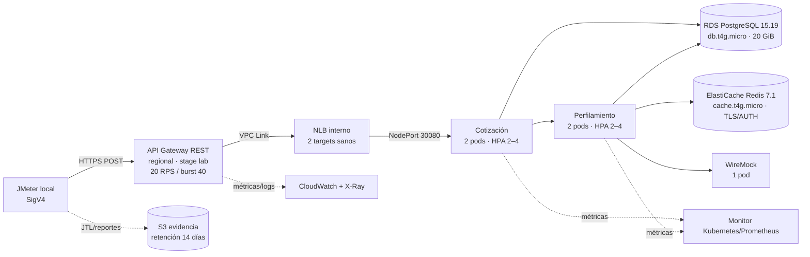

# Ejecución completa — Experimento 1: elasticidad de cotización

Documento de diseño relacionado: [cuatro experimentos arquitectónicos
prioritarios](../../documentos/semana-5/solventa_experimentos_replanteados.md).

## 1. Propósito y resultado que se pretende demostrar

Este runbook describe la ejecución reproducible de **E1**, el experimento que
evalúa `ASR-ESC-01`: elasticidad del recorrido de cotización desde **500 RPM**
hasta **50.000 cotizaciones completadas por minuto**.

La hipótesis que debe someterse a prueba es:

> Dada la plataforma estabilizada en 500 RPM y manteniendo el mismo contrato,
> mezcla de datos sintéticos y cálculo determinista, cuando un socio de
> distribución provoca un salto de carga, la plataforma incorpora capacidad y
> completa al menos 50.000 cotizaciones por minuto, con error técnico menor a
> 1 %, p95 menor o igual a 250 ms y p99 menor o igual a 500 ms. El instante a
> partir del cual una ventana completa de 60 segundos cumple simultáneamente
> throughput, latencia y error debe ocurrir en no más de 60 segundos desde el
> inicio del salto.

Para completar 50.000 solicitudes/min permitiendo hasta 1 % de error, el banco
de pruebas debe **ofrecer al menos 50.506 RPM**, equivalentes a aproximadamente
**841,77 RPS**. Se reportarán por separado solicitudes ofrecidas, aceptadas,
rechazadas y completadas.

### 1.1 Qué significa “capacidad disponible en 60 segundos”

El reloj se define así para evitar interpretaciones posteriores:

1. `T0` es el timestamp UTC en el que el generador fija la carga ofrecida en
   50.506 RPM.
2. Para cada instante `t`, se evalúa la ventana `[t, t + 60 s)`.
3. La plataforma está recuperada en el primer `t` cuya ventana completa logra:
   al menos 50.000 respuestas de negocio válidas, error técnico menor a 1 %,
   p95 menor o igual a 250 ms y p99 menor o igual a 500 ms.
4. E1 cumple el objetivo de elasticidad cuando `t - T0 <= 60 s`.

Tener pods nuevos o nodos nuevos no es suficiente por sí solo: la condición se
mide desde el resultado extremo a extremo.

## 2. Alcance real y estado de avance

E1 se divide en dos bloques que no deben confundirse:

| Bloque | Propósito | Estado al 2026-09-13 |
|---|---|---|
| Fase A | Baseline real a 500 RPM, calibración y tres corridas repetibles | Infraestructura y aplicaciones desplegadas; smoke exitoso; corridas oficiales aún no ejecutadas; falta cerrar las guardas indicadas en 3.2 |
| Fases B–E | Caracterizar capacidad, ampliar la arquitectura y demostrar 500 → 50.506 RPM ofrecidas | Pendiente; la configuración actual no puede validar 50.000 RPM |

La Fase A produce la línea base necesaria para dimensionar la fase completa,
pero **no confirma `ASR-ESC-01`**. El veredicto del ASR solo puede ser `PASS`
después de completar las Fases B–E.

### 2.1 Fuera de alcance

- datos personales, financieros o credenciales de clientes reales;
- disponibilidad Multi-AZ, failover regional y recuperación ante desastre;
- exactitud actuarial del modelo sintético;
- cuotas productivas por socio o autenticación individual de los 50 socios;
- comportamiento de proveedores externos reales: WireMock conserva el
  contrato y la carga computacional sin depender de un tercero;
- afirmar capacidad de 50.000 RPM a partir de una extrapolación sin ejecutar
  esa carga.

## 3. Arquitectura observada actualmente

Inventario verificado mediante operaciones de lectura el
`2026-09-13T09:29:10Z`. No contiene valores de secretos.



### 3.1 Inventario no sensible

| Elemento | Estado/configuración observada |
|---|---|
| Cuenta y región | Cuenta `969325258550`, `us-east-1`, perfil temporal `solventa-lab` |
| Identidad de operación | `arn:aws:iam::969325258550:user/solventa-terraform-operator`; se usa para administrar y observar el laboratorio, no debe ser la identidad final del generador |
| Terraform | Stack `infra/terraform/exp1`, 86 direcciones en estado |
| EKS | `solventa-exp1`, Kubernetes `1.36`, estado `ACTIVE`, endpoint privado y público restringido |
| Nodos | Node group `solventa-exp1-fixed`, 2 nodos On-Demand `c7i-flex.large`, `min=2`, `desired=2`, `max=2`, uno por AZ |
| Metrics Server | 2/2 réplicas disponibles, imagen `v0.9.0` |
| Cotización | 2/2 pods, cero reinicios, HPA 2–4, objetivo CPU 70 %, request/limit 250m/500m y 256/512 MiB |
| Perfilamiento | 2/2 pods, cero reinicios, HPA 2–4, objetivo CPU 70 %, request/limit 250m/500m y 256/512 MiB |
| WireMock | 1/1 pod, imagen fijada por digest, cero reinicios |
| Cálculo sintético | `QUOTE_CPU_ITERATIONS=150000` y `PROFILE_CPU_ITERATIONS=150000` |
| API Gateway | REST regional `solventa-exp1-api`, stage `lab`, AWS IAM/SigV4, rate limit 20 RPS, burst 40, métricas y X-Ray activos |
| Entrada privada | NLB interno activo; sus dos targets NodePort `30080` están `healthy` |
| PostgreSQL | `solventa-exp1-postgres`, PostgreSQL 15.19, `db.t4g.micro`, 20 GiB gp3 cifrados, privado, Single-AZ |
| Redis | `solventa-exp1-redis`, Redis OSS 7.1, `cache.t4g.micro`, un miembro, cifrado en tránsito y reposo, AUTH activo |
| Datos | 50 tarifas/socios y 5.000 perfiles sintéticos sembrados; el rol runtime es de solo lectura |
| Secretos Kubernetes | Solo release Helm, URL runtime de base de datos y URL autenticada de Redis; no permanece el secreto administrador ni el Job de seed |
| Observabilidad | Logs de API Gateway, EKS, RDS y Redis con siete días de retención; snapshots HPA/recursos cada 15 s y métricas de app cada 60 s durante una corrida |
| Evidencia | Bucket privado `solventa-exp1-evidence-969325258550`, cifrado SSE-S3, expiración de `jtl/` a 14 días |
| Runner remoto | ECS/Fargate deshabilitado (`load_runner_cluster_name = null`) |

Imágenes desplegadas:

| Componente | Referencia inmutable |
|---|---|
| Cotización | tag `00750389c2ad`; digest `sha256:19a323f3c60a723db4a88b4d8e2d1b4c80293eb3a2a13ccfb7da4f4f07e63e7c` |
| Perfilamiento | tag `00750389c2ad`; digest `sha256:35c12f5f6f195a0b7254b40ac06888a262a5c6ee8e4381fe3c82cde3a2e75e56` |
| WireMock | digest `sha256:0d4ecb3e4dc8213fd7a4d37d6a78f6e6b553a6d2e15bd51b0999781282ac61b3` |

En reposo se observaron 2–3 millicores y 58–67 MiB por pod de aplicación;
ambos HPA estaban en `1%/70%`. Estas cifras solo son un snapshot de salud, no
una medida de capacidad.

### 3.2 Limitaciones que impiden probar hoy 50.000 RPM

| Limitación actual | Consecuencia |
|---|---|
| API Gateway limitado a 20 RPS | El borde limita alrededor de 1.200 RPM sostenidas, muy por debajo de 50.506 RPM |
| Node group fijo en 2/2/2 | No existe escalamiento de nodos |
| HPA máximo de 4 pods por servicio | El techo no se calculó a partir de capacidad por pod |
| RDS y Redis clase `micro` y Single-AZ | No se ha demostrado que soporten ~842 RPS ni una tormenta de conexiones |
| Runner local único | Puede convertirse en el cuello de botella y no prueba carga ofrecida distribuida |
| Runner Fargate deshabilitado | No hay generadores dentro de AWS listos para la carga final |
| JMeter de producción bloquea cualquier target diferente de 500 RPM | Es una salvaguarda correcta para el baseline, pero se necesita un plan separado para la escalera y el pico |
| El runner local recibe hoy la sesión del operador | Las credenciales son temporales, pero el operador tiene permisos muy superiores a `execute-api:Invoke`; antes de una corrida oficial se requiere un rol dedicado de mínimo privilegio y permitir ese principal en la resource policy |
| `run-local.sh` no verifica el retorno a dos réplicas entre corridas | Si una corrida comienza con una capacidad inicial diferente, las repeticiones dejan de ser independientes |
| `monitor.sh` observa, pero no aplica abortos | Los umbrales requieren vigilancia humana en vivo o un supervisor automático que interrumpa el generador |
| Analizador actual evalúa solo HTTP central | Usa el mismo `sample_count` para `attempted_rpm` y `completed_rpm`, y acepta exactamente 99 % como PASS; no mide de forma independiente ofrecidas, aceptadas, rechazadas y completadas |
| Evidencia complementaria incompleta | No se capturan todavía series temporales de NLB/target health, contador directo de WireMock ni ocupación de pools; `full_baseline_result` debe permanecer `NOT_EVALUATED` mientras falten |

## 4. Reglas de seguridad y reproducibilidad

1. Ejecutar desde la raíz del repositorio y la rama/commit que se documentará.
2. Usar el perfil temporal `solventa-lab` para administrar y observar la
   infraestructura; no crear access keys.
3. Nunca ejecutar `aws configure` con claves, imprimir `export-credentials`,
   guardar credenciales en archivos ni pegarlas en JMeter/Postman.
4. Firmar las solicitudes de API Gateway con SigV4 para `execute-api` en
   `us-east-1`. El generador debe asumir un rol dedicado que solo pueda invocar
   `POST /lab/api/v1/cotizaciones` y, si corresponde, escribir en el prefijo de
   evidencia. Los scripts actuales exportan la sesión amplia del operador al
   contenedor: ese comportamiento es una brecha por cerrar antes de una corrida
   oficial, aunque la sesión sea temporal y se elimine al finalizar.
5. Mantener bodies, headers y tokens fuera del JTL. El plan existente conserva
   timings, código, estado, bytes y `partner_ref`, pero no payloads.
6. No cambiar contrato, datos, caché, cálculo sintético, imagen, requests/limits
   o políticas de escalamiento entre repeticiones oficiales.
7. Los mocks pueden reemplazar terceros; EKS, HPA, autoscaler de nodos, API
   Gateway, base de datos, caché y generadores usados para validar el ASR deben
   ser infraestructura real.
8. No ejecutar otra carga significativa en la cuenta, clúster o computador al
   mismo tiempo.
9. Toda hora de inicio, salto, recuperación y fin se registra en UTC.
10. Un fallo no autoriza borrar evidencia ni repetir silenciosamente una
    corrida. La repetición se registra con un nuevo `RUN_ID` y una causa.

## 5. Herramientas

Versiones observadas localmente:

- AWS CLI `2.36.44` en `/opt/homebrew/bin/aws`;
- Terraform `1.13.1`;
- kubectl `1.37.0`;
- Helm `4.3.0`;
- Docker `27.0.3`;
- JMeter `5.6.3` y Java 17 dentro de una imagen `linux/amd64`;
- `jq`, `xmllint`, ShellCheck y kubeconform.

El generador local debe ejecutarse con el computador conectado a energía, sin
VPN cambiante y con suspensión desactivada mediante `caffeinate`.

## 6. Fase A — baseline ejecutable a 500 RPM

### Paso A0 — abrir sesión y fijar el entorno

```bash
cd /Users/mgomezalarco/Documents/laboratorio-analitica

export PATH="/opt/homebrew/bin:$PATH"
export AWS_PROFILE="solventa-lab"
export AWS_REGION="us-east-1"
```

Si la sesión expiró, renovarla sin crear claves persistentes:

```bash
/opt/homebrew/bin/aws login \
  --profile "$AWS_PROFILE" \
  --region "$AWS_REGION"
```

No ejecutar el experimento hasta que la identidad sea exactamente la esperada:

```bash
/opt/homebrew/bin/aws \
  --profile "$AWS_PROFILE" \
  --region "$AWS_REGION" \
  sts get-caller-identity \
  --query '{Account:Account,Arn:Arn}' \
  --output json
```

Resultado esperado:

```json
{
  "Account": "969325258550",
  "Arn": "arn:aws:iam::969325258550:user/solventa-terraform-operator"
}
```

Esta comprobación valida la identidad de administración. Antes de entregar
credenciales a JMeter se debe cerrar este prerrequisito de seguridad:

1. crear mediante Terraform un rol de runner asumible por el operador local, o
   habilitar el rol de task de ECS ya modelado;
2. concederle únicamente `execute-api:Invoke` sobre el ARN exacto
   `lab/POST/api/v1/cotizaciones` y, si sube evidencia, `s3:PutObject` sobre el
   prefijo exacto del experimento;
3. agregar el ARN del rol a la resource policy de API Gateway manteniendo la
   allowlist de origen;
4. adaptar `common.sh`, `smoke.sh` y `run-local.sh` para verificar y exportar
   esa sesión acotada al contenedor, mientras el perfil del operador permanece
   fuera de este.

La política existente de `load_runner_task` en
`infra/terraform/exp1/iam.tf` sirve como referencia del alcance mínimo. Hasta
que este cambio esté desplegado y verificado, A4 y A6 son ensayos de
preparación y **no corridas oficiales**.

### Paso A1 — validar artefactos sin ejecutar carga

```bash
scripts/experiment-1/validate.sh

git branch --show-current
git rev-parse HEAD
git status --short
git status --porcelain -- services load-tests deploy infra
```

Condiciones de avance:

- `validate.sh` finaliza en cero;
- la rama y SHA quedan anotadas;
- `services/`, `load-tests/`, `deploy/` e `infra/` no tienen cambios sin
  commit;
- cualquier cambio ajeno en el repositorio queda registrado, pero no se borra.

### Paso A2 — preflight de infraestructura y aplicaciones

Estas consultas son de lectura:

```bash
/opt/homebrew/bin/aws \
  --profile "$AWS_PROFILE" \
  --region "$AWS_REGION" \
  eks describe-cluster \
  --name solventa-exp1 \
  --query 'cluster.{status:status,version:version}' \
  --output table

/opt/homebrew/bin/aws \
  --profile "$AWS_PROFILE" \
  --region "$AWS_REGION" \
  rds describe-db-instances \
  --query "DBInstances[?DBInstanceIdentifier=='solventa-exp1-postgres'].{status:DBInstanceStatus,class:DBInstanceClass,engine:EngineVersion}" \
  --output table

/opt/homebrew/bin/aws \
  --profile "$AWS_PROFILE" \
  --region "$AWS_REGION" \
  elasticache describe-replication-groups \
  --query "ReplicationGroups[?ReplicationGroupId=='solventa-exp1-redis'].{status:Status,members:length(MemberClusters),tls:TransitEncryptionEnabled}" \
  --output table

NLB_ARN="$(/opt/homebrew/bin/aws \
  --profile "$AWS_PROFILE" \
  --region "$AWS_REGION" \
  elbv2 describe-load-balancers \
  --names solventa-exp1-nlb \
  --query 'LoadBalancers[0].LoadBalancerArn' \
  --output text)"

TARGET_GROUP_ARN="$(/opt/homebrew/bin/aws \
  --profile "$AWS_PROFILE" \
  --region "$AWS_REGION" \
  elbv2 describe-target-groups \
  --load-balancer-arn "$NLB_ARN" \
  --query 'TargetGroups[0].TargetGroupArn' \
  --output text)"

/opt/homebrew/bin/aws \
  --profile "$AWS_PROFILE" \
  --region "$AWS_REGION" \
  elbv2 describe-load-balancers \
  --load-balancer-arns "$NLB_ARN" \
  --query 'LoadBalancers[0].{state:State.Code,scheme:Scheme,type:Type}' \
  --output table

/opt/homebrew/bin/aws \
  --profile "$AWS_PROFILE" \
  --region "$AWS_REGION" \
  elbv2 describe-target-health \
  --target-group-arn "$TARGET_GROUP_ARN" \
  --query 'TargetHealthDescriptions[].{target:Target.Id,port:Target.Port,state:TargetHealth.State,reason:TargetHealth.Reason}' \
  --output table

kubectl config current-context
kubectl get nodes -o wide
kubectl -n solventa-exp1 get deployments,pods,hpa -o wide
kubectl -n solventa-exp1 top pods --containers
kubectl -n solventa-exp1 get events --sort-by=.metadata.creationTimestamp
helm -n solventa-exp1 status solventa-exp1
```

Condiciones de avance:

- EKS, RDS, Redis y NLB están disponibles/activos;
- existen exactamente dos nodos `Ready`;
- Cotización `2/2`, Perfilamiento `2/2` y WireMock `1/1`;
- no hay pods `Pending`, `CrashLoopBackOff`, `OOMKilled` ni reinicios recientes;
- los HPA informan CPU, con mínimo 2, máximo 4 y objetivo 70 %;
- los eventos históricos de arranque no se confunden con fallas actuales.

### Paso A3 — smoke firmado extremo a extremo

```bash
scripts/experiment-1/smoke.sh
```

Debe responder `HTTP 2xx` y aprobar el esquema completo. Este paso recorre API
Gateway, VPC Link, NLB, Cotización, Perfilamiento, PostgreSQL, Redis y, ante un
miss, WireMock. No habilita retries del cliente.

### Paso A4 — calibrar el costo CPU sin contaminar las corridas oficiales

La calibración actual parte de 150.000 iteraciones en ambos servicios. Se usan
perfiles 81–100; las corridas oficiales usan rangos 1–60. Así, la calibración no
precalienta sus claves.

Primero desplegar el candidato. Repetir solo si cambia el valor de iteraciones:

```bash
QUOTATION_IMAGE="$(kubectl -n solventa-exp1 get deployment solventa-exp1-quotation \
  -o jsonpath='{.spec.template.spec.containers[?(@.name=="quotation")].image}')"
PROFILE_IMAGE="$(kubectl -n solventa-exp1 get deployment solventa-exp1-profile \
  -o jsonpath='{.spec.template.spec.containers[?(@.name=="profile")].image}')"

export IMAGE_TAG="${QUOTATION_IMAGE##*:}"
[[ "$IMAGE_TAG" == "${PROFILE_IMAGE##*:}" ]]
[[ "$IMAGE_TAG" =~ ^[0-9a-f]{12,40}$ ]]

IMAGE_TAG="$IMAGE_TAG" \
  QUOTE_CPU_ITERATIONS="150000" \
  PROFILE_CPU_ITERATIONS="150000" \
  scripts/experiment-1/deploy.sh
```

Luego construir el runner reproducible:

```bash
docker build \
  --platform linux/amd64 \
  --build-arg "SOURCE_REVISION=$(git rev-parse --short=12 HEAD)" \
  --tag solventa/jmeter-exp1:5.6.3 \
  load-tests/jmeter
```

La siguiente corrida de calibración ejecuta 2 min a 50 RPM, 5 min a 500 RPM y
5 min a 50 RPM. Usa SigV4 y no imprime secretos:

```bash
(
  set -Eeuo pipefail

  source scripts/experiment-1/common.sh
  verify_aws_identity
  load_tf_outputs

  CAL_ID="exp1-calibration-$(date -u +%Y%m%dT%H%M%SZ)"
  CAL_DIR="${RESULTS_DIR}/${CAL_ID}"
  mkdir -p "${CAL_DIR}/calibration"

  jq -n \
    --arg run_id "$CAL_ID" \
    --arg started_at "$(date -u +%Y-%m-%dT%H:%M:%SZ)" \
    '{run_id:$run_id,kind:"calibration",started_at:$started_at}' \
    > "${CAL_DIR}/manifest.json"

  API_BASE_URL="$(tf_text_first api_gateway_invoke_url)"
  TARGET_URL="${API_BASE_URL%/}/api/v1/cotizaciones"
  EXPECTED_TARGET_HOST="$(url_host "$API_BASE_URL")"
  [[ "$TARGET_URL" == https://* ]] || fail "La calibración exige HTTPS"
  [[ "$EXPECTED_TARGET_HOST" == *.execute-api.us-east-1.amazonaws.com ]] \
    || fail "El target de calibración no es API Gateway us-east-1"
  require_allowed_target "$TARGET_URL" "$EXPECTED_TARGET_HOST"
  export_aws_process_credentials

  NOW_EPOCH="$(date -u +%s)"
  REMAINING_SECONDS=$((AWS_CREDENTIAL_EXPIRATION_EPOCH - NOW_EPOCH))
  (( REMAINING_SECONDS >= 1200 )) || fail "Renueve aws login antes de calibrar"

  cleanup_calibration() {
    [[ -z "${MONITOR_PID:-}" ]] || kill "$MONITOR_PID" >/dev/null 2>&1 || true
    clear_aws_process_credentials
  }
  trap cleanup_calibration EXIT INT TERM

  RUN_ID="$CAL_ID" \
  MONITOR_DURATION_SECONDS=780 \
  SKIP_CONTEXT_UPDATE=true \
    scripts/experiment-1/monitor.sh &
  MONITOR_PID=$!

  docker run --rm \
    --name "${CAL_ID}-generator" \
    --platform linux/amd64 \
    --read-only \
    --cap-drop ALL \
    --security-opt no-new-privileges \
    --user "$(id -u):$(id -g)" \
    --tmpfs /tmp:rw,noexec,nosuid,size=256m \
    --volume "${RESULTS_DIR}:/work/results" \
    --env AWS_ACCESS_KEY_ID \
    --env AWS_SECRET_ACCESS_KEY \
    --env AWS_SESSION_TOKEN \
    --entrypoint jmeter \
    solventa/jmeter-exp1:5.6.3 \
    -n \
    -j "/work/results/${CAL_ID}/calibration/jmeter.log" \
    -q /work/user.properties \
    -t /work/experiment-1.jmx \
    -Jtarget_url="$TARGET_URL" \
    -Jwarmup_rpm=50 \
    -Jtarget_rpm=500 \
    -Jpartner_threads=50 \
    -Jprofile_offset=80 \
    -Jauth_mode=aws_iam \
    -Jaws_region=us-east-1 \
    -Jaws_service=execute-api \
    -Jramp_seconds=5 \
    -Jwarmup_seconds=120 \
    -Jmeasured_seconds=300 \
    -Jcooldown_seconds=300 \
    -Jmeasured_delay_seconds=120 \
    -Jcooldown_delay_seconds=420 \
    -Jjmeter.reportgenerator.temp_dir=/tmp/jmeter-calibration-report \
    -l "/work/results/${CAL_ID}/calibration/measured.jtl" \
    -e \
    -o "/work/results/${CAL_ID}/calibration/report"

  wait "$MONITOR_PID" || true
  MONITOR_PID=""

  SOURCE_RUN_ID="$CAL_ID" scripts/experiment-1/collect.sh

  jq '.Total | {
    samples: .sampleCount,
    errors: .errorCount,
    error_percent: .errorPct,
    throughput_rps: .throughput,
    p90_ms: .pct1ResTime,
    p95_ms: .pct2ResTime,
    p99_ms: .pct3ResTime
  }' "${CAL_DIR}/calibration/report/statistics.json"

  printf 'CAL_ID=%s\n' "$CAL_ID"
)
```

Decisión de calibración:

- aceptar el candidato si sostiene 500 RPM, mantiene los umbrales de latencia y
  error y produce una señal HPA observable —idealmente 2 → 3 en al menos el
  servicio limitante— sin saturar dependencias; esta última condición se valida
  también en `${CAL_DIR}/managed-cloudwatch-metrics.json`, no solo en el
  monitor de pods;
- si la CPU permanece por debajo de 55 % sin escalar, incrementar solo el
  componente subutilizado hasta 25 % y repetir con perfiles 61–80
  (`-Jprofile_offset=60`);
- si CPU supera 90 %, aparecen throttling/reinicios o se rompe el SLO, reducir
  el componente hasta 20 %;
- no superar 1.000.000 de iteraciones ni hacer más de dos intentos con los datos
  sembrados actuales. Si aún no se calibra, sembrar rangos nuevos mediante un
  cambio versionado antes de continuar; no reutilizar silenciosamente una
  caché caliente;
- congelar el primer candidato aceptable. La calibración no forma parte de las
  tres corridas oficiales.

### Paso A5 — congelar la configuración

Definir un identificador único y conservar la configuración previa a la carga:

```bash
export RUN_ID="exp1-baseline-$(date -u +%Y%m%dT%H%M%SZ)"
export FREEZE_DIR="load-tests/results/${RUN_ID}/freeze"
mkdir -p "$FREEZE_DIR"

date -u +%Y-%m-%dT%H:%M:%SZ > "$FREEZE_DIR/frozen-at.txt"
git rev-parse HEAD > "$FREEZE_DIR/git-revision.txt"
git status --short > "$FREEZE_DIR/git-status.txt"
git diff --binary -- services load-tests deploy infra \
  > "$FREEZE_DIR/runtime-diff.patch"
docker image inspect solventa/jmeter-exp1:5.6.3 \
  > "$FREEZE_DIR/runner-image.json"
helm -n solventa-exp1 get values solventa-exp1 --all -o yaml \
  > "$FREEZE_DIR/helm-values.yaml"
kubectl -n solventa-exp1 get deploy,hpa,pods -o yaml \
  > "$FREEZE_DIR/kubernetes-before.yaml"
kubectl -n solventa-exp1 get pods -o json \
  | jq '[.items[] | {pod:.metadata.name,containers:[.status.containerStatuses[]? | {name,image,imageID}]}]' \
  > "$FREEZE_DIR/pod-images.json"
terraform -chdir=infra/terraform/exp1 output -json \
  | jq 'with_entries(select(.value.sensitive != true))' \
  > "$FREEZE_DIR/terraform-outputs-nonsensitive.json"
printf '%s\n' "$RUN_ID" > load-tests/results/.last-exp1-run-id
```

Verificar manualmente en `helm-values.yaml` que las iteraciones son las
calibradas y que ambos HPA continúan en 2–4 al 70 %. El tag/digest de imagen,
commit, valores Helm, nodos, fecha UTC y estado inicial constituyen la
configuración congelada.

### Paso A6 — ejecutar las tres corridas del baseline

Protocolo inmutable por corrida:

1. 5 min a 50 RPM;
2. salto a 500 RPM en 5 s o menos;
3. 30 min medidos a 500 RPM;
4. 5 min a 50 RPM;
5. 30 s adicionales de observación HPA.

Cada corrida usa un contenedor y una sesión temporal nueva. Los perfiles son
1–20, 21–40 y 41–60 respectivamente. La duración de tráfico y observación es
121 min 30 s en total, más construcción y generación de reportes.

El script actual encadena las tres corridas después de su cooldown, pero no
impide que la siguiente empiece si el HPA aún no volvió a dos réplicas. Hasta
incorporar esa guardia, el operador debe comprobar en
`k8s/autoscaling.jsonl` que Cotización y Perfilamiento tenían
`current_replicas=2`, `desired_replicas=2` y dos réplicas Ready al inicio de
cada corrida. Si no fue así, el grupo es `INCONCLUSIVE` y no cuenta como tres
repeticiones independientes.

Registrar también CPU del host y del contenedor generador. El monitor de
Kubernetes ya lo inicia `run-local.sh`:

```bash
(
  set -Eeuo pipefail

  RUN_ID="$(cat load-tests/results/.last-exp1-run-id)"
  GENERATOR_LOG="load-tests/results/${RUN_ID}/generator-usage.log"

  monitor_generator() {
    while true; do
      date -u +%Y-%m-%dT%H:%M:%SZ
      top -l 1 -n 0 | awk '/CPU usage/ {print}'
      docker stats --no-stream \
        --format 'container={{.Name}} image={{.Image}} cpu={{.CPUPerc}} memory={{.MemUsage}}' \
        || true
      sleep 15
    done
  }

  monitor_generator > "$GENERATOR_LOG" 2>&1 &
  GENERATOR_MONITOR_PID=$!

  cleanup_generator_monitor() {
    kill "$GENERATOR_MONITOR_PID" >/dev/null 2>&1 || true
    wait "$GENERATOR_MONITOR_PID" >/dev/null 2>&1 || true
  }
  trap cleanup_generator_monitor EXIT INT TERM

  caffeinate -dimsu env RUN_ID="$RUN_ID" scripts/experiment-1/run-local.sh
)
```

El monitor no detiene automáticamente JMeter. Durante estas dos horas debe
haber un operador observando en una segunda terminal:

```bash
RUN_ID="$(cat load-tests/results/.last-exp1-run-id)"
tail -F \
  "load-tests/results/${RUN_ID}/generator-usage.log" \
  "load-tests/results/${RUN_ID}/k8s/autoscaling.log" \
  "load-tests/results/${RUN_ID}/k8s/monitor-errors.log"
```

Ante una condición de aborto, el operador envía `Ctrl-C` en la terminal que
ejecuta A6, espera el cierre del contenedor y anota timestamp y causa. Si no se
dispone de vigilancia en vivo, la ejecución solo sirve como ensayo técnico;
no se considera oficial. El reemplazo deseable es un supervisor automático
que evalúe los umbrales de la sección 11 y termine el generador.

No cambiar de red/IP pública ni activar/desactivar VPN durante la ejecución. Si
la IP cambia, API Gateway puede rechazar la carga y la corrida debe abortarse y
registrarse, no corregirse en caliente.

### Paso A7 — recolectar y volver a analizar

`run-local.sh` genera un análisis HTTP inicial. Después se recolectan métricas
administradas y se repite el análisis para actualizar su inventario:

```bash
export RUN_ID="$(cat load-tests/results/.last-exp1-run-id)"

SOURCE_RUN_ID="$RUN_ID" scripts/experiment-1/collect.sh
SOURCE_RUN_ID="$RUN_ID" scripts/experiment-1/analyze.sh

jq '{
  run_id,
  core_http_result,
  full_baseline_result,
  evidence_inventory,
  runs: [.runs[] | {
    run,
    attempted_rpm,
    valid_percent,
    latency,
    errors,
    core_http_result
  }]
}' "load-tests/results/${RUN_ID}/analysis.json"
```

`collect.sh` crea un archivo local, obtiene CloudWatch para la misma ventana y
sube un paquete **preliminar** al bucket. Como el segundo análisis ocurre
después, esa primera copia no es todavía el paquete canónico; la sección 12
vuelve a empaquetar y subir análisis y hashes finales.

El analizador actual tiene dos límites que se corrigen manualmente en el
veredicto:

- `attempted_rpm` y `completed_rpm` provienen hoy del mismo `sample_count` del
  JTL. Esa cifra representa intentos observados, no contadores independientes
  de ofrecidas, admitidas y completadas de negocio;
- `core_http_result` acepta `valid_percent >= 99.0`, pero el ASR exige error
  `<1 %`. Por tanto, una corrida con exactamente `99,0 %` válido se clasifica
  manualmente como `FAIL`, aunque el JSON indique `PASS`.

Por diseño, `full_baseline_result=NOT_EVALUATED` hasta cerrar los controles
manuales y las brechas de evidencia indicadas en 3.2.

### Paso A8 — emitir veredicto del baseline

Cada una de las tres corridas se evalúa por separado. No se promedian corridas
para ocultar un incumplimiento.

| Criterio | PASS por corrida |
|---|---|
| Intentos observados | 15.000 muestras iniciadas en 30 min, tolerancia ±1 %; se contrasta con timestamps y capacidad no saturada del generador |
| Respuesta válida | Más de 99 % de HTTP 2xx con esquema de negocio válido, equivalente a error `<1 %` |
| Latencia | p95 ≤250 ms y p99 ≤500 ms |
| Errores | 429, timeout, transporte, 5xx y 2xx con esquema inválido cuentan como error |
| HPA | Si se activa, capacidad adicional `Ready` y recuperación conjunta de throughput/latencia/error en ≤60 s |
| Kubernetes | Sin pods Pending/OOMKilled, reinicios continuos ni memoria ≥80 % sostenida |
| PostgreSQL | Sin agotamiento de conexiones; CPU <80 % sostenida; memoria/almacenamiento sin agotamiento |
| Redis | Sin evictions; CPU <80 % sostenida; conexiones y memoria con margen |
| Generador | CPU del contenedor y host <80 % sostenida y tasa ofrecida dentro de tolerancia |
| Independencia | Ambos HPA y deployments estaban nuevamente en dos réplicas Ready antes de iniciar cada repetición |
| Evidencia integral | Series y conteos de NLB/targets, WireMock y pools presentes; mientras falten, el resultado queda `INCONCLUSIVE` |

La guarda estricta de error se comprueba explícitamente:

```bash
jq -e 'all(.runs[]; .valid_percent > 99.0)' \
  "load-tests/results/${RUN_ID}/analysis.json"
```

Un exit code distinto de cero significa `FAIL` del criterio de error.

El catálogo también registra una meta más estricta del equipo para el baseline:
p95 `<200 ms`, p99 `<400 ms` y `0 %` de errores. Debe reportarse en una columna
separada. Hasta que el equipo la ratifique como umbral contractual, no sustituye
los límites derivados de p95 ≤250 ms, p99 ≤500 ms y error <1 %.

Estados permitidos para la Fase A:

- `PASS`: las tres corridas cumplen HTTP y todos los controles manuales;
- `FAIL`: al menos una corrida válida incumple un criterio;
- `INCONCLUSIVE`: falta evidencia, el generador se saturó, cambió la
  configuración o la corrida fue abortada por una causa externa al SUT.

Si el HPA nunca escala pero se cumplen los SLO, la conclusión correcta es:
“500 RPM caben en la capacidad inicial”; no se demostró elasticidad.

## 7. Fase B — caracterización de capacidad

Esta fase usa el mismo contrato y cálculo congelado para convertir la línea base
en un dimensionamiento. No debe comenzar si la Fase A es inconclusa.

### Paso B1 — medir capacidad segura por réplica

Ejecutar una escalera controlada con capacidad fija para cada servicio y medir,
por nivel, RPS completadas, CPU, memoria, conexiones, latencia de dependencias y
errores. Los niveles iniciales recomendados son 500, 1.000, 2.000 y 5.000 RPM;
se detiene antes si aparece un criterio de aborto.

Para cada componente `s`, definir:

```text
safe_rps_per_pod[s] = mayor RPS por pod que conserva simultáneamente:
                      CPU <= 70 %, memoria < 80 %, error < 1 %,
                      p95 <= 250 ms y p99 <= 500 ms

required_pods[s] = ceil(841,77 / safe_rps_per_pod[s])
```

Agregar al menos 30 % de margen y redondear a nodos completos. No usar el
promedio de CPU global para esconder un pod o AZ saturado.

### Paso B2 — medir capacidad de RDS, Redis y borde

Por cada nivel registrar:

- RDS: CPU, conexiones máximas, `FreeableMemory`, `FreeStorageSpace`, read/write
  latency y errores del pool;
- Redis: engine CPU, conexiones, memoria libre, hits, misses y evictions;
- API Gateway: Count, 4XX, 5XX, Latency e IntegrationLatency;
- NLB/EKS: targets sanos, pods Ready, reinicios y capacidad asignable;
- WireMock: solicitudes recibidas y latencia, separando hits/misses de caché.

Resultado obligatorio: tabla de capacidad segura por pod, nodo y dependencia.
Sin esa tabla no se autoriza dimensionar la fase de 50.000 RPM.

## 8. Fase C — tratamiento arquitectónico para 50.000 RPM

La rama actual no implementa aún esta fase. Antes de ejecutar carga alta deben
existir cambios versionados, `terraform plan` revisado y una nueva congelación.

### Paso C1 — eliminar los techos artificiales del borde

- aumentar el method throttle de API Gateway desde 20 RPS a un valor no menor
  de 1.000 RPS, con burst suficiente —por ejemplo 2.000— para ofrecer 841,77
  RPS sin que el banco de pruebas sea limitado por configuración;
- verificar la cuota regional efectiva de API Gateway y solicitar aumento solo
  si el valor aprobado es menor que el requerido;
- mantener AWS IAM, resource policy e IP/NAT allowlist; no abrir
  `0.0.0.0/0`.

Consulta de cuotas sin asumir códigos estáticos:

```bash
/opt/homebrew/bin/aws \
  --profile solventa-lab \
  --region us-east-1 \
  service-quotas list-service-quotas \
  --service-code apigateway \
  --query "Quotas[?contains(QuotaName, 'rate') || contains(QuotaName, 'Rate')].{Name:QuotaName,Value:Value,Adjustable:Adjustable}" \
  --output table
```

### Paso C2 — habilitar escalamiento real de nodos y pods

- ampliar el máximo del node group con base en la capacidad de Fase B;
- desplegar Cluster Autoscaler, Karpenter o EKS Auto Mode y registrar cuál fue
  elegido; no se acepta escalamiento manual durante la ventana medida;
- conservar capacidad caliente suficiente para que los pods críticos entren en
  servicio mientras se incorporan nodos. El tamaño se deriva del objetivo de
  60 s, no de una cifra arbitraria;
- ajustar `maxReplicas` de cada HPA a `required_pods[s]` más margen;
- validar distribución entre AZ, `topologySpreadConstraints`, PDB, requests y
  limits;
- conservar CPU como señal solo si Fase B demuestra correlación estable con
  RPS. Si no, agregar HPA por RPS/concurrencia mediante una fuente real de
  métricas.

El experimento debe capturar por separado tiempos de decisión HPA, pod
Scheduled, imagen disponible, pod Ready, decisión del autoscaler y nodo Ready.

### Paso C3 — redimensionar datos y conexiones

- seleccionar clase/capacidad de RDS a partir de la curva medida, no por
  extrapolación lineal;
- fijar pools máximos por pod para que `pods_max × pool_max` no agote RDS;
- incorporar RDS Proxy solo si la tormenta de conexiones lo justifica y medir
  el resultado;
- dimensionar Redis por CPU, memoria, conexiones y miss rate; las evictions no
  pueden aparecer;
- mantener RDS y Redis reales. Single-AZ/Multi-AZ es una decisión de
  disponibilidad distinta, pero cualquier cambio debe permanecer idéntico en
  las tres repeticiones.

### Paso C4 — desplegar generadores distribuidos fuera del SUT

El runner Fargate opcional actual es una sola tarea de 0,5 vCPU/1 GiB y está
deshabilitado. Para la carga final se requiere un coordinador y múltiples
workers reales, separados de los nodos EKS medidos.

Dimensionar concurrencia mínima con:

```text
threads_min >= ceil(target_rps × p99_seconds × 1,25)
```

Con 841,77 RPS y p99 de 0,5 s, el banco necesita al menos 527 hilos concurrentes
distribuidos, además de margen de CPU/red. Cada worker debe quedar por debajo de
80 % de CPU y demostrar su tasa ofrecida. La suma de workers, no la intención
del coordinador, es la carga oficial.

El plan de carga alta debe ser un artefacto diferente al baseline: el runner
actual rechaza correctamente `TARGET_RPM != 500`. Antes de Fase D se deben
implementar y probar:

- partición determinista de tasa y socios entre workers;
- inicio coordinado con timestamp UTC común;
- SigV4 por task role, sin claves estáticas;
- JTL sin bodies/headers y un manifiesto común;
- agregación por segundo y por ventana de 60 s sin sumar percentiles;
- recolección de CPU/red/errores de cada generador;
- prueba en vacío que demuestre al menos 20 % de capacidad adicional del banco.

### Paso C5 — plan, costo y congelación

Antes de aplicar:

```bash
terraform -chdir=infra/terraform/exp1 fmt -check
terraform -chdir=infra/terraform/exp1 validate
terraform -chdir=infra/terraform/exp1 plan -out=exp1-50k.tfplan
terraform -chdir=infra/terraform/exp1 show exp1-50k.tfplan
```

Revisar recursos, cuotas, máximo de nodos/tasks, clases de RDS/Redis, retención
de logs y costo máximo. No aplicar sin una ventana y un presupuesto aprobados.

La referencia histórica del plan de laboratorio para la Fase A es
aproximadamente USD 0,39/h antes de logs, trazas, solicitudes y transferencia;
no es una cotización vigente. La Fase C cambia sustancialmente ese costo y debe
estimarse de nuevo con los recursos exactos y precios vigentes antes del apply.

## 9. Fase D — escalera de carga hasta 50.506 RPM

La escalera evita descubrir por primera vez un cuello de botella en el salto
final. Se ejecuta con el tratamiento arquitectónico ya desplegado y el cálculo
sintético congelado.

| Escalón | RPM ofrecidas | RPS aproximadas | Ventana estable mínima |
|---:|---:|---:|---:|
| D1 | 500 | 8,33 | 5 min |
| D2 | 2.000 | 33,33 | 5 min |
| D3 | 5.000 | 83,33 | 5 min |
| D4 | 10.000 | 166,67 | 5 min |
| D5 | 25.000 | 416,67 | 10 min |
| D6 | 50.506 | 841,77 | 10 min |

Entre escalones, no bajar a cero: avanzar desde el nivel anterior cuando el SUT
esté estable y haya margen. Registrar ofrecidas, completadas, válidas,
rechazadas, p50/p95/p99, recursos y eventos cada segundo y agregarlos por
ventanas de 60 s.

Condición de avance entre escalones:

- error técnico <1 %;
- p95 ≤250 ms y p99 ≤500 ms;
- sin saturación sostenida;
- generadores <80 % de CPU y con al menos 20 % de headroom demostrado;
- ninguna intervención manual sobre pods, nodos o dependencias.

Si un escalón falla, detener la escalera, conservar evidencia y corregir fuera
de la corrida. No saltar al nivel siguiente.

## 10. Fase E — prueba oficial 500 → 50.506 RPM

Solo se autoriza cuando D6 cumple y la configuración queda nuevamente
congelada.

### Protocolo de cada repetición

1. estabilizar 5 min a 500 RPM;
2. fijar 50.506 RPM en ≤5 s y marcar `T0` en UTC;
3. mantener el pico 30 min;
4. bajar a 500 RPM durante al menos la ventana completa de scale-down;
5. observar recuperación de pods/nodos y finalizar la evidencia;
6. repetir tres veces con rangos de perfiles equivalentes y no compartidos.

Las tres repeticiones deben usar las mismas imágenes, cálculo, distribución por
socio, mix hit/miss, HPA/autoscaler, clases de datos y número/configuración de
workers. Una modificación invalida la comparabilidad y exige un nuevo grupo de
tres corridas.

### PASS del experimento completo

Cada repetición debe cumplir simultáneamente:

- carga ofrecida ≥50.506 RPM durante el pico;
- cotizaciones completadas y válidas ≥50.000 en cada ventana estable de 60 s;
- error técnico <1 %;
- p95 ≤250 ms y p99 ≤500 ms en la ventana estable;
- primer inicio de una ventana completa conforme en ≤60 s desde `T0`;
- sin pérdida silenciosa, OOM, reinicios continuos, pods Pending sostenidos,
  agotamiento de conexiones ni evictions;
- generadores con CPU <80 % y headroom probado;
- escalamiento sin intervención manual.

El resultado general es `PASS` únicamente si las tres repeticiones pasan. Es
`FAIL` si una repetición válida incumple. Es `INCONCLUSIVE` si el banco de carga,
las credenciales, la red de origen o la instrumentación impiden demostrar la
carga.

## 11. Criterios de aborto controlado

Abortar preservando evidencia si cualquiera ocurre durante dos minutos
consecutivos, salvo los fallos críticos que exigen aborto inmediato:

| Condición | Acción |
|---|---|
| Error técnico >5 % | Abortar |
| p99 >2 s | Abortar |
| CPU de RDS, Redis o generador ≥80 % sostenida | Abortar |
| Memoria de un pod ≥80 % de su límite sostenida | Abortar |
| Conexiones RDS/Redis ≥80 % del máximo seguro | Abortar |
| Evictions de Redis >0 | Abortar |
| Pods Pending por falta de capacidad, OOMKilled o reinicios continuos | Abortar |
| Generador no sostiene la tasa o pierde sincronización | Abortar e indicar `INCONCLUSIVE` |
| Credenciales expiran o IP/VPN cambia | Abortar e indicar `INCONCLUSIVE` |
| Corrupción/pérdida de JTL o timestamps | Aborto inmediato |
| Riesgo de costo por encima del presupuesto aprobado | Aborto inmediato |

Un aborto no equivale automáticamente a fallo del SUT. El informe debe separar
`FAIL` de `INCONCLUSIVE` y atribuir la causa con evidencia.

## 12. Paquete mínimo de evidencia

Por grupo de corridas conservar:

- manifiesto de protocolo, `RUN_ID`, UTC y versión del esquema;
- commit, estado Git, imágenes por tag y digest;
- Terraform outputs no sensibles, plan aprobado y valores Helm efectivos;
- JTL crudo y dashboard HTML por corrida, sin payloads ni headers;
- tasa ofrecida, aceptada, limitada, completada y válida por segundo/minuto;
- p50, p95, p99 y máximo calculados desde muestras crudas;
- categorías de error, API Gateway access logs y X-Ray del borde;
- snapshots HPA, deployments, pods, nodos, eventos y uso por contenedor;
- decisiones y tiempos HPA/autoscaler/pod/nodo;
- métricas de RDS, Redis, NLB, WireMock y pools de aplicación;
- métricas de cada generador y prueba de headroom;
- análisis automático, checklist manual y veredicto firmado;
- hash SHA-256 de cada archivo comprimido y ubicación S3.

Mientras no existan las series de NLB/targets, el contador directo de WireMock
y la ocupación de pools, se conserva lo disponible pero el paquete no habilita
un `PASS` integral. Después de A7, crear y subir el paquete canónico sin exponer
secretos:

```bash
export RUN_ID="$(cat load-tests/results/.last-exp1-run-id)"
export RESULTS_ROOT="load-tests/results"
export RUN_ROOT="${RESULTS_ROOT}/${RUN_ID}"
export FINAL_ARCHIVE_NAME="${RUN_ID}-final.tar.gz"
export FINAL_ARCHIVE_PATH="${RESULTS_ROOT}/${FINAL_ARCHIVE_NAME}"

(
  cd "$RUN_ROOT"
  find . -type f ! -name SHA256SUMS -print | LC_ALL=C sort
  find . -type f ! -name SHA256SUMS -exec shasum -a 256 {} \; \
    | LC_ALL=C sort > SHA256SUMS
  shasum -a 256 -c SHA256SUMS
)

tar -czf "$FINAL_ARCHIVE_PATH" -C "$RESULTS_ROOT" "$RUN_ID"
tar -tzf "$FINAL_ARCHIVE_PATH" >/dev/null

(
  cd "$RESULTS_ROOT"
  shasum -a 256 "$FINAL_ARCHIVE_NAME" \
    > "${FINAL_ARCHIVE_NAME}.sha256"
  shasum -a 256 -c "${FINAL_ARCHIVE_NAME}.sha256"
)

EVIDENCE_BUCKET="$(terraform -chdir=infra/terraform/exp1 \
  output -raw evidence_bucket_name)"

/opt/homebrew/bin/aws \
  --profile solventa-lab \
  --region us-east-1 \
  s3 cp "$FINAL_ARCHIVE_PATH" \
  "s3://${EVIDENCE_BUCKET}/jtl/${RUN_ID}/final/${FINAL_ARCHIVE_NAME}" \
  --only-show-errors \
  --sse AES256

/opt/homebrew/bin/aws \
  --profile solventa-lab \
  --region us-east-1 \
  s3 cp "${FINAL_ARCHIVE_PATH}.sha256" \
  "s3://${EVIDENCE_BUCKET}/jtl/${RUN_ID}/final/${FINAL_ARCHIVE_NAME}.sha256" \
  --only-show-errors \
  --sse AES256

/opt/homebrew/bin/aws \
  --profile solventa-lab \
  --region us-east-1 \
  s3api head-object \
  --bucket "$EVIDENCE_BUCKET" \
  --key "jtl/${RUN_ID}/final/${FINAL_ARCHIVE_NAME}" \
  --query '{bytes:ContentLength,encryption:ServerSideEncryption,last_modified:LastModified}' \
  --output json
```

El objeto bajo `final/` es la evidencia canónica. El archivo que sube
`collect.sh` antes del segundo análisis se conserva como paquete preliminar y
no se usa para emitir el veredicto.

## 13. Teardown condicionado

No desmontar nada hasta verificar que el paquete local se abre, su hash es
válido y la copia S3 existe.

### 13.1 Retirar solo aplicaciones

Esta acción conserva la infraestructura Terraform:

```bash
CONFIRM_TEARDOWN=solventa-exp1 scripts/experiment-1/teardown.sh
```

No usar `DELETE_NAMESPACE=true`, `DELETE_DB_SECRET=true` ni
`UNINSTALL_METRICS_SERVER=true` salvo que se haya decidido explícitamente su
alcance.

### 13.2 Destruir infraestructura AWS

`terraform destroy` es una acción separada, destructiva y requiere autorización
humana explícita. El bucket de evidencia del stack tiene `force_destroy=true`:
antes de destruir, descargar y verificar la evidencia fuera del stack.

Preparación no destructiva:

```bash
export RUN_ID="$(cat load-tests/results/.last-exp1-run-id)"
export BACKUP_DIR="load-tests/results/${RUN_ID}/s3-backup"
export EVIDENCE_BUCKET="$(terraform -chdir=infra/terraform/exp1 \
  output -raw evidence_bucket_name)"
mkdir -p "$BACKUP_DIR"

/opt/homebrew/bin/aws \
  --profile solventa-lab \
  --region us-east-1 \
  s3 sync \
  "s3://${EVIDENCE_BUCKET}/jtl/${RUN_ID}/" \
  "$BACKUP_DIR/"

(
  cd "$BACKUP_DIR/final"
  shasum -a 256 -c "${RUN_ID}-final.tar.gz.sha256"
  tar -tzf "${RUN_ID}-final.tar.gz" >/dev/null
)

terraform -chdir=infra/terraform/exp1 plan -destroy -out=exp1-destroy.tfplan
terraform -chdir=infra/terraform/exp1 show exp1-destroy.tfplan
```

Solo tras revisar el plan y recibir confirmación explícita se aplicaría el plan
de destrucción. El bucket de backend/estado no pertenece al teardown automático
del experimento y se conserva hasta cerrar el laboratorio.

Después del destroy, confirmar por APIs que no permanecen EKS, nodos/EC2, NAT,
NLB, RDS, Redis, tareas ECS, Secrets Manager o log groups con prefijo
`solventa-exp1`.

## 14. Matriz de decisión final

| Evidencia alcanzada | Afirmación permitida |
|---|---|
| Smoke únicamente | El recorrido desplegado responde con contrato válido |
| Fase A PASS sin HPA | La capacidad inicial sostiene 500 RPM |
| Fase A PASS con HPA | El HPA de pods reaccionó al baseline bajo la señal calibrada |
| Fases B–D PASS | La plataforma fue dimensionada y alcanzó 50.506 RPM de forma progresiva; aún falta el salto oficial repetido |
| Tres repeticiones de Fase E PASS | `ASR-ESC-01` validado para la configuración, mezcla y región congeladas |
| Extrapolación desde 500 RPM | No permite afirmar 50.000 RPM |

## 15. Pendientes antes de declarar E1 listo para 50.000 RPM

- ratificar el umbral estricto del equipo para el baseline frente al umbral
  contractual derivado;
- crear y permitir un rol de runner de mínimo privilegio, y evitar que el
  contenedor reciba la sesión `PowerUser` del operador;
- automatizar la guardia de dos réplicas iniciales y los criterios de aborto;
- medir de forma independiente solicitudes ofrecidas, admitidas, rechazadas y
  completadas, y corregir la comparación estricta de error `<1 %`;
- incorporar series de NLB/target health, contador directo de WireMock y
  ocupación de pools al paquete canónico;
- definir presupuesto máximo por corrida y costo máximo por cotización;
- implementar el plan distribuido de carga alta y su agregador;
- habilitar Fargate u otro banco real separado del SUT;
- implementar autoscaling de nodos y capacidad caliente;
- dimensionar HPA, node group, RDS, Redis y pools a partir de Fase B;
- aumentar method throttle/cuotas del borde;
- definir mezcla exacta de hit/miss y rangos de perfiles equivalentes para todas
  las repeticiones;
- extender el analizador para emitir el veredicto integral y medir formalmente
  el reloj de elasticidad.

Hasta cerrar estos puntos, la infraestructura está lista para **Fase A**, no
para la afirmación completa de 50.000 RPM.
