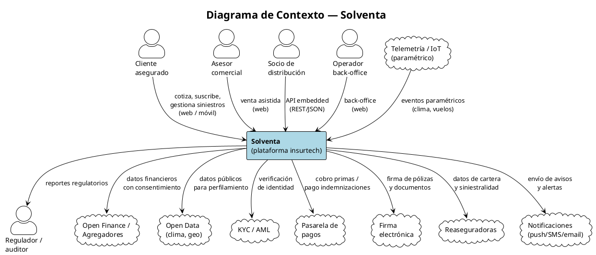
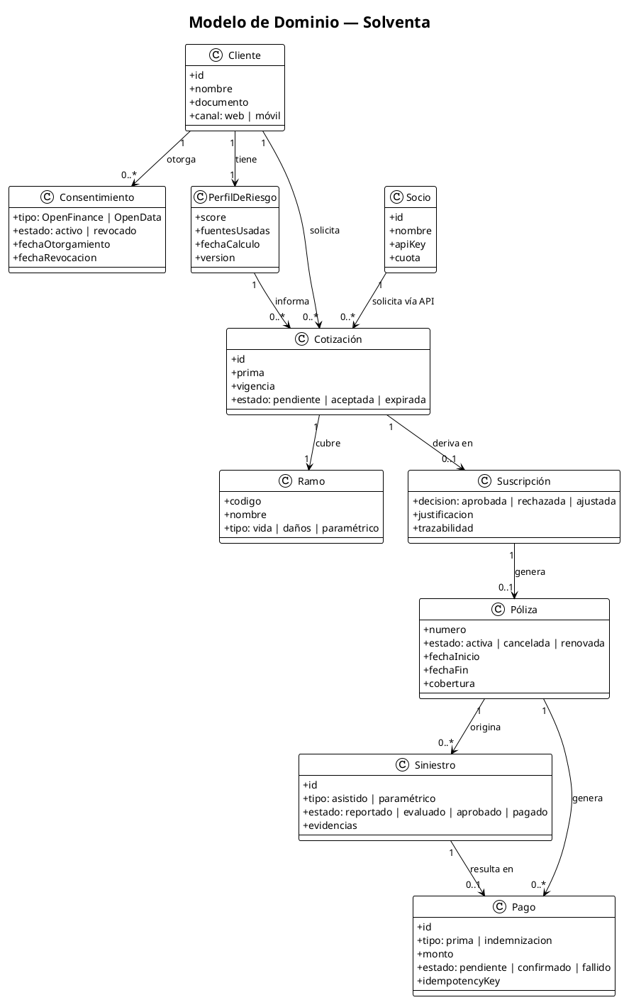
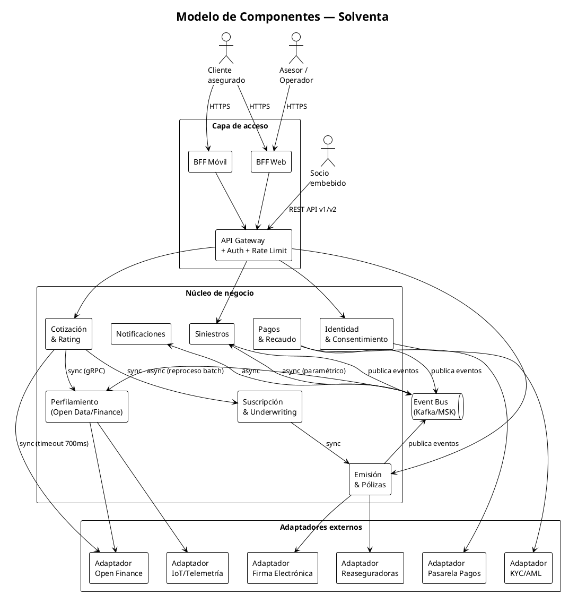
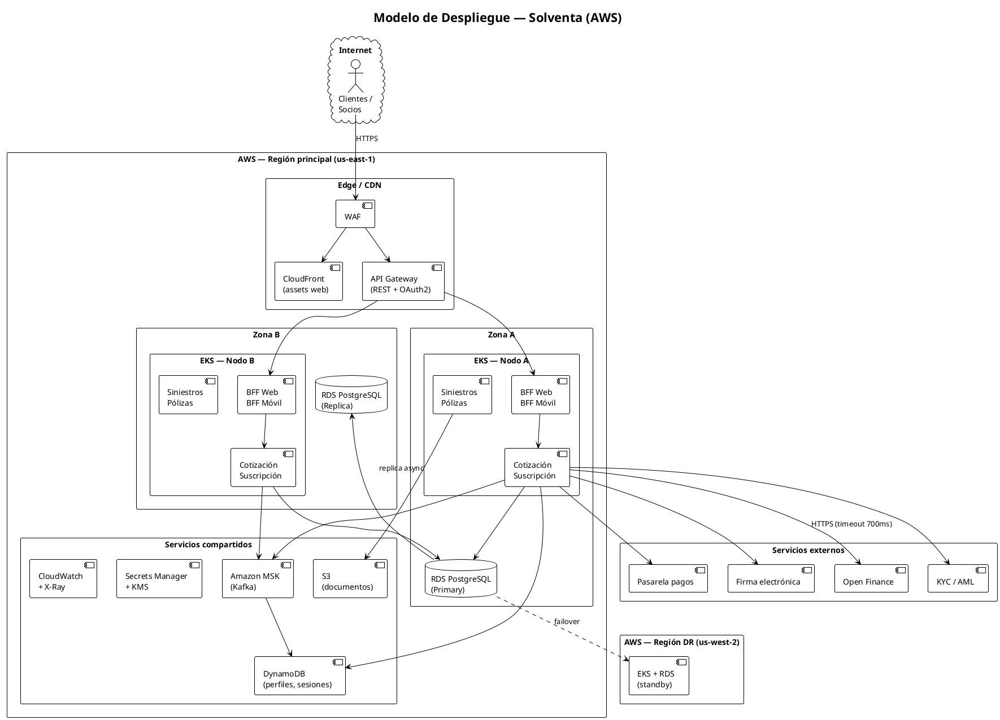

# Visión de Arquitectura — Solventa
**Proyecto:** MISW4501 · Proyecto Final — Universidad de los Andes
**Versión:** 1.0.0 | **Sprint 0 / Fase de descubrimiento** | **Fecha:** 16 de agosto de 2026

---

## 1. Problema de negocio a resolver

El mercado asegurador en América Latina opera con baja penetración, procesos manuales, tiempos de emisión de días y una experiencia de siniestros que erosiona la confianza del consumidor. Solventa nace en 2026 como aseguradora digital (insurtech) greenfield para resolver este problema: **cotizar, suscribir, emitir y pagar siniestros de forma casi instantánea**, embebiendo seguros directamente en el punto de necesidad del cliente (API-first / embedded insurance).

El diferenciador central es el uso de **Finanzas Abiertas (Open Finance)** y **Datos Abiertos (Open Data)** para construir perfiles de riesgo individualizados, lo que permite ofrecer coberturas personalizadas y precios competitivos. El caso insignia es el **seguro de vida hipotecario**, donde el perfil de riesgo se construye en tiempo real durante el flujo de originación del crédito, tensionando simultáneamente los seis atributos de calidad del sistema.

La pregunta central que la arquitectura debe responder es: **¿Cómo satisfacer simultáneamente latencia, escalabilidad, disponibilidad, seguridad, facilidad de modificación y facilidad de integración, y qué se gana y sacrifica con cada decisión?**

---

## 2. Objetivos de los stakeholders

| Stakeholder | Interés arquitectónico |
|---|---|
| **CEO / Junta directiva** | Crecimiento rápido, time-to-market, costo unitario bajo, reputación y continuidad del negocio |
| **CTO / Arquitectura** | Sostenibilidad técnica, evolvabilidad del sistema y control del costo de la nube |
| **Actuaría / Riesgo** | Precisión y trazabilidad del pricing; toda decisión de suscripción explicable y auditable |
| **Producto y crecimiento** | Rapidez para lanzar nuevos ramos; baja latencia en la cotización embebida |
| **Operaciones y siniestros** | Automatización del canal de siniestros; alta disponibilidad y tiempos de respuesta cortos |
| **Seguridad (CISO)** | Confidencialidad, gestión de consentimiento, superficie de ataque mínima, cumplimiento PCI-DSS |
| **Cumplimiento y legal** | Cumplimiento Ley 1581/2012 (habeas data), Decreto 1297/2022 y Circular 004/2024 SFC |
| **Finanzas (CFO)** | Costo total de propiedad predecible y eficiencia operativa |
| **Equipos dev / SRE** | Autonomía de despliegue, velocidad de entrega, observabilidad y baja carga cognitiva |
| **Cliente asegurado** | Inmediatez, transparencia y disponibilidad 24/7 en compra y siniestros |
| **Socios de distribución** | APIs estables, seguras y de baja latencia para embeber seguros en sus canales |
| **Regulador (SFC)** | Solvencia, protección al consumidor y cumplimiento de Open Finance |
| **Reaseguradoras** | Intercambio de datos de cartera y siniestralidad con exactitud y conciliación |

---

## 3. Riesgos identificados

| # | Riesgo | Probabilidad | Impacto | Mitigación arquitectónica |
|---|---|---|---|---|
| R1 | Falla o degradación de un proveedor externo (Open Finance, KYC, pagos) durante journeys críticos | Alta | Muy alto | Circuit breakers, timeouts duros (700 ms), caché de perfiles, degradación elegante con valor por defecto |
| R2 | Picos de tráfico 100× por campañas de socios (e.g. aerolínea lanza promo de seguro de viaje) | Media | Alto | Autoescalado horizontal en ≤ 60 s; aislamiento de carga por socio |
| R3 | Incumplimiento regulatorio (habeas data, PCI-DSS) por manejo inadecuado de PII y datos financieros | Media | Muy alto | Tokenización de PII, cifrado en tránsito/reposo, consentimiento revocable ≤ 5 min, trazabilidad 100% |
| R4 | Erosión de fronteras entre módulos (deuda técnica) que encarece cada cambio futuro | Media | Alto | Fronteras de dominio explícitas (DDD), APIs internas versionadas, pruebas de contrato entre servicios |
| R5 | Caída de una zona o región completa de nube | Baja | Muy alto | Multi-zona activo-activo; failover multi-región RTO ≤ 5 min / RPO ≤ 30 s |
| R6 | Cambios regulatorios frecuentes en Open Finance (estándar en maduración) que obligan a re-diseñar integraciones | Alta | Alto | Adaptadores por cada fuente externa; interfaz estable hacia adentro; cambio absorbido en el adaptador |
| R7 | Fraude en siniestros o en el proceso de onboarding biométrico | Media | Alto | Detección de patrón anómalo ≤ 1 s, trazabilidad completa, KYC/AML en tiempo real |

---

## 4. Restricciones de negocio y tecnología

### Restricciones de negocio
| # | Restricción |
|---|---|
| RN1 | Greenfield: no existen sistemas heredados. El diseño parte desde cero. |
| RN2 | El equipo de desarrollo es reducido (4 personas en el proyecto académico); la arquitectura debe permitir crecer sin reescribir el núcleo. |
| RN3 | Gran parte del valor depende de integraciones externas fuera del control de Solventa (Open Finance, KYC, pagos). |
| RN4 | La regulación de Finanzas Abiertas está en maduración; la arquitectura debe absorber cambios normativos sin impacto en el núcleo. |
| RN5 | Marco regulatorio supuesto: Ley 1581/2012 (habeas data), Decreto 1297/2022, Circular Externa 004/2024 SFC, PCI-DSS. |
| RN6 | Expansión planificada a México, Chile y Perú en 36 meses; la arquitectura debe soportar multi-región y multi-mercado. |

### Restricciones de tecnología
| # | Restricción |
|---|---|
| RT1 | Infraestructura 100% en la nube (AWS); elástica, multi-zona y preparada para multi-región. |
| RT2 | El producto debe ofrecerse mediante dos clientes: aplicación web y aplicación móvil, cada una con capacidades propias de su canal. |
| RT3 | Las APIs externas de distribución (socios embedded) deben estar versionadas para no obligar a redesplegar clientes ya instalados. |
| RT4 | Los datos personales y financieros deben estar cifrados en tránsito (TLS 1.3) y en reposo (AES-256); PII tokenizada. |
| RT5 | El proyecto académico tiene duración de 8 semanas y un equipo de 4 personas; la solución debe ser construible en ese plazo. |

---

## 5. Esfuerzo estimado

El proyecto tiene una duración de **8 semanas** (3 ago – 30 sep 2026) con un equipo de **4 personas** trabajando aproximadamente **24 horas semanales** en total.

| Fase | Semanas | Actividades principales | Esfuerzo estimado |
|---|---|---|---|
| Diseño y arquitectura (Sprint 0) | 1–2 | Visión, modelos, backlog de arquitectura, escenarios de calidad | 48 h |
| Experimentos de arquitectura | 3–5 | Diseño y ejecución de pruebas de concepto sobre atributos de calidad | 72 h |
| Desarrollo canal Web | 5–6 | Implementación de journeys core (cotización, suscripción, siniestro) | 48 h |
| Desarrollo canal Móvil | 6–7 | Onboarding, billetera, siniestro con cámara, notificaciones | 48 h |
| Integraciones y cierre | 7–8 | Open Finance, pagos, KYC; pruebas finales, documentación y entrega | 48 h |
| **Total** | **8 semanas** | | **~264 h** |

> El esfuerzo en esta visión está expresado como estimación de alto nivel (±30%). Se refinará en cada sprint según velocidad real del equipo.

---

## 6. Modelo de contexto

### Descripción
El modelo de contexto delimita la frontera de Solventa e identifica los actores y sistemas externos con los que interactúa.

**Actores (usuarios del sistema):**
- **Cliente asegurado** — accede vía app móvil o web para cotizar, comprar y gestionar siniestros
- **Asesor comercial** — usa el cliente web para venta asistida y gestión de pólizas
- **Socio de distribución** — integra Solventa vía API para ofrecer seguros embebidos en su canal
- **Operador de back-office** — gestiona siniestros, reportes y ciclo de vida de pólizas en la web
- **Regulador / auditor** — recibe reportes regulatorios y trazas de suscripción

**Sistemas externos:**
- Open Finance / agregadores de datos financieros (bancos, fintechs)
- Fuentes de Open Data (clima, geolocalización, listas oficiales)
- Proveedor KYC / AML (verificación de identidad y listas restrictivas)
- Pasarela de pagos / recaudo (PCI-DSS)
- Proveedor de firma electrónica
- Reaseguradoras (intercambio de cartera y siniestralidad)
- Proveedor de notificaciones (push, SMS, email)
- Telemetría / IoT (datos paramétricos: clima, vuelos)

### Diagrama de contexto (PlantUML — renderizar en draw.io o PlantUML online)

---

## 7. Modelo de dominio

### Descripción
El modelo de dominio representa las principales entidades del negocio de Solventa y sus relaciones. **No es un modelo de la solución técnica** — no contiene decisiones de implementación.

**Entidades principales:**
- **Cliente** — persona natural o jurídica asegurada; tiene consentimientos Open Finance y datos de perfil
- **Póliza** — contrato de seguro con cobertura, vigencia, prima y estado del ciclo de vida
- **Ramo** — tipo de seguro (viaje, dispositivos, vida hipotecario, paramétrico, etc.)
- **Cotización** — oferta de precio para un cliente, ramo y cobertura determinados
- **Prima** — monto a pagar por la póliza; calculado por el motor de rating
- **Suscripción** — decisión de aceptar/rechazar/ajustar el riesgo del cliente
- **Siniestro** — evento cubierto reportado por el cliente; tiene evaluación, resolución y pago
- **Perfil de riesgo** — combinación de señales Open Finance y Open Data para personalizar la oferta
- **Consentimiento** — autorización revocable del cliente para usar sus datos financieros
- **Socio** — empresa que distribuye seguros de Solventa vía API (embedded)
- **Pago** — transacción de cobro de prima o desembolso de indemnización

### Diagrama de dominio (PlantUML)

---

## 8. Modelo de componentes

### Descripción
El modelo de componentes presenta los grandes subsistemas de Solventa y los mecanismos de comunicación entre ellos.

**Decisiones de diseño de alto nivel:**
- **Arquitectura orientada a capacidades de negocio (DDD):** cada servicio agrupa una capacidad (cotización, suscripción, siniestros, etc.), alineado con los bounded contexts del dominio.
- **BFF (Backend for Frontend):** un BFF para web y otro para móvil optimizan la experiencia de cada canal sin exponer la lógica interna.
- **Event Bus:** comunicación asíncrona entre servicios para absorber picos (siniestros paramétricos, campañas masivas) y desacoplar productores de consumidores.
- **API Gateway:** punto de entrada único para socios externos y clientes, con autenticación, rate limiting y versionado.
- **Adaptadores de integración:** cada tercero externo (Open Finance, KYC, pagos) tiene su propio adaptador que aísla cambios externos del núcleo.

**Subsistemas principales:**

| Componente | Responsabilidad |
|---|---|
| API Gateway | Enrutamiento, autenticación, rate limiting, versionado de APIs |
| BFF Web | Orquestación de experiencias para el cliente web |
| BFF Móvil | Orquestación de experiencias para el cliente móvil |
| Cotización & Rating | Motor de pricing; combina reglas actuariales y señales Open Finance |
| Suscripción & Underwriting | Decisión de aceptar/rechazar/ajustar riesgo |
| Emisión & Pólizas | Ciclo de vida de la póliza (alta, cambios, renovación, cancelación) |
| Siniestros | Gestión de aviso, evaluación, aprobación y pago; automatización paramétrica |
| Perfilamiento | Orquesta Open Finance y Open Data para construir el perfil de riesgo |
| Identidad & Consentimiento | KYC, onboarding biométrico, gestión de consentimientos Open Finance |
| Pagos & Recaudo | Cobro de primas e indemnizaciones; idempotencia; integración PCI-DSS |
| Notificaciones | Envío de push, SMS y email |
| Event Bus | Cola de mensajes para comunicación asíncrona entre servicios |
| Adaptadores externos | Conectores para Open Finance, KYC/AML, pagos, firma, reaseguradoras, IoT |

### Diagrama de componentes (PlantUML)

---

## 9. Modelo de despliegue

### Descripción
El modelo de despliegue recoge las decisiones tecnológicas de infraestructura para Solventa.

**Decisiones clave:**
- **Proveedor:** AWS como proveedor de nube principal
- **Multi-zona:** despliegue activo-activo en al menos 2 zonas de disponibilidad (RTO zona ≤ 10 min)
- **Preparación multi-región:** arquitectura lista para expandirse a región adicional (RTO región ≤ 5 min)
- **Orquestación de contenedores:** Amazon EKS (Kubernetes) para todos los microservicios
- **Event streaming:** Amazon MSK (Kafka gestionado) para el bus de eventos
- **Bases de datos:**
  - Amazon RDS PostgreSQL (transaccional: pólizas, siniestros, pagos) con replica de lectura multi-zona
  - Amazon DynamoDB (perfiles de riesgo cacheados, sesiones, consentimientos) — baja latencia
  - Amazon S3 (documentos, pólizas PDF, evidencias de siniestro)
- **API Gateway:** Amazon API Gateway con autenticación OAuth 2.0 / JWT
- **CDN:** Amazon CloudFront para assets del cliente web
- **Observabilidad:** Amazon CloudWatch + AWS X-Ray (trazas distribuidas)
- **Seguridad:** AWS WAF, AWS Secrets Manager, AWS KMS (cifrado en reposo), VPC privada

### Ambientes de operación

| Ambiente | Propósito |
|---|---|
| Desarrollo (dev) | Pruebas locales del equipo; servicios externos mockeados |
| Staging | Integración completa; conectado a sandboxes de terceros |
| Producción | Multi-zona; conectado a proveedores reales |

### Diagrama de despliegue (PlantUML)

---

## 10. Backlog inicial de historias de arquitectura

| ID | Historia | Atributo de calidad | Prioridad |
|---|---|---|---|
| HA-01 | Como motor de cotización, debo responder a solicitudes de socios en p95 ≤ 250 ms incluso en horario pico | Latencia | Alta |
| HA-02 | Como plataforma, debo escalar de 500 a 50.000 cotizaciones/min en ≤ 60 s ante campaña masiva de socio | Escalabilidad | Alta |
| HA-03 | Como sistema de pagos, debo garantizar disponibilidad ≥ 99,99% con idempotencia y cero pérdida de transacciones | Disponibilidad | Alta |
| HA-04 | Como arquitectura, debo soportar la caída de una zona de nube con RTO ≤ 10 min y RPO ≤ 30 s | Disponibilidad | Alta |
| HA-05 | Como sistema, debo tokenizar PII y cifrar todos los datos de Open Finance en tránsito y reposo | Seguridad | Alta |
| HA-06 | Como plataforma, debo permitir agregar un nuevo ramo de seguro en ≤ 2 semanas-equipo sin tocar el núcleo | Facilidad de modificación | Media |
| HA-07 | Como API de socios, debo permitir dar de alta a un nuevo socio de distribución en ≤ 1 semana | Facilidad de integración | Media |
| HA-08 | Como motor de perfilamiento, debo construir el perfil de riesgo de vida hipotecario en p95 ≤ 400 ms | Latencia | Alta |
| HA-09 | Como sistema paramétrico, debo absorber ≥ 1.000.000 eventos de telemetría en 10 min sin pérdida | Escalabilidad | Media |
| HA-10 | Como BFF móvil, debo soportar modo offline para consulta de pólizas y sincronización posterior | Disponibilidad | Media |
