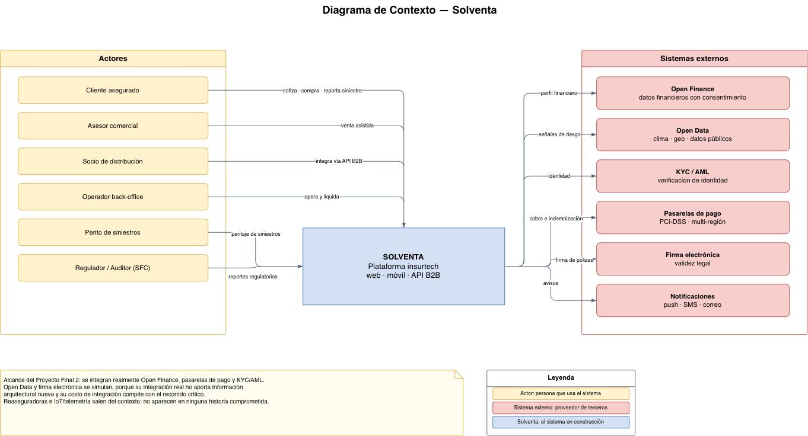
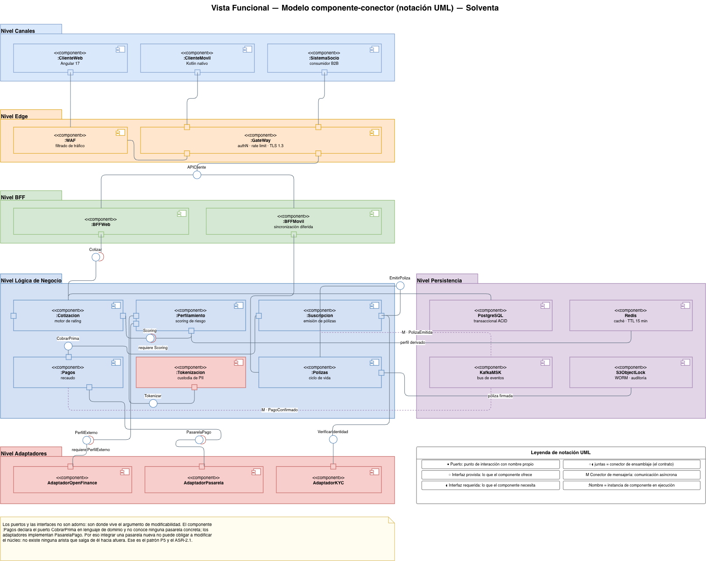
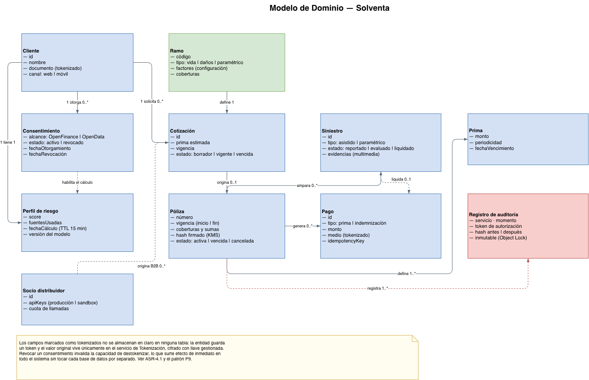
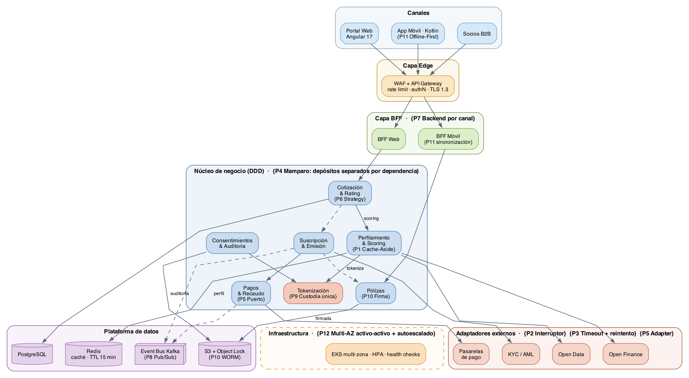
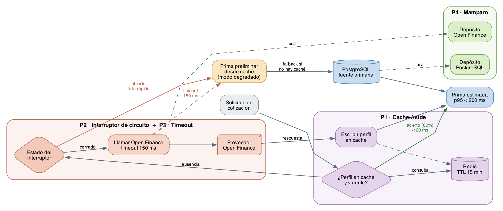
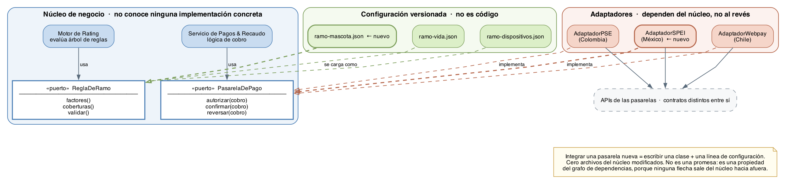
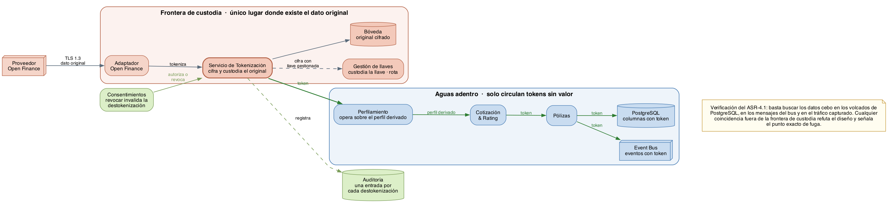

---portada
institucion: Universidad de los Andes
facultad: Facultad de Ingeniería · Departamento de Ingeniería de Sistemas y Computación
programa: Maestría en Ingeniería de Software
curso: MISW4501 — Proyecto Final
titulo: Avance Semana 4
subtitulo: Modelos de arquitectura, patrones de diseño, experimentos, estrategia de pruebas y plan de trabajo
proyecto: Proyecto Solventa — Aseguradora digital sobre Finanzas Abiertas
entrega: Avance de entrega  ·  el bloque de arquitectura y experimentos cierra en la semana 5
grupo: Grupo 2
integrantes: Jazmin Natalia Córdoba Puerto ~ Gerente del proyecto — Usabilidad y entrega|Juan Esteban Mejía Izasa ~ Web front, integración de APIs y pagos|Miguel Alejandro Gómez Alarcón ~ Arquitectura, Open Finance, KYC, rendimiento y seguridad|Angie Natalia Arandio Niño ~ Dominio, web back, móvil y pruebas unitarias
fecha: Bogotá D.C. · 30 de agosto de 2026
---

## Mapa de la entrega

Este documento contiene **la totalidad de los entregables de la semana 4**. Cada ítem de la rúbrica se encuentra completo dentro de estas páginas; no se remite a archivos externos para ningún contenido calificable.

**Sobre el alcance de esta entrega.** Las semanas 4 y 5 forman un solo bloque de trabajo cuyo entregable final es la semana 5. Este documento es el **avance de la semana 4**, y su foco está donde el curso indica que debe estar esta semana: la arquitectura. El diseño de los experimentos se presenta ya completo en su estructura, y la semana 5 se reserva para ajustar la arquitectura si el diseño detallado revela una carencia, cerrar la versión final de las fichas de experimento e incorporar los wireframes. Lo que se detalla en §7.8.

| # | Ítem de la rúbrica | Puntos | Dónde está en este documento |
|---|---|---|---|
| 1 | **Hoja de trabajo: modelos de arquitectura, patrones detallados y experimentos** | **70** | |
| 1a | Modelos de arquitectura — vista funcional, de despliegue y de información | 20 | §2.1 declara el estilo de arquitectura y lo justifica; §2.2 a §2.5 desarrollan seis modelos: contexto, funcional, componente-conector en notación UML, despliegue, información y dominio |
| 1b | Diseño detallado con patrones y razonamiento, en relación con los ASR | 30 | §3: vista de asignación de patrones, matriz de trazabilidad patrón→táctica→componente→ASR, estructura de los patrones críticos y los doce patrones en detalle. §4: decisiones y alternativas descartadas |
| 1c | Propuesta de experimentos — propósito, respuesta esperada, tecnologías y esfuerzo | 20 | §5: criterio para decidir cuántos experimentos, tres fichas completas y las cinco alternativas evaluadas y descartadas con su razón |
| 2 | **Refinamiento de la estrategia de pruebas** | **10** | §6 |
| 3 | **Actualización del plan de trabajo y tablero** | **10** | §7: qué es un punto de historia, cálculo de la capacidad del equipo, dónde se gasta en el Proyecto Final 1, compromiso del backlog contra los tres sprints del Proyecto Final 2, viabilidad de construcción y estado del tablero |
| 4 | **Video con evidencias** | **10** | §8, con el enlace y el guion completo por presentador |
| — | *Corrección de la entrega de la semana 3* | *Reentrega* | §9, con remisión al documento de historias de usuario v2.0 |

**Documento que acompaña esta entrega.** El backlog completo de 62 historias de usuario con sus criterios de aceptación, el cálculo de la capacidad del equipo y el corte de alcance entre Proyecto Final 1 y 2 están en `historias_de_usuario_v2.docx`, que constituye la corrección del entregable de la semana 3. En §9 se resume qué se corrigió y dónde verificarlo.

---

## 1. Contexto y atributos de calidad que dirigen el diseño

Solventa es una aseguradora digital nativa en la nube construida sobre Finanzas Abiertas y Datos Abiertos. Su promesa de negocio —cotizar, suscribir, emitir y pagar siniestros de forma casi instantánea, embebiendo el seguro en el punto de necesidad del cliente— impone exigencias que no se resuelven eligiendo bien un framework, sino decidiendo bien la estructura del sistema.

El diseño que se presenta en este documento no parte de una preferencia tecnológica sino de los nueve escenarios de calidad (ASR) definidos en la semana 3. Cada decisión estructural que se documenta a continuación existe porque hay al menos un ASR que la exige.

| ASR | Atributo | Medida de respuesta | Consecuencia arquitectural |
|---|---|---|---|
| ASR-1.1 | Latencia | p95 < 200 ms con 500 req/min | Caché de perfiles, cálculo asíncrono de lo no crítico |
| ASR-1.2 | Latencia bajo degradación | p95 < 200 ms desde caché, 0% de pérdida | Circuit breaker, timeout agresivo, degradación elegante |
| ASR-2.1 | Modificabilidad | Nueva pasarela en < 4 horas-hombre, 0 cambios en el núcleo | Puertos y adaptadores, inversión de dependencias |
| ASR-2.2 | Modificabilidad | Nuevo ramo en ≤ 2 semanas, 0 cambios en el motor de rating | Configuración externalizada, motor parametrizado |
| ASR-3.1 | Disponibilidad | Recuperación < 30 s, ≥ 99,9% | Fallback a fuente primaria, health checks, bulkhead |
| ASR-3.2 | Disponibilidad multi-zona | RTO ≤ 10 min, RPO ≤ 30 s | Despliegue activo-activo multi-AZ, réplica con promoción |
| ASR-3.3 | Continuidad offline | 100% de consultas sin conexión, sync ≤ 10 s | Cliente offline-first, almacenamiento local cifrado |
| ASR-4.1 | Confidencialidad | 100% TLS 1.3, 0 PII en texto plano | Tokenización de PII, cifrado en tránsito y reposo |
| ASR-4.2 | Integridad | Alerta de alteración no autorizada < 1 s | Firma digital, almacenamiento inmutable, auditoría |

**Restricciones que acotan el espacio de diseño**

- Contenedores obligatorios para todos los microservicios; nada se instala en el sistema anfitrión.
- PostgreSQL como almacenamiento transaccional primario; no se admite una base NoSQL en ese rol.
- Cumplimiento de Ley 1581 de 2012, Decreto 1297 de 2022, Circular Externa 004 de 2024 y PCI-DSS.
- Consentimiento revocable con efecto en menos de 5 minutos.
- Expansión a México, Chile y Perú dentro de 36 meses, lo que obliga a que la regionalización sea configuración y no una bifurcación del código.

---

## 2. Modelos de arquitectura

### 2.1 Estilo de arquitectura

Antes de presentar las vistas conviene declarar el **estilo** que gobierna la solución, porque es la decisión de la que dependen todas las demás. Solventa no adopta un estilo puro sino una **combinación deliberada de tres**, cada uno resolviendo un problema que los otros no resuelven bien.

| Estilo | Dónde se aplica | Qué problema resuelve | ASR que lo exige |
|---|---|---|---|
| **Microservicios** | Núcleo de negocio: siete servicios delimitados por contexto de dominio | Permite escalar y desplegar de forma independiente el servicio con exigencia de latencia, sin arrastrar a los demás | ASR-1.1 · ASR-3.2 |
| **Por capas** | Edge → BFF → Núcleo → Adaptadores | Confina las responsabilidades transversales —seguridad en el borde, formato por canal en el BFF, integración externa en los adaptadores— para que no se repitan en cada servicio | ASR-2.1 · ASR-4.1 |
| **Orientado a eventos** | Comunicación asíncrona entre servicios del núcleo vía Event Bus | Saca del camino crítico todo lo que no es necesario para responder al usuario y desacopla productores de consumidores | ASR-1.2 · ASR-2.1 |

**Por qué microservicios y no un monolito modular.** Un monolito habría simplificado el desarrollo en el plazo disponible, y esa era una alternativa seria. Se descartó por una razón concreta y no por moda: el servicio de Perfilamiento y Scoring es el único con una exigencia de latencia de 200 ms y el único que enfrenta picos de diez veces el tráfico normal durante campañas de socios. En un monolito, escalar ese componente obliga a replicar todo el sistema, lo que multiplica el costo de infraestructura por una necesidad que solo tiene una parte. La independencia de despliegue no es un fin: es lo que hace económicamente viable el ASR-1.1.

**Por qué capas sobre los microservicios.** Los microservicios por sí solos no dicen dónde vive la autenticación, ni el formato de respuesta por canal, ni la traducción hacia proveedores externos. Sin capas, cada servicio termina implementando su propia versión de esas tres cosas, que es la principal fuente de inconsistencias de seguridad en arquitecturas de microservicios. Las capas asignan un único lugar a cada responsabilidad transversal.

**Por qué eventos además de llamadas sincrónicas.** La emisión de una póliza dispara efectos en cuatro servicios. Si Emisión los llamara de forma sincrónica, su latencia sería la suma de las cuatro y su disponibilidad el producto de las cuatro. El estilo orientado a eventos convierte esa suma en una sola escritura al bus. La contrapartida es consistencia eventual, que se acepta para efectos secundarios pero **no** para el cobro de la prima, que permanece sincrónico dentro de la transacción de emisión.

**Lo que el estilo deja fuera.** No se adopta arquitectura sin servidor para el núcleo, pese a que encajaría con los picos de tráfico, porque los arranques en frío son incompatibles con un presupuesto de 200 ms y porque el equipo no tiene experiencia previa que permita estimar su comportamiento con confianza. Tampoco se adopta una malla de servicios: aportaría observabilidad y control de tráfico, pero su costo de operación no se justifica con siete servicios y un equipo de cuatro personas.

### 2.2 Vista de contexto

Antes de descomponer el sistema conviene fijar su frontera: quién lo usa, de qué terceros depende y qué intercambia con cada uno.



**Seis actores.** El cliente asegurado es el usuario principal, pero no el único que impone requisitos: el regulador exige reportes trazables, el perito necesita acceso acotado a la evidencia de un siniestro, y el socio de distribución consume la plataforma por API sin pasar nunca por la interfaz. Ese último es el que obliga a que la API B2B sea un canal de primera clase y no un añadido.

**Cinco sistemas externos, con distinto grado de compromiso.** La distinción importa para el alcance: en el Proyecto Final 2 se integran realmente Open Finance, las pasarelas de pago y KYC/AML, porque son los que introducen incertidumbre arquitectural. Open Data y firma electrónica se simulan: su integración real no aporta información de diseño nueva y su costo compite con el recorrido crítico.

**Lo que salió del contexto.** Las versiones anteriores incluían reaseguradoras e IoT/telemetría como sistemas externos. Se retiran porque no aparecen en ninguna historia del backlog comprometido, y un contexto que muestra integraciones que nadie va a construir describe un sistema que no existe.

### 2.3 Vista funcional

La vista funcional muestra cómo se descompone el sistema en componentes y cómo colaboran para atender los recorridos de negocio. La estructura es de cuatro capas más una plataforma de datos transversal.


**Capa de canales.** Tres consumidores con necesidades distintas: el portal web en Angular, la aplicación móvil nativa en Kotlin y los sistemas de socios distribuidores que consumen la API B2B. Son deliberadamente delgados: no contienen reglas de negocio, porque una regla que vive en el canal debe reimplementarse en cada canal nuevo.

**Capa Edge.** Concentra lo que debe ocurrir antes de que una petición toque lógica de negocio: filtrado de tráfico malicioso en el WAF, y en el API Gateway la autenticación, la limitación de tasa por cliente y por socio, y la terminación TLS. Situar esto en el borde evita que cada servicio reimplemente controles de seguridad, que es la principal fuente de inconsistencias de seguridad en arquitecturas de microservicios.

**Capa BFF.** Un backend por canal. El BFF Web compone respuestas orientadas a pantallas amplias con muchos datos por petición; el BFF Móvil compone respuestas compactas y además gestiona el protocolo de sincronización offline. Sin esta capa, o bien el núcleo se contamina con formatos específicos de canal, o bien el móvil paga el costo de recibir cargas útiles pensadas para web.

**Núcleo de negocio.** Siete servicios delimitados por contexto de dominio: Cotización y Rating, Perfilamiento y Scoring, Suscripción y Emisión, Pólizas, Siniestros, Pagos y Recaudo, y Consentimientos y Auditoría. La frontera de cada servicio coincide con una frontera de lenguaje del negocio, no con una capa técnica. Los servicios se comunican de forma síncrona solo cuando el resultado es necesario para responder al usuario; el resto de la colaboración ocurre por eventos.

**Plataforma de datos.** PostgreSQL para lo transaccional, Redis como caché de perfiles de riesgo, Kafka como bus de eventos de dominio y almacenamiento de objetos con bloqueo de escritura para documentos y auditoría.

**Adaptadores externos.** Cada proveedor externo —Open Finance, Open Data, KYC/AML, pasarelas de pago y firma electrónica— se alcanza exclusivamente a través de un adaptador que traduce entre el modelo del proveedor y el modelo de dominio de Solventa. Ningún servicio del núcleo conoce el formato de un proveedor.


#### El mismo nivel funcional como modelo componente-conector

La vista anterior sirve para orientarse, pero sus flechas no dicen si una interacción es síncrona o asíncrona ni cuál es el contrato que se usa. El modelo siguiente expresa la misma estructura en **notación UML de componente-conector**, donde cada símbolo tiene significado definido.



| Símbolo | Qué es | Qué comunica |
|---|---|---|
| Cuadrado sobre el borde | **Puerto** | Punto de interacción con nombre propio; aísla el interior del componente de su exterior |
| Círculo | **Interfaz provista** | Lo que el componente ofrece |
| Semicírculo | **Interfaz requerida** | Lo que el componente necesita |
| Círculo encajado en semicírculo | **Conector de ensamblaje** | El contrato concreto entre dos componentes |
| Conector marcado con **M** | Conector de mensajería | Comunicación asíncrona por el bus de eventos |
| Nombre precedido de dos puntos | Instancia de componente | Algo que se ejecuta, no un tipo |

**Por qué esta notación y no cajas genéricas.** Los puertos y las interfaces son exactamente donde vive el argumento de modificabilidad del ASR-2.1. El componente `:Pagos` declara el puerto `CobrarPrima` en lenguaje de dominio —autorizar, confirmar, reversar— y no conoce ninguna pasarela concreta; los adaptadores implementan `PasarelaPago`. Integrar una pasarela nueva no puede obligar a modificar el núcleo porque no existe ninguna arista que salga de él hacia afuera. Con cajas genéricas eso hay que afirmarlo en prosa; en notación UML se lee en el diagrama.

**Los ocho contratos del sistema.** El modelo nombra las interfaces que constituyen la frontera entre componentes: `APICliente`, `Cotizar`, `Scoring`, `Tokenizar`, `CobrarPrima`, `EmitirPoliza`, `PerfilExterno`, `PasarelaPago` y `VerificarIdentidad`. Esa lista es el contrato que el Proyecto Final 2 debe respetar: los tutores validarán que el código se conforme a esta arquitectura, y estas interfaces son la parte verificable de ese compromiso.

### 2.4 Vista de despliegue

La vista de despliegue muestra dónde se ejecuta cada componente y qué mecanismos de redundancia lo protegen.


**Distribución activo-activo.** Los nodos de EKS están repartidos entre dos zonas de disponibilidad y ambas reciben tráfico simultáneamente. No es una configuración activo-pasivo: si una zona cae, la capacidad de la otra ya está caliente y sirviendo peticiones, lo que hace que el tiempo de recuperación dependa del tiempo de detección del balanceador y no del tiempo de arranque de instancias. Esta es la decisión que hace alcanzable el RTO de 10 minutos del ASR-3.2.

**Datos.** RDS PostgreSQL opera en configuración multi-AZ con réplica en espera y promoción automática. La replicación síncrona hacia la zona B es lo que sostiene el RPO de 30 segundos. Redis y los brokers de Kafka también están replicados entre zonas.

**Región de recuperación.** Una réplica de lectura entre regiones hacia us-west-2 y replicación entre regiones del almacenamiento de objetos cubren el escenario de pérdida completa de la región principal. Este escenario está fuera del alcance de los experimentos del Proyecto Final 1, pero se documenta porque condiciona decisiones de diseño que sí se toman ahora, como no depender de identificadores generados localmente por instancia.

**Servicios regionales.** El servicio de gestión de llaves cifra los datos en reposo y firma las pólizas emitidas; el almacenamiento de objetos con bloqueo de escritura garantiza que un registro de auditoría no pueda alterarse ni siquiera con credenciales administrativas; la observabilidad centralizada recoge métricas y trazas distribuidas de todos los servicios.

### 2.5 Vista de información

La vista de información muestra las entidades de dominio, cómo se clasifican sus datos según sensibilidad y dónde se persiste cada clase.


**Entidades de dominio.** El cliente es la entidad raíz. De él dependen su perfil de riesgo, sus consentimientos y sus cotizaciones. Una cotización origina una póliza; una póliza ampara siniestros y genera pagos. Los socios distribuidores originan cotizaciones por el canal B2B, lo que significa que el modelo debe soportar una cotización sin cliente registrado previamente.

**Clasificación de datos.** El sistema clasifica los datos en tres niveles y el nivel determina el tratamiento, no la preferencia del desarrollador:

| Nivel | Contenido | Tratamiento |
|---|---|---|
| Restringido | Información personal identificable, datos financieros de Open Finance, datos de medios de pago | Tokenizado antes de persistirse; el dato original solo existe en el servicio de tokenización, cifrado con llave gestionada |
| Confidencial | Pólizas, siniestros, consentimientos | Cifrado en reposo; los documentos además firmados digitalmente |
| Interno | Catálogos de ramos, tarifas, parámetros de configuración | Sin cifrado especial; su exposición no genera daño |

Esta clasificación es la que hace verificable el ASR-4.1: la afirmación «cero datos personales en texto plano» solo se puede comprobar si antes se declaró qué cuenta como dato personal.

#### Modelo de dominio detallado

La vista anterior resume las entidades para poder relacionarlas con su clasificación. El modelo siguiente las desarrolla con sus atributos y cardinalidades, que es lo que se traduce en esquema de base de datos.



Tres decisiones del modelo merecen explicación:

**Los campos marcados como tokenizados no se almacenan en claro en ninguna tabla.** La entidad guarda un token y el valor original vive únicamente en el servicio de Tokenización. Por eso `Cliente.documento` y `Pago.medio` aparecen anotados: son los dos puntos por donde entra información personal al modelo.

**El registro de auditoría es una entidad de primera clase, no un efecto secundario.** Aparece con sus atributos y su relación con Póliza porque el ASR-4.2 exige que sea inmutable y retenido cinco años; tratarlo como una tabla de log accesoria llevaría a diseñarlo sin esa garantía.

**Ramo es una entidad de configuración, no de código.** Sus factores y coberturas se cargan desde configuración versionada, que es lo que sostiene el ASR-2.2: agregar un ramo nuevo es cargar una definición, no modificar el motor de rating.


**Persistencia.** PostgreSQL guarda el estado transaccional; Redis guarda perfiles de riesgo con vencimiento de 15 minutos, lo que acota la ventana de exposición de datos derivados; el almacenamiento de objetos guarda documentos firmados y el registro de auditoría en modo de solo escritura; Kafka retiene los eventos de dominio 7 días para permitir su reproceso.

---

## 3. Diseño detallado — patrones aplicados y su razonamiento

Esta sección documenta cada patrón estructural adoptado. Para cada uno se indica el problema concreto que resuelve, el ASR que lo motiva, cómo se aplica en Solventa y qué se sacrifica al adoptarlo. Un patrón sin contrapartida declarada suele ser un patrón que no se entendió.

### 3.1 Tabla resumen

| # | Patrón | ASR que atiende | Componente donde se aplica |
|---|---|---|---|
| P1 | Caché de perfiles con lectura anticipada | ASR-1.1, ASR-1.2 | Perfilamiento y Scoring · Redis |
| P2 | Interruptor de circuito | ASR-1.2, ASR-3.1 | Adaptadores externos |
| P3 | Tiempo de espera acotado con reintento y espera creciente | ASR-1.2 | Adaptadores externos |
| P4 | Mamparo de aislamiento | ASR-3.1 | Núcleo de negocio |
| P5 | Puertos y adaptadores | ASR-2.1 | Adaptadores externos · núcleo |
| P6 | Estrategia con configuración externalizada | ASR-2.2 | Cotización y Rating |
| P7 | Backend por canal | ASR-3.3 | Capa BFF |
| P8 | Publicación y suscripción de eventos de dominio | ASR-1.2, ASR-2.1 | Event Bus |
| P9 | Tokenización de datos sensibles | ASR-4.1 | Consentimientos · Perfilamiento |
| P10 | Almacenamiento inmutable con firma digital | ASR-4.2 | Pólizas · auditoría |
| P11 | Cliente con prioridad al modo desconectado | ASR-3.3 | App móvil · BFF Móvil |
| P12 | Autoescalado con comprobaciones de salud | ASR-3.2 | EKS |

### 3.2 Marco: patrón, táctica y su relación con el ASR

Los tres conceptos operan en niveles distintos y conviene no confundirlos, porque el profesor evalúa la relación entre ellos:

| Concepto | Qué es | Ejemplo en Solventa |
|---|---|---|
| **Atributo de calidad (ASR)** | La propiedad que el sistema debe exhibir, expresada como escenario medible | ASR-1.1: p95 < 200 ms con 500 req/min |
| **Táctica** | Una decisión de diseño elemental que influye sobre un atributo de calidad. Es el «qué se hace» | Mantener múltiples copias de datos computados |
| **Patrón** | Una composición de tácticas con una estructura conocida y contrapartidas documentadas. Es el «cómo se materializa» | Cache-Aside, que compone esa táctica con una política de vencimiento y una de escritura |

La cadena de razonamiento que sigue este documento es siempre la misma: **un ASR exige una propiedad → esa propiedad se consigue con una o varias tácticas → esas tácticas se materializan en un patrón → ese patrón se asigna a componentes concretos → un experimento mide si funcionó.**

### 3.3 Vista de asignación de patrones

Esta vista muestra dónde vive cada patrón dentro de la arquitectura. Las anotaciones entre llaves indican el patrón que gobierna ese componente o esa capa.



Tres observaciones sobre la asignación:

1. **Los patrones de disponibilidad se concentran en la frontera con lo externo.** El interruptor de circuito, el tiempo de espera acotado y el adaptador viven todos en la capa de adaptadores, porque es ahí donde el sistema deja de controlar lo que ocurre. Ningún servicio del núcleo implementa resiliencia frente a terceros: la hereda de la frontera.
2. **El mamparo es transversal al núcleo y no un componente.** No aparece como una caja porque no lo es: es la política de que cada servicio tenga depósitos de recursos separados por dependencia. Se representa como propiedad de la capa.
3. **La tokenización es el único componente del núcleo dibujado en color de frontera.** Es deliberado: aunque se ejecuta dentro del núcleo, actúa como frontera de custodia, y esa dualidad es lo que hace verificable el ASR-4.1.

### 3.4 Matriz de trazabilidad

Cada fila se lee así: el patrón materializa esas tácticas, vive en esos componentes, existe para satisfacer ese ASR, y ese experimento comprueba si lo consigue.

| Patrón | Tácticas que materializa | Componentes donde vive | ASR | Experimento |
|---|---|---|---|---|
| **P1** Cache-Aside | Mantener múltiples copias de datos computados · Reducir la demanda computacional en el camino crítico | Perfilamiento · Redis | ASR-1.1 · ASR-1.2 | EXP-01 |
| **P2** Interruptor de circuito | Detectar fallas por tasa de respuesta · Degradación elegante | Adaptadores externos | ASR-1.2 · ASR-3.1 | EXP-02 |
| **P3** Tiempo de espera con reintento | Acotar el tiempo de espera · Reintento de operaciones idempotentes | Adaptadores externos | ASR-1.2 | EXP-02 |
| **P4** Mamparo de aislamiento | Contener el fallo limitando recursos compartidos | Todo el núcleo (depósitos por dependencia) | ASR-3.1 | EXP-02 (instrumentado) |
| **P5** Puertos y adaptadores | Encapsular la variabilidad · Invertir dependencias · Diferir el enlace | Pagos & Recaudo · capa de adaptadores | ASR-2.1 | EXP-03 |
| **P6** Strategy con configuración externalizada | Encapsular la variabilidad · Diferir el enlace al despliegue | Cotización & Rating · configuración de ramos | ASR-2.2 | EXP-03 |
| **P7** Backend por canal | Aislar la variabilidad del canal · Reducir el acoplamiento entre canales | BFF Web · BFF Móvil | ASR-3.3 | Prototipo móvil |
| **P8** Publicación y suscripción | Sacar del camino crítico lo no esencial · Desacoplar productor y consumidor | Event Bus · servicios del núcleo | ASR-1.2 · ASR-2.1 | EXP-02 |
| **P9** Tokenización | Limitar el acceso por custodia centralizada · Cifrar en tránsito y reposo · Auditar cada acceso | Tokenización · Perfilamiento · Consentimientos | ASR-4.1 | EXP-03 |
| **P10** Almacenamiento inmutable con firma | Verificar integridad · Registro no repudiable · Autorizar por token de servicio | Pólizas · Object Storage · Auditoría | ASR-4.2 | Prueba de configuración |
| **P11** Cliente offline-first | Mantener copia local · Sincronización diferida · Acotar la vigencia del dato replicado | App móvil · BFF Móvil | ASR-3.3 | Prototipo móvil |
| **P12** Multi-AZ con autoescalado | Redundancia activa · Replicación síncrona · Detección por comprobación de salud | EKS · RDS · MSK | ASR-3.2 | Proyecto Final 2 |

**Cobertura.** Los nueve ASR quedan cubiertos por al menos un patrón, y los doce patrones tienen al menos un ASR que los justifica. No hay patrones huérfanos —adoptados sin un requisito que los exija— ni ASR sin mecanismo asignado.

### 3.5 Estructura de los patrones críticos

Los tres patrones siguientes se detallan estructuralmente porque son los que sostienen los ASR de mayor exigencia y los que más fácilmente se implementan mal.

#### El camino de latencia: P1 + P2 + P3 + P4 operando juntos

Los cuatro patrones del camino crítico no actúan por separado sino como una cadena de decisiones. Este diagrama muestra el recorrido completo de una solicitud de cotización y dónde interviene cada uno.



La lectura importante es que **hay tres salidas distintas hacia una respuesta válida** y ninguna es un error: acierto de caché en menos de 20 ms, respuesta del proveedor dentro del presupuesto de 150 ms, o prima preliminar en modo degradado. El sistema nunca se queda esperando, que es precisamente lo que exige la medida de «0% de solicitudes perdidas» del ASR-1.2.

#### La modificabilidad: P5 + P6 y la dirección de las dependencias



Lo relevante de este diagrama no son las cajas sino **el sentido de las flechas**. El núcleo define los puertos `PasarelaDePago` y `ReglaDeRamo` y no depende de nada externo; los adaptadores y los archivos de configuración apuntan *hacia* el núcleo. Por eso la afirmación del ASR-2.1 —«cero cambios en servicios del núcleo»— no es una promesa de disciplina del equipo sino una propiedad estructural: agregar `AdaptadorSPEI` no puede obligar a modificar el núcleo porque no existe ninguna arista que vaya en esa dirección.

#### La confidencialidad: P9 y la frontera de custodia



El diagrama define una **frontera de custodia**. A su izquierda existe el dato original; a su derecha solo existen tokens, que no tienen valor si se filtran. Esa frontera es lo que convierte el ASR-4.1 en algo verificable: para comprobar que no hay datos personales en texto plano basta con inspeccionar todo lo que hay a la derecha y comprobar que solo aparecen tokens. Sin la frontera, la verificación tendría que ser exhaustiva sobre los siete servicios del núcleo.

Además, **revocar un consentimiento se reduce a invalidar la capacidad de destokenizar**, lo que surte efecto de inmediato en todo el sistema. Con el dato replicado en cada servicio, cumplir el plazo regulatorio de 5 minutos exigiría borrarlo en siete bases de datos y demostrarlo.

### 3.6 P1 — Caché de perfiles con lectura anticipada

**Problema.** El cálculo del perfil de riesgo requiere consultar Open Finance y Open Data. Esas consultas tardan cientos de milisegundos en el mejor caso. Si la cotización espera esa consulta de forma sincrónica, el objetivo de 200 ms del ASR-1.1 es inalcanzable por construcción: ninguna optimización interna compensa una llamada de red externa a un tercero.

**Aplicación.** El servicio de Perfilamiento consulta primero Redis. Si el perfil está presente y vigente, responde desde caché. Si no, consulta al proveedor externo, responde y almacena el resultado con vencimiento de 15 minutos. Para los clientes que llegan por un socio distribuidor con campaña programada, el perfil se precalcula en lote antes de la campaña.

**Razonamiento frente al ASR.** El ASR-1.1 exige p95 menor a 200 ms con 500 peticiones por minuto. Con una tasa de acierto de caché del 80% —conservadora para una ventana de 15 minutos en un flujo de cotización donde el usuario itera sobre planes— el percentil 95 queda determinado por el camino de caché y no por el camino externo. El ASR-1.2 va más lejos: exige que bajo degradación del proveedor el sistema siga respondiendo en 200 ms, lo que solo es posible si el perfil cacheado puede servir como respuesta válida y no solo como optimización.

**Contrapartida aceptada.** Un perfil cacheado puede estar hasta 15 minutos desactualizado. Para un scoring de seguro esto es tolerable: la situación financiera de una persona no cambia de forma material en ese intervalo. No sería tolerable para un saldo de cuenta, y por eso el caché se aplica al perfil derivado y nunca al dato financiero crudo.

### 3.7 P2 — Interruptor de circuito

**Problema.** Cuando un proveedor externo se degrada, el modo de falla más dañino no es que responda con error, sino que responda lento. Las peticiones se acumulan, los hilos del servicio se agotan esperando, y un problema de un proveedor se convierte en la caída completa de Solventa.

**Aplicación.** Cada adaptador externo está envuelto en un interruptor con tres estados. En estado cerrado las peticiones fluyen normalmente. Cuando la proporción de fallos o de respuestas por encima del umbral de tiempo supera el 50% en una ventana móvil, el interruptor abre y las peticiones siguientes fallan de inmediato sin tocar la red, activando la ruta de degradación. Tras un intervalo, el interruptor pasa a semiabierto y deja pasar un número reducido de peticiones de prueba.

**Razonamiento frente al ASR.** El ASR-1.2 describe exactamente este escenario: 5.000 peticiones concurrentes con el proveedor respondiendo por encima de 700 ms, y exige 0% de peticiones perdidas. Sin interruptor, las peticiones se pierden por agotamiento de recursos. Con interruptor, la petición no se pierde: se atiende por la ruta degradada usando el perfil cacheado. La diferencia entre cumplir y no cumplir el ASR-1.2 no está en la velocidad del sistema sino en su capacidad de dejar de esperar a tiempo.

**Contrapartida aceptada.** Durante la apertura del interruptor, clientes cuyo perfil no está en caché reciben una cotización preliminar en lugar de una definitiva. Se prefiere una respuesta aproximada e inmediata sobre una respuesta exacta que no llega.

### 3.8 P3 — Tiempo de espera acotado con reintento y espera creciente

**Problema.** Un tiempo de espera mal calibrado anula el interruptor de circuito. Si el tiempo de espera del cliente supera el del usuario, el usuario abandona antes de que el sistema decida.

**Aplicación.** Cada llamada externa tiene un tiempo de espera explícito, derivado hacia atrás desde el presupuesto de latencia total: si el objetivo extremo a extremo es 200 ms, el adaptador de Open Finance no puede tener un tiempo de espera de 3 segundos. Los reintentos se aplican solo a operaciones idempotentes, con espera creciente y un componente aleatorio para no sincronizar a todos los clientes en la misma reintentada.

**Razonamiento frente al ASR.** Es el patrón que hace operativo el presupuesto de latencia del ASR-1.1. Un presupuesto de latencia que no se traduce en tiempos de espera configurados es una intención, no un mecanismo.

**Contrapartida aceptada.** Tiempos de espera agresivos aumentan la proporción de respuestas degradadas cuando la red está lenta pero funcional. Se acepta porque el ASR prioriza responder a tiempo sobre responder con el dato más fresco.

### 3.9 P4 — Mamparo de aislamiento

**Problema.** Servicios que comparten un mismo depósito de conexiones o de hilos se hunden juntos. Si Siniestros agota el depósito de conexiones a la base de datos, Cotización deja de responder aunque no tenga ningún problema propio.

**Aplicación.** Cada servicio tiene depósitos de recursos separados por dependencia: un depósito de conexiones para PostgreSQL, otro para Redis, otro por cada adaptador externo. En Kubernetes, cada servicio tiene límites propios de CPU y memoria.

**Razonamiento frente al ASR.** El ASR-3.1 exige disponibilidad de 99,9% con recuperación en menos de 30 segundos ante la caída de Redis. Sin aislamiento, la caída de Redis propaga la saturación a las conexiones de PostgreSQL y la recuperación deja de depender solo de Redis. Con aislamiento, el fallo queda confinado y la ruta de respaldo hacia PostgreSQL tiene recursos disponibles para operar.

**Contrapartida aceptada.** Se desperdicia capacidad: recursos reservados para una dependencia inactiva no se prestan a otra. Es el costo directo de que un fallo no se propague.

### 3.10 P5 — Puertos y adaptadores

**Problema.** El ASR-2.1 exige integrar una pasarela de pagos nueva en menos de 4 horas-hombre y sin modificar ningún servicio del núcleo. Si el servicio de Pagos conoce el formato de la pasarela, cada pasarela nueva obliga a modificarlo, probarlo y desplegarlo.

**Aplicación.** El núcleo define un puerto —una interfaz expresada en el lenguaje del dominio: autorizar cobro, confirmar cobro, reversar cobro— y no conoce ninguna implementación. Cada pasarela se integra escribiendo un adaptador que implementa ese puerto y traduce entre el modelo de la pasarela y el del dominio. La selección del adaptador ocurre por configuración según el país. Integrar una pasarela nueva es escribir una clase nueva y agregar una entrada de configuración: cero archivos modificados en el núcleo.

**Razonamiento frente al ASR.** La medida de respuesta del ASR-2.1 —«cero cambios en servicios del núcleo»— es una afirmación verificable sobre el diagrama de dependencias, no sobre la buena voluntad del equipo. La inversión de dependencias es lo que la vuelve estructuralmente cierta: el núcleo no puede depender de una pasarela porque la flecha de dependencia apunta al revés.

**Contrapartida aceptada.** Hay una capa de indirección adicional y un modelo de dominio que mantener en paralelo a los modelos de los proveedores. Para un sistema con un solo proveedor sería sobrecosto injustificado; con cinco categorías de proveedores externos y expansión a cuatro países, se paga solo.

### 3.11 P6 — Estrategia con configuración externalizada

**Problema.** El ASR-2.2 exige lanzar un ramo nuevo en dos semanas sin tocar la lógica central del motor de rating. Un motor con las reglas de cada ramo escritas en código requiere modificar, probar y desplegar el motor por cada ramo.

**Aplicación.** El motor de rating no conoce ramos: conoce cómo evaluar un árbol de reglas y cómo componer factores. Las reglas de cada ramo, sus factores, coberturas y parámetros viven en configuración versionada, no en el código. Añadir el seguro de mascota es cargar una definición nueva. Lo mismo aplica a la regionalización: los parámetros de México son una configuración, no una bifurcación del código.

**Razonamiento frente al ASR.** El objetivo de negocio de expandirse a tres países en 36 meses y el ASR-2.2 apuntan a la misma propiedad estructural: la variabilidad del negocio debe estar en los datos y no en el código. Si está en el código, cada variación cuesta un ciclo de despliegue y el plazo de dos semanas se consume en el proceso, no en el trabajo.

**Contrapartida aceptada.** Una configuración mal formada puede romper el motor en ejecución, un error que un compilador habría detectado. Se mitiga validando la definición contra un esquema al cargarla y ejecutando un juego de casos de referencia antes de activarla.

### 3.12 P7 — Backend por canal

**Problema.** Web y móvil tienen necesidades opuestas. Web puede recibir cargas útiles grandes en una sola petición; móvil necesita cargas pequeñas, tolerancia a red intermitente y un protocolo de sincronización. Un backend único termina sirviendo mal a ambos.

**Aplicación.** Dos backends: el BFF Web compone vistas ricas agregando varios servicios del núcleo en una respuesta; el BFF Móvil entrega cargas mínimas, gestiona el protocolo de sincronización con el almacenamiento local del dispositivo y resuelve conflictos.

**Razonamiento frente al ASR.** El ASR-3.3 exige que el 100% de las consultas de póliza funcionen sin conexión y que la sincronización tome 10 segundos o menos. Eso requiere lógica de sincronización con estado, versiones y resolución de conflictos, que no tiene ningún sentido en el canal web. Ponerla en un backend compartido obligaría al canal web a cargar con complejidad que no usa.

**Contrapartida aceptada.** Hay lógica de composición duplicada entre los dos BFF. Se acepta porque la alternativa —un backend que sirve a ambos— acopla la evolución de los dos canales: cada cambio para móvil obliga a re-probar web.

### 3.13 P8 — Publicación y suscripción de eventos de dominio

**Problema.** La emisión de una póliza dispara efectos en varios servicios: notificar al cliente, actualizar la administración de pólizas, registrar auditoría, alimentar tableros regulatorios. Si Emisión llama sincrónicamente a los cuatro, su latencia es la suma de las cuatro y su disponibilidad el producto de las cuatro.

**Aplicación.** Emisión publica un evento de dominio y termina. Los servicios interesados se suscriben y reaccionan a su ritmo. El bus retiene los eventos 7 días, lo que permite reprocesar cuando un consumidor estuvo caído o cuando se corrige un error de procesamiento.

**Razonamiento frente al ASR.** Sostiene el ASR-1.2 al sacar del camino crítico todo lo que no es necesario para responderle al usuario, y refuerza el ASR-2.1: agregar un consumidor nuevo —por ejemplo, un tablero regulatorio para un país nuevo— no requiere tocar el productor.

**Contrapartida aceptada.** Consistencia eventual. Durante un intervalo breve la póliza existe pero el tablero aún no la refleja. Es aceptable para efectos secundarios; no lo sería para el cobro de la prima, que por eso permanece sincrónico dentro de la transacción de emisión.

### 3.14 P9 — Tokenización de datos sensibles

**Problema.** El ASR-4.1 exige cero datos personales en texto plano en tránsito, y la regulación exige poder revocar un consentimiento con efecto en menos de 5 minutos. Si el dato personal está copiado en las bases de siete servicios, revocar significa borrarlo en siete lugares y demostrarlo.

**Aplicación.** Un único servicio custodia los datos sensibles. El resto del sistema opera sobre tokens que no tienen valor si se filtran. Un servicio que necesita el dato original debe solicitarlo presentando autorización, y cada solicitud queda registrada. Revocar un consentimiento es invalidar la capacidad de destokenizar, lo que surte efecto de inmediato en todo el sistema sin tocar siete bases de datos.

**Razonamiento frente al ASR.** Convierte la afirmación del ASR-4.1 en algo demostrable: para verificar que no hay información personal en texto plano basta con inspeccionar el tráfico y los volcados de las bases y comprobar que solo aparecen tokens. Con el dato replicado, la verificación tendría que ser exhaustiva sobre todo el sistema.

**Contrapartida aceptada.** El servicio de tokenización es un punto único de falla y un salto adicional de latencia en las operaciones que requieren el dato original. Se mitiga porque el camino crítico de cotización opera sobre el perfil derivado y no necesita destokenizar.

### 3.15 P10 — Almacenamiento inmutable con firma digital

**Problema.** El ASR-4.2 exige detectar en menos de 1 segundo cualquier alteración no autorizada de una póliza emitida, incluyendo alteraciones hechas con credenciales internas comprometidas. Un control basado en permisos no sirve: se asume que el atacante ya tiene los permisos.

**Aplicación.** Al emitirse, cada póliza se firma con una llave gestionada y se almacena en un contenedor con bloqueo de escritura que impide la modificación y el borrado durante el periodo de retención, incluso para cuentas administrativas. Cada lectura verifica la firma. Cada escritura genera un registro de auditoría inmutable con el servicio, el momento y la huella antes y después.

**Razonamiento frente al ASR.** El control no depende de que el atacante carezca de permisos, sino de que la plataforma de almacenamiento no acepte la operación. Esto cambia la naturaleza de la garantía: pasa de ser una política a ser una propiedad del sistema.

**Contrapartida aceptada.** El periodo de retención inmutable implica costo de almacenamiento que no se puede liberar anticipadamente, y errores legítimos no se corrigen borrando sino emitiendo un documento compensatorio. Es exactamente el comportamiento que la regulación espera de una aseguradora.

### 3.16 P11 — Cliente con prioridad al modo desconectado

**Problema.** El ASR-3.3 exige que el 100% de las consultas de póliza estén disponibles sin conexión. Un cliente que consulta al servidor y muestra un error cuando no hay red no puede cumplirlo, por rápido que sea el servidor.

**Aplicación.** La app trata el almacenamiento local cifrado como su fuente de lectura y la red como un mecanismo de actualización en segundo plano. Las pólizas se sincronizan al iniciar sesión y se conservan con vigencia de 24 horas. Las acciones ejecutadas sin conexión se encolan y se envían en orden al recuperar conectividad.

**Razonamiento frente al ASR.** La medida «100% de consultas disponibles sin conexión» solo es alcanzable si la ausencia de red es el caso normal y no la excepción. Esta es una decisión de diseño del cliente que no se puede añadir después: reordena de dónde lee la aplicación.

**Contrapartida aceptada.** Datos potencialmente desactualizados, resolución de conflictos y datos sensibles en el dispositivo. Se mitiga con vigencia de 24 horas, aviso visible al vencerse, precedencia del servidor ante conflicto y cifrado del almacenamiento local limitado a lo mínimo necesario para mostrar la póliza.

### 3.17 P12 — Autoescalado con comprobaciones de salud

**Problema.** El ASR-3.2 exige RTO de 10 minutos ante la pérdida de una zona. Si la recuperación depende de arrancar instancias nuevas, el tiempo lo determina el arranque en frío.

**Aplicación.** Los pods se distribuyen entre zonas con reglas de antiafinidad, de modo que ninguna zona concentra todas las réplicas de un servicio. Cada pod expone comprobaciones de vitalidad y de disponibilidad, y el balanceador retira de rotación al que no responde. El autoescalador horizontal reacciona al uso de CPU con umbral del 70% y ventana de 30 segundos, con reducción lenta para evitar oscilaciones.

**Razonamiento frente al ASR.** Al mantener capacidad activa en ambas zonas, la recuperación se reduce al tiempo de detección más el de redistribución, ambos del orden de decenas de segundos. El autoescalado cubre el segundo efecto de perder una zona: la zona superviviente recibe el doble de tráfico y debe crecer.

**Contrapartida aceptada.** Se paga capacidad ociosa en operación normal, del orden del doble de la estrictamente necesaria. Es el precio explícito de un RTO de minutos.

---

## 4. Decisiones de arquitectura y alternativas descartadas

Documentar lo que se descartó y por qué es tan informativo como documentar lo elegido.

| # | Decisión adoptada | Alternativas evaluadas | Razón del descarte |
|---|---|---|---|
| D1 | Microservicios por contexto de dominio | Monolito modular | El monolito habría simplificado el desarrollo en 8 semanas, pero impide escalar de forma independiente el servicio de scoring, que es el único con exigencia de latencia de 200 ms y el único con picos de 10× |
| D2 | PostgreSQL como almacenamiento transaccional | Base documental como primaria | Restricción dura del proyecto; además la emisión requiere transacciones con garantías fuertes entre póliza, pago y consentimiento |
| D3 | Kafka como bus de eventos | Cola de mensajes tradicional | La retención y la relectura de eventos son necesarias para reprocesar y para incorporar consumidores nuevos sin coordinación con el productor |
| D4 | Dos BFF, uno por canal | BFF único compartido | La lógica de sincronización offline es específica de móvil; compartirla acopla la evolución de ambos canales |
| D5 | Tokenización centralizada | Cifrado a nivel de campo en cada servicio | El cifrado por campo replica el dato en siete bases y hace que revocar un consentimiento en menos de 5 minutos sea inverificable |
| D6 | Multi-AZ activo-activo | Activo-pasivo con recuperación | Un esquema pasivo hace que el RTO dependa del arranque en frío, lo que pone en riesgo el objetivo de 10 minutos del ASR-3.2 |
| D7 | Kotlin nativo para móvil | Framework multiplataforma | El acceso a biometría, cámara con validación de nitidez y almacenamiento seguro del dispositivo es de primera clase en nativo; el onboarding biométrico es el recorrido de mayor riesgo técnico |
| D8 | Angular para web | Alternativa basada en biblioteca | Decisión del equipo del 19 de agosto; el marco de trabajo completo aporta enrutamiento, formularios e internacionalización integrados, relevantes para los cuatro locales objetivo |

---

## 5. Propuesta de experimentos de arquitectura

### 5.1 Qué es un experimento de arquitectura y qué no lo es

Un experimento de arquitectura no es una prueba de software. Una prueba verifica que el sistema hace lo que se especificó. Un experimento **valida una hipótesis de diseño sobre la cual el equipo tiene incertidumbre**, construyendo una porción real del diseño para evaluar su viabilidad y medir si la decisión tomada permite cumplir el requisito de calidad objetivo.

De esa definición se desprenden cuatro consecuencias que gobiernan el diseño de esta sección:

1. **El experimento construye una porción del diseño, no un banco de pruebas desechable.** Los microservicios y conectores que se levantan son los mismos que quedan en el producto. Lo que se recorta es el alcance funcional, no la fidelidad arquitectural.
2. **El experimento debe medir de forma precisa.** Una conclusión del tipo «funcionó bien» no reduce incertidumbre. Cada experimento define de antemano la métrica, el instrumento que la captura y el umbral que separa el éxito del fracaso.
3. **Si el análisis no es favorable, se cambia la decisión de diseño y se experimenta de nuevo.** Por eso cada ficha declara cuál es la decisión alternativa que se adoptaría ante un resultado adverso. Un experimento sin plan B no es un experimento: es una demostración.
4. **Solo se experimenta donde hay incertidumbre.** Si el punto de sensibilidad no genera incertidumbre en el equipo, experimentarlo consume esfuerzo sin producir información.

### 5.2 Puntos de sensibilidad, incertidumbre y selección

Un **punto de sensibilidad** es una decisión de arquitectura de la que depende críticamente el cumplimiento de una historia de arquitectura. El equipo identificó los puntos de sensibilidad de las once historias de arquitectura y calificó la incertidumbre de cada uno con tres criterios: si el equipo ha implementado antes ese mecanismo, si el cumplimiento del umbral depende de valores que hoy no se conocen, y si un resultado adverso obligaría a rehacer estructura y no solo a ajustar parámetros.

| ASR | Punto de sensibilidad (decisión crítica) | Historia | Incertidumbre | Experimento |
|---|---|---|---|---|
| ASR-1.1 | Que el perfil derivado se pueda cachear con una tasa de acierto suficiente y que el procesamiento restante quepa en el presupuesto de 200 ms | SOL-28 | **Alta** | EXP-01 |
| ASR-1.2 | La calibración del umbral y la ventana del interruptor de circuito, y el reparto del presupuesto de latencia entre tiempos de espera | SOL-37 | **Alta** | EXP-02 |
| ASR-2.1 | Que la definición del puerto de pagos sea lo bastante general para absorber una pasarela con contrato distinto | SOL-20 | Media | Verificación estática |
| ASR-2.2 | Que el motor de rating sea genuinamente agnóstico al ramo | SOL-21 | Media | Verificación estática |
| ASR-3.1 | Que la ruta de respaldo hacia PostgreSQL absorba el tráfico del caché caído sin propagar la saturación | SOL-29 | **Alta** | Instrumentado dentro de EXP-02 |
| ASR-3.2 | Que el esquema multi-zona opere de hecho como activo-activo y no como activo-pasivo encubierto | SOL-43 | Media-alta | Diferido a Proyecto Final 2 |
| ASR-3.3 | El protocolo de sincronización y la resolución de conflictos entre almacenamiento local y servidor | SOL-44 | Media | Prototipo móvil, semanas 6–7 |
| ASR-4.1 | Que la tokenización centralizada no introduzca latencia inaceptable ni deje rutas por donde el dato original se filtre | SOL-23 | **Alta** | EXP-03 |
| ASR-4.2 | Que la ruta de auditoría detecte y registre una alteración en menos de 1 segundo | SOL-45 | Media | Prueba de configuración |

**Cobertura sin experimentar todo.** Los nueve puntos de sensibilidad quedan atendidos, pero por mecanismos distintos y proporcionados a su incertidumbre: tres con experimento propio, uno instrumentado dentro de otro experimento, dos por verificación estática del grafo de dependencias, uno con el prototipo móvil, uno con una prueba de configuración y uno diferido al Proyecto Final 2. El criterio que decide cuál va a cada categoría se explica en §5.3.

### 5.3 Cuántos experimentos y con qué criterio

El curso no fija un número de experimentos: cada equipo debe justificar el suyo. El criterio del equipo combina una restricción de calendario con una regla de utilidad.

**La restricción de calendario.** El diseño de los experimentos ocurre en las semanas 4 y 5, pero su **construcción y ejecución** ocurre en las semanas 6 y 7, que son las mismas dos semanas en que debe construirse toda la experiencia de usuario del prototipo web y móvil. No son dos semanas dedicadas a experimentar: son dos semanas compartidas.

```
Capacidad del equipo, semanas 6 y 7   2 semanas × 19 pts   =  38 pts  ≈  76 h
Reserva para experiencia de usuario   (mockups, wireframes, prototipo)  ≈  40 h
──────────────────────────────────────────────────────────────────────────────
Disponible para construir experimentos                                 ≈  36 h
```

**La regla de utilidad.** Solo se experimenta donde el punto de sensibilidad genera incertidumbre real. Un experimento sobre una decisión de la que ya se conoce el resultado consume horas sin producir información. Aplicando esa regla a los nueve puntos de sensibilidad de §5.2, solo cuatro resultaron de incertidumbre alta, y de esos cuatro uno queda cubierto parcialmente por otro.

**Resultado: tres experimentos, 34 horas.**

| Experimento | Punto de sensibilidad | ASR | Esfuerzo |
|---|---|---|---|
| **EXP-01** Presupuesto de latencia | La tasa de acierto del caché de perfiles y el reparto del presupuesto entre saltos | ASR-1.1 | 10 h |
| **EXP-02** Degradación elegante | La calibración del umbral y la ventana del interruptor de circuito | ASR-1.2 | 12 h |
| **EXP-03** Tokenización de datos sensibles | Centralizar la custodia del dato en un único servicio | ASR-4.1 | 12 h |
| | | **Total** | **34 h** |

Las 34 horas caben en las 36 disponibles, con dos horas de margen. Proponer más habría significado o bien no construirlos, o bien sacrificar la experiencia de usuario, que también se califica.

**Por qué estos tres y no otros.** Comparten una propiedad que los demás no tienen: **un resultado adverso obligaría a rehacer estructura, no a ajustar un parámetro.** Si el caché no alcanza la tasa de acierto necesaria hay que cambiar cuándo se calcula la prima; si el interruptor no se puede calibrar hay que rediseñar el aislamiento de recursos; si la tokenización centralizada filtra el dato hay que cambiar cómo viajan los eventos. Los cinco descartados, en cambio, admiten corrección local.

### 5.4 EXP-01 — Viabilidad del presupuesto de latencia del motor de scoring

| Campo | Contenido |
|---|---|
| **Título** | Validación de latencia del motor de scoring en condiciones normales de operación |
| **Propósito del experimento** | Determinar si la decisión de resolver el scoring desde un perfil derivado cacheado hace viable el presupuesto de 200 ms, y medir el reparto real de ese presupuesto entre sus componentes |
| **Resultados esperados** | p95 < 200 ms y p99 < 400 ms bajo 500 solicitudes por minuto, con tasa de acierto de caché ≥ 80% y 0% de errores |
| **Recursos requeridos** | Servicios de Cotización & Rating y de Perfilamiento, Redis, PostgreSQL, adaptador Open Finance, WireMock para simular el proveedor y Apache JMeter para generar carga |
| **Elementos de arquitectura** | ASR-1.1. Vista funcional: Cotización & Rating, Perfilamiento, Adaptador Open Finance, Redis. Vista de despliegue: EKS, RDS PostgreSQL, ElastiCache |
| **Esfuerzo estimado** | 10 horas-hombre |

**Hipótesis de diseño**

| Campo | Contenido |
|---|---|
| Puntos de sensibilidad | Tasa de acierto del caché de perfiles y reparto del presupuesto de latencia entre saltos |
| Historias de arquitectura asociadas | SOL-28 (HU-ARQ-07) · SOL-26 (HU-ARQ-05) |
| Nivel de incertidumbre | **Alta.** El equipo no sabe qué tasa de acierto produce una vigencia de 15 minutos en un flujo donde el usuario itera sobre planes, ni cuánto del presupuesto consume el procesamiento propio. Si el rating consume 150 ms, el diseño no cierra por más que el caché acierte |
| Patrones de arquitectura | **Cache-Aside** |
| Descripción de los patrones | El servicio consulta primero el caché y solo ante ausencia recurre a la fuente costosa, escribiendo el resultado con vigencia acotada |
| Tácticas de arquitectura | Mantener múltiples copias de los datos computados · Reducir la demanda computacional en el camino crítico · Acotar el tiempo de ejecución mediante presupuesto por salto |
| Descripción de las tácticas | Se evita la llamada externa en el camino crítico sirviendo el perfil derivado desde memoria, y se asigna a cada salto un tiempo máximo derivado hacia atrás del objetivo extremo a extremo |

**Componentes involucrados**

| Componente | Propósito y comportamiento esperado | Tecnología |
|---|---|---|
| Cotización & Rating | Recibe la solicitud, pide el perfil, aplica el motor de rating y compone la prima. Debe consumir menos de 40 ms en el cálculo | Python 3.11 · Flask · Gunicorn |
| Perfilamiento & Scoring | Resuelve el perfil consultando primero el caché. Tasa de acierto ≥ 80%, menos de 20 ms en el camino de acierto | Python 3.11 · Flask |
| Adaptador Open Finance | Traduce del modelo del proveedor al de dominio respetando un tiempo de espera de 150 ms | Python 3.11 · httpx |
| Caché de perfiles | Sirve el perfil derivado con vigencia de 15 minutos | Redis 7 |
| Base de datos | Provee tarifas y parámetros del ramo | PostgreSQL 15 |

**Conectores involucrados**

| Conector | Comportamiento a probar | Tecnología |
|---|---|---|
| Cotización → Perfilamiento | Que el salto de red añada menos de 5 ms al p95 | HTTP/1.1 con conexión persistente y depósito |
| Perfilamiento → Caché | Que la lectura se resuelva por debajo de 2 ms en p99 | Protocolo RESP · redis-py con depósito |
| Cotización → Base de datos | Que la consulta de tarifas no supere 10 ms | psycopg con depósito |
| Perfilamiento → Proveedor externo | Que el tiempo de espera de 150 ms se respete y no se desborde | HTTP sobre TLS hacia WireMock con retardo fijo |

**Medición**

| Métrica | Instrumento | Umbral |
|---|---|---|
| Latencia extremo a extremo por percentil | Apache JMeter | p95 < 200 ms · p99 < 400 ms |
| Tasa de acierto del caché | Contadores del servicio de perfilamiento | ≥ 80% |
| Latencia atribuida a cada salto | Trazas distribuidas | Ver tabla de conectores |
| Tasa de error | Apache JMeter | 0% |

**Criterio de refutación.** La hipótesis queda refutada si el p95 supera 200 ms **teniendo la tasa de acierto en el objetivo**: eso significaría que el problema no está en la estrategia de caché sino en el procesamiento propio.

**Decisión alternativa ante resultado adverso.** Se revisa el momento del cálculo: se pasa de calcular la prima de forma sincrónica a precalcular las combinaciones más frecuentes de ramo y perfil, sirviendo el cálculo exacto solo para las poco frecuentes. Convierte el problema de latencia en uno de espacio, más barato de resolver.

**Tecnología asociada**

| Elemento | Detalle |
|---|---|
| Justificación | Las herramientas permiten generar carga controlada, simular la dependencia externa con retardo determinista y atribuir el tiempo consumido a un componente concreto, que es lo que el experimento necesita medir |
| Lenguaje | Python 3.11 |
| Framework | Flask · Gunicorn |
| Plataforma de despliegue | Docker Compose (experimento) · AWS EKS (destino) |
| Bases de datos | PostgreSQL 15 · Redis 7 |
| Librerías | redis-py · psycopg · httpx |
| Herramientas de análisis | Apache JMeter 5.6 · WireMock · trazas distribuidas · CloudWatch |

---
### 5.5 EXP-02 — Calibración de la degradación elegante

| Campo | Contenido |
|---|---|
| **Título** | Validación de degradación elegante ante lentitud del proveedor Open Finance |
| **Propósito del experimento** | Encontrar la calibración del interruptor de circuito que abre a tiempo para evitar el agotamiento de recursos sin abrir de forma espuria, y confirmar que la ruta degradada sostiene el objetivo de latencia |
| **Resultados esperados** | Interruptor abierto en menos de 10 s desde el inicio de la degradación, p95 < 200 ms sirviendo desde caché, 0% de solicitudes perdidas por timeout externo y 0 aperturas espurias en operación normal |
| **Recursos requeridos** | Montaje del EXP-01 más el interruptor de circuito instrumentado, WireMock con inyección de retardo creciente y Apache JMeter |
| **Elementos de arquitectura** | ASR-1.2. Vista funcional: Perfilamiento, Adaptador Open Finance, Redis, Event Bus |
| **Esfuerzo estimado** | 12 horas-hombre |

**Hipótesis de diseño**

| Campo | Contenido |
|---|---|
| Puntos de sensibilidad | Umbral y ventana del interruptor de circuito · reparto del presupuesto de latencia entre tiempos de espera |
| Historias de arquitectura asociadas | SOL-37 (HU-ARQ-08) · SOL-28 (HU-ARQ-07) · SOL-26 (HU-ARQ-05) |
| Nivel de incertidumbre | **Alta.** El interruptor es un mecanismo conocido, pero sus parámetros no se derivan analíticamente. Un umbral alto deja que el sistema se sature antes de abrir; uno bajo abre ante fluctuaciones normales y degrada sin necesidad. El equipo no tiene datos previos para elegirlos |
| Patrones de arquitectura | **Circuit Breaker** · **Fallback** |
| Descripción de los patrones | El interruptor corta las llamadas a una dependencia degradada tras superar un umbral de fallos, y el fallback continúa la operación con la fuente alternativa en lugar de propagar el error |
| Tácticas de arquitectura | Detección de fallas mediante monitoreo de la tasa de respuesta · Degradación elegante ante indisponibilidad · Acotar el tiempo de espera para liberar recursos |
| Descripción de las tácticas | Se limita el tiempo que el sistema espera a un tercero y se decide dejar de esperar antes de que el depósito de conexiones se agote |

**Componentes involucrados**

| Componente | Propósito y comportamiento esperado | Tecnología |
|---|---|---|
| Perfilamiento & Scoring | Aloja el interruptor y decide entre ruta normal y degradada. Debe conmutar en menos de 10 s | Python 3.11 · pybreaker |
| Adaptador Open Finance | Recurso protegido por el interruptor. Debe fallar rápido sin consumir conexiones cuando está abierto | Python 3.11 · httpx |
| Cotización & Rating | Consume el perfil sin saber por qué ruta vino. Mantiene p95 < 200 ms durante la degradación | Python 3.11 · Flask |
| Caché de perfiles | Sostiene el volumen completo de tráfico redirigido | Redis 7 |

**Conectores involucrados**

| Conector | Comportamiento a probar | Tecnología |
|---|---|---|
| Perfilamiento → Proveedor externo | Que ante latencia superior a 700 ms el interruptor abra antes de agotar el depósito | httpx con pybreaker y tiempo de espera de 150 ms |
| Perfilamiento → Caché | Que la ruta degradada absorba el 100% del tráfico redirigido | redis-py con depósito dimensionado para el pico |
| Instrumentación del interruptor | Que las transiciones de estado se registren con marca de tiempo precisa | Métricas expuestas por el servicio |
| Servicios → Event Bus | Que la publicación de eventos no bloquee la respuesta al usuario | Kafka 3.x (KRaft) · kafka-python |

**Medición**

| Métrica | Instrumento | Umbral |
|---|---|---|
| Tiempo hasta la apertura del interruptor | Métrica de estado del interruptor | < 10 s |
| Latencia durante la degradación | Apache JMeter | p95 < 200 ms |
| Solicitudes perdidas por agotamiento de recursos | JMeter · métricas del depósito | 0% |
| Aperturas espurias bajo carga nominal | Métrica de estado del interruptor | 0 en 10 minutos |

**Criterio de refutación.** Queda refutada si ninguna configuración de la rejilla ensayada logra abrir a tiempo sin producir aperturas espurias: eso indicaría que el problema no es de calibración sino de dimensionamiento de los depósitos de recursos.

**Decisión alternativa ante resultado adverso.** Se adopta el mamparo de aislamiento como mecanismo primario en lugar de complementario: se asigna al adaptador Open Finance un depósito de conexiones propio y estrecho, de modo que su saturación sea imposible de propagar aunque el interruptor no abra a tiempo.

**Tecnología asociada**

| Elemento | Detalle |
|---|---|
| Justificación | Se requiere inyectar retardo de forma progresiva y observar el estado interno del interruptor, lo que exige instrumentarlo y no solo medir desde fuera |
| Lenguaje | Python 3.11 |
| Framework | Flask · Gunicorn |
| Plataforma de despliegue | Docker Compose · AWS EKS |
| Bases de datos | Redis 7 · PostgreSQL 15 |
| Librerías | pybreaker · httpx · redis-py · kafka-python |
| Herramientas de análisis | Apache JMeter 5.6 · WireMock con retardo variable · Toxiproxy |

---
### 5.6 EXP-03 — Costo y hermeticidad de la tokenización de datos sensibles

| Campo | Contenido |
|---|---|
| **Título** | Validación de confidencialidad y protección de información financiera Open Finance |
| **Propósito del experimento** | Medir el costo en latencia de la tokenización centralizada y verificar empíricamente que no existe ninguna ruta por la cual el dato original escape del servicio custodio |
| **Resultados esperados** | 100% de las transmisiones sobre TLS 1.3, 100% de los campos personales tokenizados antes de salir de Perfilamiento, cero datos personales en texto plano en tránsito ni en reposo, y latencia añadida por la tokenización inferior a 15 ms |
| **Recursos requeridos** | Servicio de Tokenización, Perfilamiento, Consentimientos, adaptador Open Finance, AWS KMS, certificados TLS, OWASP ZAP, captura de tráfico y datos cebo |
| **Elementos de arquitectura** | ASR-4.1. Vista funcional: Tokenización, Perfilamiento, Consentimientos & Auditoría, Adaptador Open Finance. Vista de información: clasificación de datos restringidos |
| **Esfuerzo estimado** | 12 horas-hombre |

**Hipótesis de diseño**

| Campo | Contenido |
|---|---|
| Puntos de sensibilidad | Centralizar la custodia del dato sensible en un único servicio en lugar de cifrar por campo en cada servicio |
| Historias de arquitectura asociadas | SOL-23 (HU-ARQ-03) · SOL-22 (HU-ARQ-04) |
| Nivel de incertidumbre | **Alta.** La decisión tiene dos riesgos que no se resuelven en el papel. De rendimiento: el servicio custodio es un salto adicional y un punto único, y no se sabe cuánto añade al camino crítico. De hermeticidad: el diseño afirma que el dato original no sale del custodio, pero esa afirmación solo se sostiene inspeccionando lo que realmente circula y se persiste |
| Patrones de arquitectura | **Tokenization** · **Defense in Depth** |
| Descripción de los patrones | El dato sensible se sustituye por un token sin valor fuera del sistema y su original queda bajo custodia única; y la protección se aplica en capas, cifrando también el transporte y el reposo |
| Tácticas de arquitectura | Limitar el acceso mediante custodia centralizada · Cifrar los datos en tránsito y en reposo · Registrar la auditoría de cada acceso al dato original |
| Descripción de las tácticas | Revocar un consentimiento se convierte en invalidar la capacidad de destokenizar, lo que surte efecto de inmediato en todo el sistema sin tocar siete bases de datos |

**Componentes involucrados**

| Componente | Propósito y comportamiento esperado | Tecnología |
|---|---|---|
| Tokenización | Custodia el dato original y entrega tokens sin valor fuera del sistema. Tokeniza en menos de 15 ms y registra cada destokenización | Python 3.11 · Flask · cifrado con llave gestionada |
| Gestión de llaves | Custodia y rota las llaves de cifrado; ningún servicio accede al material de la llave | AWS KMS |
| Perfilamiento & Scoring | Opera solo sobre el perfil derivado; no solicita destokenización en el camino crítico | Python 3.11 · Flask |
| Consentimientos & Auditoría | Registra el consentimiento y su revocación, con efecto en menos de 5 minutos | Python 3.11 · Flask · PostgreSQL 15 |
| Adaptador Open Finance | Negocia TLS 1.3 con el proveedor y entrega los datos ya tokenizados aguas adentro | Python 3.11 · httpx |

**Conectores involucrados**

| Conector | Comportamiento a probar | Tecnología |
|---|---|---|
| Servicio a servicio | Que el 100% de las conexiones negocie TLS 1.3 y ninguna caiga a una versión anterior | TLS 1.3 entre contenedores |
| Perfilamiento → Tokenización | Que el salto añada menos de 15 ms y no esté en el camino crítico de cotización | HTTP sobre TLS · httpx con depósito |
| Tokenización → Gestión de llaves | Que el material de la llave nunca salga del servicio de llaves | AWS KMS · boto3 |
| Servicios → Bus de eventos | Que ningún evento publicado contenga datos personales en texto plano | Kafka 3.x · consumidor de inspección |
| Servicios → Base de datos | Que ninguna tabla persista datos personales en texto plano | psycopg · inspección de volcados |

**Medición**

| Métrica | Instrumento | Umbral |
|---|---|---|
| Coincidencias de datos cebo fuera del custodio | Búsqueda sobre volcados, tráfico capturado y mensajes del bus | 0 |
| Versión de TLS negociada | OWASP ZAP · captura de tráfico | TLS 1.3 en el 100% |
| Latencia añadida por la tokenización | Trazas distribuidas | < 15 ms |
| Entradas de auditoría por destokenización | Consulta al registro de auditoría | Una por acceso, sin excepción |
| Efecto de la revocación de consentimiento | Prueba de extremo a extremo cronometrada | < 5 minutos |

**Criterio de refutación.** Una sola coincidencia de dato cebo en un volcado, en un mensaje del bus o en el tráfico refuta la hipótesis e identifica el punto exacto de fuga, que es precisamente el valor del experimento.

**Decisión alternativa ante resultado adverso.** Si aparece una fuga por el bus de eventos, se adopta la publicación de eventos con referencia en lugar de con contenido: el evento transporta un identificador y el consumidor recupera lo que necesite sujeto a su propia autorización. Si la latencia añadida resulta inaceptable, se introduce un caché de tokens de corta vigencia en el consumidor, aceptando el aumento de superficie de exposición.

**Tecnología asociada**

| Elemento | Detalle |
|---|---|
| Justificación | La hermeticidad no se demuestra leyendo código: exige sembrar datos reconocibles y buscarlos en todo lo que el sistema transmite y persiste. De ahí el uso de datos cebo y de inspección directa de volcados y temas |
| Lenguaje | Python 3.11 |
| Framework | Flask |
| Plataforma de despliegue | Docker Compose · AWS EKS |
| Bases de datos | PostgreSQL 15 · Redis 7 |
| Librerías | cryptography · boto3 · httpx · psycopg · kafka-python |
| Herramientas de análisis | OWASP ZAP · captura de tráfico · consumidor de inspección de Kafka · consultas de verificación sobre PostgreSQL · datos cebo |

> **Precisión respecto de versiones anteriores.** AWS KMS **no** es un servicio de tokenización: gestiona el ciclo de vida de las llaves. La tokenización la implementa un servicio propio de Solventa que usa KMS para custodiar la llave con la que cifra el dato original. Confundirlos dejaría el ASR-4.1 sin componente responsable.

---
### 5.7 Alternativas evaluadas y descartadas

Se diseñaron y evaluaron cinco experimentos adicionales que finalmente no se proponen. Documentar por qué se descartaron es parte del criterio de estimación: no se trata de no haberlos pensado.

| Candidato | ASR | Por qué se descarta |
|---|---|---|
| **Caída del caché** — verificar que la ruta de respaldo hacia PostgreSQL absorba el tráfico sin propagar la saturación | ASR-3.1 | Se cubre parcialmente en el EXP-02: el interruptor de circuito y el mamparo que se calibran ahí son los mismos mecanismos que operan ante la caída de Redis. Se instrumenta el EXP-02 para registrar también ese escenario, en lugar de montar un experimento propio. Ahorra 8 horas |
| **Modificabilidad de los puntos de extensión** — medir el costo de integrar una pasarela nueva | ASR-2.1 · ASR-2.2 | Su medida es el conjunto de archivos que cambian, y eso se comprueba revisando el grafo de dependencias y el registro del control de versiones. No requiere montaje ni ejecución: es una verificación estática que se hace durante la revisión de código |
| **Pérdida de una zona de disponibilidad** | ASR-3.2 | Requiere infraestructura multi-zona en la nube con costo real y un servicio de inyección de fallas. El presupuesto del curso no lo cubre. Se difiere al Proyecto Final 2, donde la infraestructura ya estará provisionada |
| **Continuidad del cliente móvil sin conexión** | ASR-3.3 | El prototipo móvil que se construye en las semanas 6 y 7 como parte de la experiencia de usuario ya ejercita este escenario. Validarlo ahí evita duplicar el montaje del emulador |
| **Integridad de pólizas emitidas** | ASR-4.2 | El bloqueo de escritura del almacenamiento de objetos es una garantía documentada de la plataforma y sobre eso el equipo no tiene incertidumbre. Lo que sí es incierto —el tiempo de detección de la ruta de auditoría propia— se verifica con una prueba de configuración dentro de la suite de seguridad, no con un experimento |

> Esta tabla responde a una distinción que el curso subraya: **un experimento valida una hipótesis de diseño, no el funcionamiento de una herramienta.** Ninguno de los tres experimentos propuestos prueba si una tecnología hace lo que promete; los tres prueban si una decisión del equipo produce la propiedad de calidad que se le atribuyó.

### 5.8 Ficha consolidada de tecnología

Tecnología completa del programa de experimentación. La columna de familiaridad importa: donde el equipo no domina la herramienta, el esfuerzo estimado incluye el tiempo de aprendizaje.

| Categoría | Tecnología | Experimentos | Familiaridad |
|---|---|---|---|
| Lenguaje backend | Python 3.11 | Todos | Alta |
| Lenguaje móvil | Kotlin | Prototipo móvil | Media |
| Lenguaje web | TypeScript · Angular 17 | EXP-03 | Media |
| Framework backend | Flask · Gunicorn | Todos | Alta |
| Base de datos | PostgreSQL 15 | 01, 03, 04, 05, 07, 08 | Alta |
| Caché | Redis 7 | 01, 02, 04, 07 | Media |
| Bus de eventos | Kafka 3.x (KRaft) · Amazon MSK | 02, 05, 07 | Baja — se reserva tiempo de aprendizaje |
| Almacenamiento de objetos | Amazon S3 con Object Lock | 08 | Baja — se reserva tiempo de aprendizaje |
| Gestión de llaves | AWS KMS | 07, 08 | Baja — se reserva tiempo de aprendizaje |
| Cliente de base de datos | psycopg con depósito | 01, 03, 04, 05, 07 | Alta |
| Cliente de caché | redis-py con depósito | 01, 02, 04 | Media |
| Cliente HTTP | httpx con depósito y tiempo de espera | 01, 02, 03, 07 | Alta |
| Interruptor de circuito | pybreaker | 02, 04 | Baja — se reserva tiempo de aprendizaje |
| Cliente de eventos | kafka-python | 02, 05, 07 | Baja |
| SDK de nube | boto3 | 07, 08 | Media |
| Criptografía | cryptography | 07, 08 | Media |
| Validación de esquema | jsonschema | 03 | Alta |
| Cliente móvil | Retrofit · OkHttp · WorkManager · Room con SQLCipher | Prototipo móvil | Media |
| Orquestación local | Docker · Docker Compose | Todos | Alta |
| Orquestación de nube | Amazon EKS · Horizontal Pod Autoscaler | 05 | Media |
| Generación de carga | Apache JMeter 5.6 | 01, 02, 04, 05 | Media |
| Simulación de dependencias | WireMock | 01, 02 | Media |
| Inyección de fallas | Toxiproxy · `docker stop` · AWS Fault Injection Service | 02, 04, 05 | Baja — se reserva tiempo de aprendizaje |
| Trazas distribuidas | Instrumentación de trazas por salto | 01, 02, 07 | Baja — se reserva tiempo de aprendizaje |
| Seguridad | OWASP ZAP | 07 | Media |
| Pruebas backend | pytest 8 · pytest-cov | 03 y pruebas residuales | Alta |
| Pruebas móviles | Espresso · JUnit 5 · MockK | 06 | Media |
| Pruebas de API | Postman · Newman | 03 | Alta |
| Observabilidad | AWS CloudWatch · CloudTrail | 04, 05, 08 | Media |
| Control de versiones | Git con registro de cambios por archivo | 03 | Alta |

### 5.9 Distribución de actividades por integrante

Reparto de las 34 horas de construcción y ejecución de los tres experimentos, durante las semanas 6 y 7.

| Integrante | Actividades asignadas | Experimentos | Horas |
|---|---|---|---|
| **Miguel Gómez** | Construir el servicio de Perfilamiento con su caché; instrumentar las trazas por salto; calibrar el interruptor recorriendo la rejilla de configuraciones | EXP-01 · EXP-02 | 9 h |
| **Juan Mejía** | Construir el adaptador Open Finance y el simulador con retardo controlado; construir el servicio de Tokenización e integrarlo al recorrido de cotización | EXP-01 · EXP-03 | 9 h |
| **Angie Arandio** | Construir el servicio de Cotización y el motor de rating; sembrar los datos cebo e inspeccionar volcados, temas del bus y tráfico capturado | EXP-01 · EXP-03 | 8 h |
| **Jazmin Córdoba** | Preparar el entorno en contenedores; construir los planes de carga; ejecutar las corridas, consolidar las mediciones y redactar el informe de resultados | EXP-01 · EXP-02 | 8 h |
| | | **Total** | **34 h** |

> Cada integrante participa en al menos dos experimentos y combina construcción con medición, de modo que nadie quede solo construyendo ni solo midiendo. La redacción del informe se asigna explícitamente porque un experimento cuyo resultado no se documenta no reduce la incertidumbre del equipo, solo la de quien lo ejecutó.
>
> Estas 34 horas conviven en las semanas 6 y 7 con la construcción de la experiencia de usuario, para la que se reservan unas 40 horas. La suma se aproxima a las 76 horas efectivas de esas dos semanas, sin holgura.

### 5.10 Resumen y calendario del programa

| Experimento | ASR | Historia | Incertidumbre | Esfuerzo | Diseño | Construcción y ejecución |
|---|---|---|---|---|---|---|
| EXP-01 Presupuesto de latencia | ASR-1.1 | SOL-28 | Alta | 10 h | Semanas 4–5 | Semana 6 |
| EXP-02 Degradación elegante | ASR-1.2 · ASR-3.1 | SOL-37 · SOL-29 | Alta | 12 h | Semanas 4–5 | Semanas 6–7 |
| EXP-03 Tokenización | ASR-4.1 | SOL-23 | Alta | 12 h | Semanas 4–5 | Semana 7 |
| **Total** | | | | **34 h** | | |

**Cómo se reparte el calendario.** El diseño de los tres experimentos ocurre en las semanas 4 y 5 —esta entrega contiene la versión de avance y la semana 5 cierra la versión final—. La construcción y ejecución ocurre en las semanas 6 y 7, compartidas con la experiencia de usuario. Los resultados y el ajuste de las decisiones de diseño que se deriven de ellos se consolidan en la semana 8.

| Semana | Experimentos | Experiencia de usuario |
|---|---|---|
| 4 | Diseño — versión de avance *(esta entrega)* | — |
| 5 | Diseño — versión final | Definición de recorridos y wireframes de baja fidelidad |
| 6 | Construcción y ejecución de EXP-01 y EXP-02 | Mockups de alta fidelidad del recorrido web |
| 7 | Ejecución de EXP-02 y EXP-03 | Prototipo móvil, incluida la consulta sin conexión |
| 8 | Análisis de resultados y ajuste del diseño | Consolidación y cierre |


---

## 6. Refinamiento de la estrategia de pruebas

La estrategia de pruebas versión 2.0, entregada en la semana 3, se refina en tres puntos como consecuencia del diseño detallado de este documento.

### 6.1 Cambios respecto a la versión 2.0

| # | Cambio | Motivo |
|---|---|---|
| 1 | Se incorpora el nivel de **prueba de arquitectura** como categoría propia, distinta de la prueba de integración | Un experimento de arquitectura valida una propiedad de calidad, no una funcionalidad; mezclarlo con las pruebas de integración oculta que su criterio de éxito es una medida y no una aserción de igualdad |
| 2 | Se alinean los objetivos de cobertura con el backlog descompuesto de 62 historias | La versión 2.0 se escribió contra un backlog de 20 historias; los umbrales por componente se redistribuyen según el nuevo reparto |
| 3 | Se elimina toda referencia residual al stack anterior en los documentos fuente | Los entregables ya se migraron a Angular y Kotlin nativo, pero los archivos fuente en el repositorio conservan referencias al stack descartado, lo que arrastra el error a cada versión nueva |

### 6.2 Niveles de prueba consolidados

| Nivel | Qué verifica | Herramientas | Criterio |
|---|---|---|---|
| Unitaria | Lógica de una unidad aislada | pytest (backend) · Jasmine y Karma (web) · JUnit 5 y MockK (móvil) | 80% de líneas en backend · 70% en clientes |
| Módulo | Un servicio completo con sus dependencias simuladas | pytest con dobles de prueba | Todos los criterios de aceptación de las historias del servicio |
| Integración | Colaboración real entre servicios | pytest con contenedores de prueba · Postman | Recorridos de cotización, emisión y siniestro completos |
| Extremo a extremo | Recorrido de usuario en el cliente real | Playwright (web) · Espresso (móvil) | Los dos recorridos críticos del alcance del Proyecto Final 1 |
| **Arquitectura** | Que una decisión de diseño produce la propiedad de calidad atribuida | JMeter · OWASP ZAP · inyección de fallas | La medida de respuesta del ASR correspondiente |
| Rendimiento | Comportamiento bajo carga | JMeter | Objetivos de percentil de los ASR de latencia |
| Seguridad | Ausencia de vulnerabilidades conocidas y de fuga de datos | OWASP ZAP · inspección de volcados | 0 hallazgos críticos · 0 datos personales en texto plano |
| Internacionalización | Comportamiento por locale | Pruebas parametrizadas por locale | 4 locales: CO, MX, CL, PE |

### 6.3 Relación entre experimentos y pruebas

Los experimentos de la sección §5 no reemplazan a las pruebas: las anteceden. Un experimento responde «¿esta decisión de diseño produce la propiedad que necesito?». Una prueba responde «¿esta propiedad sigue presente después del último cambio?». Por eso cada experimento que resulte satisfactorio deja como residuo una prueba automatizada que lo vuelve a ejecutar de forma continua: el EXP-01 se convierte en una prueba de rendimiento periódica, y el EXP-03 en una verificación de seguridad dentro del proceso de integración.

---

## 7. Capacidad del equipo, esfuerzo y plan de trabajo

### 7.1 Qué es un punto de historia

Un **punto de historia** es una medida **relativa** del esfuerzo que cuesta completar una historia. No es una unidad de tiempo. Mide tamaño, considerando tres cosas a la vez: cuánto trabajo hay, cuánta complejidad tiene y cuánta incertidumbre queda.

**Por qué el equipo no estima directamente en horas.** Una misma historia le toma tiempos distintos a personas distintas, de modo que una estimación en horas depende de quién la haga y deja de ser comparable. En cambio, el juicio de que «esta historia es del doble de tamaño que aquella» es estable entre personas. Por eso se estima el tamaño relativo y solo después se convierte a tiempo usando la velocidad observada del equipo.

**Escala usada.** Se emplea la sucesión de Fibonacci —1, 2, 3, 5, 8, 13— porque los saltos crecientes reflejan que la incertidumbre aumenta con el tamaño: distinguir entre 1 y 2 puntos es razonable, pero pretender distinguir entre 20 y 21 es falsa precisión.

| Puntos | Significado en este proyecto | Ejemplo del backlog |
|---|---|---|
| **1** | Cambio trivial, sin lógica nueva | — |
| **2** | Una pantalla o un endpoint simple, sin integración externa | FE-01.1 Iniciar cotización seleccionando ramo |
| **3** | Lógica propia o una integración conocida | FE-01.2 Autorizar consulta Open Finance |
| **5** | Varios componentes o una integración con incertidumbre | FE-05.2 Verificar identidad con prueba de vida |
| **8** | Mecanismo transversal que toca varios servicios | HU-ARQ-07 Optimización de latencia del scoring |
| **13** | Mecanismo transversal con alta incertidumbre; candidato a dividirse | HU-ARQ-06 Tolerancia a fallos y failover |

**Regla de tamaño.** Ninguna historia funcional del backlog supera 5 puntos. Las dos historias de 13 puntos son de arquitectura y se conservan sin dividir porque su validación es un experimento único e indivisible.

**Conversión a horas.** Para poder contrastar el backlog contra un calendario fijo de ocho semanas, el equipo adoptó una equivalencia de referencia:

```
1 punto de historia  =  2 horas de trabajo efectivo
```

Esta equivalencia se fijó calibrando contra historias ya conocidas del proyecto y **se recalibrará al cerrar el primer sprint**, cuando exista velocidad medida en lugar de estimada. La conversión se usa solo para planear capacidad; la estimación de cada historia sigue siendo relativa.

### 7.2 Cálculo de la capacidad del equipo

**Paso 1 — Horas comprometidas por semana**

Cada integrante se comprometió en el acta de constitución a dedicar 12 horas semanales al proyecto.

```
4 integrantes  ×  12 horas/semana  =  48 horas/semana
```

**Paso 2 — Convertir esas horas a puntos**

```
48 horas/semana  ÷  2 horas/punto  =  24 puntos/semana  (capacidad bruta)
```

**Paso 3 — Descontar el trabajo que no es construcción**

No todas las horas comprometidas producen historias terminadas. Se van en reuniones de coordinación, revisión entre pares, preparación de entregas e imprevistos. El equipo aplica un **factor de carga del 80 %**, valor conservador estándar para equipos sin velocidad histórica medida.

```
24 puntos/semana  ×  0,80  =  19,2  ≈  19 puntos/semana
```

> **Velocidad efectiva del equipo: 19 puntos de historia por semana.**

**Paso 4 — Capacidad total del proyecto**

```
19 puntos/semana  ×  8 semanas  =  152 puntos
```

**Paso 5 — Capacidad realmente disponible para construir**

Las semanas 1 a 4 se dedicaron a acta de constitución, EDT, visión de arquitectura, escenarios de calidad, estrategia de pruebas y diseño de experimentos. Ese trabajo era necesario, pero no produjo historias del backlog de producto. Esa capacidad ya está consumida.

```
Capacidad total del proyecto            8 semanas × 19 pts  =  152 pts
Consumida en semanas 1–4 (arquitectura)  4 semanas × 19 pts  =   76 pts
──────────────────────────────────────────────────────────────────────
Disponible para construcción (semanas 5–8)  4 semanas × 19 pts  =  76 pts
```

> **Capacidad disponible para construir historias: 76 puntos.**

### 7.3 Capacidad por integrante

La misma cuenta, vista por persona, muestra cuánto aporta cada integrante a esos 76 puntos:

| Paso | Cálculo | Resultado |
|---|---|---|
| Horas comprometidas por persona, semanas 5 a 8 | 12 h/semana × 4 semanas | 48 h |
| Convertidas a puntos | 48 h ÷ 2 h/punto | 24 pts brutos |
| Aplicando el factor de carga del 80 % | 24 pts × 0,80 | **19 pts efectivos** |
| Multiplicado por los cuatro integrantes | 19 pts × 4 personas | **76 pts** |

| Integrante | Horas comprometidas | Puntos efectivos | Foco según su rol |
|---|---|---|---|
| Jazmin Córdoba | 48 h | 19 pts | Gerencia, usabilidad y entrega |
| Juan Mejía | 48 h | 19 pts | Web front, integración de APIs y pagos |
| Miguel Gómez | 48 h | 19 pts | Arquitectura, Open Finance, KYC, rendimiento y seguridad |
| Angie Arandio | 48 h | 19 pts | Dominio, web back, móvil y pruebas unitarias |
| **Total** | **192 h** | **76 pts** | |

Las 192 horas brutas equivalen a 154 horas efectivas tras el factor de carga; las 38 horas restantes son las que absorben coordinación, revisión e imprevistos.

### 7.4 Dónde se gasta la capacidad del Proyecto Final 1

Conviene distinguir dos cosas que es fácil confundir: la capacidad del equipo y aquello en lo que se gasta.

**En el Proyecto Final 1 no se construyen las historias de usuario del producto.** Se construye la arquitectura, se diseñan y ejecutan los experimentos que la validan, y se construye la experiencia de usuario del prototipo. Las historias del backlog se implementan en el Proyecto Final 2.

| Semanas | En qué se gasta la capacidad | Puntos |
|---|---|---|
| 1–3 | Acta de constitución, EDT, visión de arquitectura, escenarios de calidad, estrategia de pruebas, backlog | 57 |
| 4–5 | Diseño de la arquitectura y de los experimentos | 38 |
| 6–7 | Construcción y ejecución de los experimentos (34 h) + experiencia de usuario: mockups, wireframes y prototipo (≈40 h) | 38 |
| 8 | Análisis de resultados, ajuste del diseño y preparación del backlog del Sprint 1 | 19 |
| **Total Proyecto Final 1** | | **152** |

Los 152 puntos son exactamente la capacidad calculada en §7.2 para las ocho semanas. Ninguno de ellos produce historias del backlog de producto terminadas, y eso es lo esperado en esta fase.

### 7.5 Capacidad del Proyecto Final 2 y compromiso del backlog

El Proyecto Final 2 tiene una estructura fija que no se negocia: **tres sprints, de dos, dos y tres semanas**, siete semanas en total. Con la misma velocidad de 19 puntos por semana:

```
19 puntos/semana  ×  7 semanas  =  133 puntos
```

| Sprint | Duración | Capacidad |
|---|---|---|
| Sprint 1 | 2 semanas | 38 pts |
| Sprint 2 | 2 semanas | 38 pts |
| Sprint 3 | 3 semanas | 57 pts |
| **Total** | **7 semanas** | **133 pts** |

**El backlog frente a esa capacidad:**

| Concepto | Puntos | Historias |
|---|---|---|
| Backlog total del producto | 229 | 62 |
| Capacidad del Proyecto Final 2 | 133 | — |
| **Comprometido** | **133** | **30** |
| **Diferido a una fase posterior** | **96** | **32** |

El backlog completo no cabe: sobran 96 puntos. Forzar los números para que cuadraran habría exigido reducir las estimaciones a poco más de la mitad, produciendo un plan que se incumple en el primer sprint. La respuesta correcta es **declarar el alcance**: se comprometen las 30 historias de mayor prioridad, que suman exactamente los 133 puntos disponibles.

**Criterio de priorización, en este orden:**

1. **¿Valida un ASR que el sistema debe demostrar?** Las historias de arquitectura ligadas a los escenarios de calidad entran primero: sin ellas no hay atributos de calidad, solo funcionalidad.
2. **¿Pertenece al recorrido crítico?** *Cotizar → suscribir → emitir* en web y *onboarding → consultar póliza* en móvil es lo que hace que el producto exista.
3. **¿Es prerrequisito de algo ya comprometido?** Hereda la prioridad de aquello que habilita.

| Bloque comprometido | Historias | Puntos |
|---|---|---|
| Historias de arquitectura que sostienen los ASR *(las once menos HU-ARQ-09, cuyo escenario multi-zona se difiere)* | 10 | 79 |
| Cotización web completa — FE-01 | 6 | 15 |
| Suscripción y emisión web — FE-02, recorrido mínimo | 4 | 11 |
| Autenticación web completa — FE-10 | 4 | 9 |
| Onboarding móvil — FE-05, recorrido mínimo | 3 | 11 |
| Billetera móvil — FE-06, incluida la consulta sin conexión | 3 | 8 |
| **Total comprometido** | **30** | **133** |
| **Capacidad del Proyecto Final 2** | | **133** |
| **Holgura** | | **0** |

> El alcance se ajustó a la capacidad exacta y el equipo asume ese compromiso de forma explícita: **ante un imprevisto se saca alcance, no se extienden horas.** Cualquier historia adicional que entre desplaza a otra.

Las 32 historias diferidas —administración de pólizas, gestión completa de siniestros, portal de socios y la mayor parte de la autogestión móvil— quedan documentadas, estimadas y priorizadas en el backlog. Su detalle está en `historias_de_usuario_v2.docx`.

### 7.6 Distribución por sprint del Proyecto Final 2

| Sprint | Semanas | Foco | Historias | Puntos |
|---|---|---|---|---|
| **Sprint 1** | 2 | Cimientos de arquitectura: persistencia, caché, bus de eventos, tokenización y consentimientos. Autenticación web completa | 9 | 38 |
| **Sprint 2** | 2 | Recorrido de cotización completo con Open Finance. Latencia del scoring y tolerancia a fallos | 9 | 38 |
| **Sprint 3** | 3 | Suscripción, emisión y pagos. Onboarding móvil y billetera. Parametrización, pasarelas, integridad y sincronización offline | 12 | 57 |
| **Total** | **7** | | **30** | **133** |

Cada sprint se llena hasta su capacidad exacta. El detalle historia por historia está en el tablero: filtrando por `sprint-1`, `sprint-2` o `sprint-3` se obtiene el contenido de cada uno, y por `valvula-escape` las siete historias declaradas en §7.7.

El Sprint 1 concentra historias de arquitectura porque son prerrequisito de todo lo demás: sin persistencia, caché y bus no hay dónde apoyar los recorridos funcionales. El Sprint 3 es más largo y absorbe más puntos, lo que da margen para el ajuste que casi siempre exige el cierre.

### 7.7 Margen para atrasos: sensibilidad de la velocidad y válvula de escape

Los 133 puntos comprometidos equivalen a la capacidad completa del equipo. Eso significa que **no hay holgura por construcción**, y conviene ser explícito sobre qué protege ese plan y qué no.

**Lo que el factor de carga sí cubre.** El descuento del 20 % aplicado en §7.2 absorbe el trabajo conocido que no produce historias terminadas: ceremonias, coordinación y revisión entre pares. Sobre las siete semanas son unos 38 puntos de esfuerzo ya descontados. Pero eso es **overhead previsible**, no reserva para lo imprevisto.

**Lo que no cubre.** La velocidad de 19 puntos por semana descansa en dos supuestos que el equipo todavía no ha medido: que un punto de historia equivale a dos horas, y que el factor de carga real es del 80 %. Si cualquiera se corre, la capacidad cae:

| Escenario | Supuestos | Velocidad | Capacidad en 7 semanas |
|---|---|---|---|
| **A** — el plan actual | 2 h/SP · factor 80 % | 19 SP/semana | **133 SP** |
| **B** — factor más conservador | 2 h/SP · factor 70 % | 17 SP/semana | 119 SP |
| **C** — subestimamos el tamaño | 2,5 h/SP · factor 80 % | 15 SP/semana | 107 SP |
| **D** — ambos a la vez | 2,5 h/SP · factor 70 % | 13 SP/semana | **94 SP** |

El compromiso de 133 puntos corresponde al escenario A, que es el más favorable de los cuatro. Tres factores empujan hacia abajo: tres tecnologías con familiaridad baja declarada en §5.8 —bus de eventos, gestión de llaves y almacenamiento inmutable—, el rendimiento típicamente menor del primer sprint mientras se montan entornos, y el tamaño de las dos historias de arquitectura de 13 puntos.

**La válvula de escape.** En lugar de descubrir el desvío a mitad del Sprint 3, el equipo declara **desde ahora** qué historias salen primero si la velocidad medida resulta menor que la estimada. Son 18 puntos, el 13,5 % del compromiso, elegidas porque su ausencia degrada la experiencia sin romper ningún recorrido crítico ni dejar un ASR sin cobertura:

| Orden de corte | Historia | SP | Qué se pierde si sale |
|---|---|---|---|
| 1 | FE-01.5 Comparar planes de cobertura | 3 | El cliente ve una sola opción de cobertura en lugar de tres; el recorrido de cotización sigue completo |
| 2 | FE-10.4 Cerrar sesión y expirar por inactividad | 2 | La sesión expira solo del lado del navegador; el ingreso sigue protegido |
| 3 | FE-01.6 Guardar y recuperar cotización | 2 | La cotización no se puede retomar más tarde; se recotiza |
| 4 | FE-10.3 Recuperar el acceso a la cuenta | 2 | El restablecimiento de contraseña pasa a soporte manual |
| 5 | FE-05.5 Iniciar sesión con biometría del dispositivo | 3 | El acceso móvil queda solo con contraseña; el onboarding biométrico no se toca |
| 6 | FE-06.4 Sincronizar al recuperar conectividad | 3 | La sincronización pasa a ser manual; la consulta sin conexión del ASR-3.3 se conserva |
| 7 | FE-02.3 Firmar electrónicamente la solicitud | 3 | La firma se simula en el prototipo; la emisión y su firma digital se conservan |
| | **Total** | **18** | |

Ninguna de las siete es prerrequisito de otra historia comprometida, y ninguna deja un escenario de calidad sin mecanismo. Se cortan **en ese orden**, no por conveniencia del momento.

**Punto de recalibración obligatorio.** Al cerrar el Sprint 1 el equipo tendrá por primera vez velocidad *medida* en lugar de estimada. Ese es el momento de revisar la equivalencia de dos horas por punto y el factor de carga, y de decidir si se activa la válvula. La regla que el equipo adopta:

```
Si la velocidad medida del Sprint 1  <  16 SP/semana
   →  se activa la válvula de escape en el orden declarado
   →  se recalcula el compromiso de los Sprints 2 y 3 con la velocidad real
```

Este mecanismo es la respuesta concreta a la advertencia recibida sobre los dolores de cabeza en el Proyecto Final 2: el riesgo de sobrecompromiso no se elimina declarando que no existe, sino decidiendo de antemano qué se sacrifica y con qué criterio.

### 7.8 Viabilidad: ¿es construible esta arquitectura?

La arquitectura del Proyecto Final 1 no es un documento que se archiva: es el compromiso que el equipo debe cumplir en el Proyecto Final 2, y los tutores validarán que el código se conforme a ella. Por eso el equipo verificó explícitamente que lo propuesto sea construible en siete semanas por cuatro personas a doce horas semanales.

**Lo que efectivamente se construye:**

| Elemento de la arquitectura | Se construye en Proyecto Final 2 | Justificación |
|---|---|---|
| Servicios del núcleo | **5 de 7** | Cotización & Rating, Perfilamiento, Suscripción & Emisión, Pólizas y Tokenización. Siniestros y Consentimientos quedan como interfaz mínima, porque sus recorridos completos están diferidos |
| Capa BFF | **2 de 2** | El BFF Móvil es indispensable para el ASR-3.3; el BFF Web para el recorrido de cotización |
| Adaptadores externos | **3 de 5** | Open Finance, pasarela de pagos y KYC. Open Data y firma electrónica se simulan, porque su integración real no aporta información arquitectural nueva |
| Plataforma de datos | **Completa** | PostgreSQL, Redis y Kafka son prerrequisito de tres ASR |
| Despliegue multi-zona | **No** | Se despliega en una sola zona. El ASR-3.2 se difiere: su validación exige infraestructura con costo que el curso no cubre |

**Por qué el estilo elegido no infla el costo de construcción.** La preocupación razonable con microservicios es que cinco servicios cuesten cinco veces más que uno. En este caso no ocurre, por tres razones: los cinco comparten un mismo esqueleto de proyecto y las mismas bibliotecas de acceso a datos y de cliente HTTP; se ejecutan con un único archivo de composición de contenedores, de modo que levantar el sistema completo es un comando; y la frontera entre ellos coincide con la frontera de responsabilidad entre integrantes, lo que reduce el costo de coordinación en lugar de aumentarlo.

**Riesgo declarado.** El elemento de mayor riesgo de cronograma no es la arquitectura sino el cliente móvil nativo, seguido de las pruebas. Son las dos actividades que el curso identifica como principales causas de retraso. Por eso el onboarding móvil y la billetera entran en el Sprint 3, con las tres semanas de mayor holgura, y por eso la estrategia de pruebas se revisa en cada entrega en lugar de darse por cerrada.

### 7.9 Plan del Proyecto Final 1

| Semana | Foco | Estado |
|---|---|---|
| 1 (3–9 ago) | Acta de constitución y backlog inicial | Completada |
| 2 (10–16 ago) | Visión de arquitectura, EDT y estrategia de pruebas | Completada |
| 3 (17–23 ago) | Escenarios de calidad, historias de usuario y frameworks | Completada · corregida en esta entrega |
| 4 (24–30 ago) | **Arquitectura detallada y diseño de experimentos — versión de avance** | **Esta entrega** |
| 5 (31 ago–6 sep) | Cierre de la arquitectura y versión final del diseño de experimentos · wireframes | Planificada |
| 6 (7–13 sep) | Construcción y ejecución de EXP-01 y EXP-02 · mockups del recorrido web | Planificada |
| 7 (14–20 sep) | Ejecución de EXP-02 y EXP-03 · prototipo móvil | Planificada |
| 8 (21–27 sep) | Análisis de resultados, ajuste del diseño y preparación del backlog del Sprint 1 | Planificada |

> **Esta entrega es un avance, no la versión final.** El bloque de arquitectura y experimentos abarca las semanas 4 y 5, y se cierra en la semana 5. Lo que la semana 5 puede modificar: el ajuste de los modelos si el diseño detallado revela una carencia, la versión final de las tres fichas de experimento, y la incorporación de los wireframes.

### 7.10 Tablero

El tablero del proyecto en Jira refleja el backlog descompuesto, con épicas, estimación en puntos de historia, prioridad y la asociación de cada historia de arquitectura con su ASR y su experimento.

| Tablero | Qué muestra | Enlace |
|---|---|---|
| Jira — Tablero | Épicas, funciones e historias con estimación, prioridad y etiquetas | https://proyectointegradorgrupo2.atlassian.net/jira/software/projects/SOL/boards |
| Jira — Backlog | Backlog descompuesto de 62 historias ordenado por prioridad | https://proyectointegradorgrupo2.atlassian.net/jira/software/projects/SOL/backlog |
| Repositorio | Documentos, fuentes de los diagramas y registro de cambios | https://github.com/Migue765/proyecto-final-uniandes |

### 7.11 Estado del tablero tras la actualización

| Tipo de incidencia | Cantidad | Puntos de historia |
|---|---|---|
| Épica | 10 | — |
| Función | 10 | — |
| Historia | 62 | 229 |
| Subtarea | 25 | — |

El tablero es un proyecto gestionado por el equipo, cuya jerarquía tiene tres niveles: **Épica** en el nivel superior; **Función** e **Historia** como tipos hermanos en el nivel intermedio; y **Subtarea** en el inferior. Como Función e Historia comparten nivel, una historia no puede colgar de una función: ambas cuelgan de la épica, y la relación entre ellas se expresa con etiquetas. Por la misma razón la estimación vive únicamente en las historias; si las funciones también la llevaran, el tablero sumaría dos veces el mismo trabajo y mostraría 298 puntos donde el backlog real son 229.

### 7.12 Cómo leer el tablero

| Etiqueta | Significado |
|---|---|
| `FE-01` … `FE-10` | Función a la que pertenece la historia |
| `funcion` | Marca los diez ítems de tipo Función |
| `arquitectura` | Marca las once historias de arquitectura |
| `canal-web` · `canal-movil` · `canal-api` | Canal donde se implementa |
| `prioridad-alta` · `prioridad-media` · `prioridad-baja` | Prioridad asignada |
| `sprint-1` · `sprint-2` · `sprint-3` | Sprint del Proyecto Final 2 en que se construye |
| `diferido` | Fuera del alcance comprometido |
| `valvula-escape` | Historia declarada como primera en salir ante un atraso (§7.7) |
| `EXP-01` … `EXP-03` | Historia de arquitectura que lleva ese experimento |

Para ver el alcance comprometido, filtrar por `sprint-1`, `sprint-2` y `sprint-3`: devuelve 30 historias y 133 puntos, exactamente el compromiso de §7.6. Filtrando por `diferido` se obtienen las 32 restantes con sus 96 puntos.

---

## 8. Video con evidencias

### 8.1 Enlace al video

| Descripción | Duración | Presentadores | Enlace |
|---|---|---|---|
| Corrección de la semana 3, estilo y modelos de arquitectura, patrones, propuesta de experimentos, capacidad del equipo y recorrido por el tablero | 10 minutos | Jazmin Córdoba · Miguel Gómez · Juan Mejía · Angie Arandio | *(pegar enlace del video)* |

### 8.2 Contenido por bloque

| Bloque | Presentador | Minuto | Contenido |
|---|---|---|---|
| 0 | Jazmin | 0:00 – 0:40 | Apertura y qué contiene la entrega |
| 1 | Jazmin | 0:40 – 2:10 | Corrección de la semana 3: descomposición del backlog y cálculo de capacidad |
| 2 | Miguel | 2:10 – 3:30 | Estilo de arquitectura y por qué se eligió |
| 3 | Miguel | 3:30 – 5:20 | Los seis modelos, con foco en el componente-conector UML |
| 4 | Juan | 5:20 – 7:00 | Patrones, tácticas y trazabilidad con los ASR |
| 5 | Angie | 7:00 – 8:40 | Propuesta de experimentos y criterio de cuántos |
| 6 | Jazmin | 8:40 – 10:00 | Capacidad, plan por sprint, tablero y cierre |

### 8.3 Guion de la sustentación

> El texto en párrafos es lo que se dice; el texto entre corchetes es lo que se muestra en pantalla. Conviene grabar por bloques y unirlos.

#### Bloque 0 — Apertura · Jazmin · 0:00 – 0:40

[Pantalla: portada del entregable]

Buenas tardes. Somos el Grupo 2 y este es el avance de la semana 4 del proyecto Solventa, nuestra aseguradora digital construida sobre Finanzas Abiertas.

Esta semana el foco estuvo en la arquitectura, que es lo que el curso pide priorizar en este bloque. Traemos cuatro cosas: la corrección de la entrega de la semana 3, el estilo y los modelos de arquitectura, el diseño detallado con patrones, y la propuesta de experimentos. Empezamos por la corrección, porque cambia la base sobre la que está construido todo lo demás.

#### Bloque 1 — Corrección de la semana 3 · Jazmin · 0:40 – 2:10

[Pantalla: sección 9, tabla de correcciones]

La retroalimentación nos señaló tres cosas y las tomamos todas.

La primera: se esperaba la lista completa de historias y nosotros entregamos veinte. Al revisar el tablero encontramos el origen exacto del problema, y es más revelador de lo que pensábamos: **ocho de esas veinte estaban tipadas en Jira como Función, no como Historia**, y ninguna tenía historias asociadas. O sea que el backlog tenía en realidad doce historias y ocho funciones sin descomponer. El tablero ya nos estaba diciendo lo mismo que el profesor.

[Pantalla: anexo de mapeo, SOL-3 descompuesta]

Descompusimos todo. Pasamos de veinte a sesenta y dos historias, y el promedio bajó de siete coma seis a tres coma siete puntos por historia. En el ejercicio encontramos algo que no teníamos: la autenticación web era un recorrido crítico sin una sola historia asociada.

[Pantalla: sección 7.2, cálculo de capacidad]

La segunda observación fue que no se encontró la evidencia del cálculo de capacidad. Y tenía razón: el cálculo existía, pero lo habíamos dejado en un archivo del repositorio en vez de ponerlo dentro del documento que se entrega. Esa fue nuestra lección de la semana, y por eso este entregable es un documento único donde todo lo calificable está adentro.

#### Bloque 2 — Estilo de arquitectura · Miguel · 2:10 – 3:30

[Pantalla: sección 2.1, tabla de estilos]

Paso a la arquitectura. Antes de mostrar modelos quiero declarar el estilo, porque es la decisión de la que dependen todas las demás.

Solventa no adopta un estilo puro sino una combinación de tres. **Microservicios** en el núcleo, **capas** por encima y **orientado a eventos** para lo asíncrono. Cada uno resuelve algo que los otros no.

Y quiero justificar el primero, porque es el más discutible. Un monolito modular nos habría simplificado estas ocho semanas, y era una alternativa seria. Lo descartamos por una razón concreta: el servicio de Perfilamiento es el único con exigencia de latencia de doscientos milisegundos y el único que enfrenta picos de diez veces el tráfico. En un monolito, escalar ese componente obliga a replicar todo el sistema. La independencia de despliegue no es un fin en sí: es lo que hace económicamente viable el escenario de latencia.

[Pantalla: último párrafo de 2.1]

También documentamos lo que dejamos fuera. No adoptamos arquitectura sin servidor pese a que encajaría con los picos, porque los arranques en frío son incompatibles con un presupuesto de doscientos milisegundos. Y no adoptamos malla de servicios porque su costo de operación no se justifica con siete servicios y cuatro personas.

#### Bloque 3 — Los modelos · Miguel · 3:30 – 5:20

[Pantalla: Figura 1, contexto]

Hicimos seis modelos. Este es el de contexto: seis actores y cinco sistemas externos. Lo importante acá es que distinguimos qué integramos de verdad y qué simulamos: Open Finance, pagos y KYC se integran realmente porque son los que traen incertidumbre; Open Data y firma electrónica se simulan.

[Pantalla: Figura 2, vista funcional]

Esta es la vista funcional: cuatro capas más la plataforma de datos.

[Pantalla: Figura 3, componente-conector UML]

Y esta es la misma estructura en notación UML de componente-conector. Quiero detenerme porque el cambio no es estético.

En el diagrama anterior una flecha no dice si la interacción es síncrona o asíncrona, ni cuál es el contrato. Acá sí. Los cuadraditos son **puertos**, los círculos son **interfaces provistas**, los semicírculos son **interfaces requeridas**, y donde encajan hay un **contrato**.

Y esto es lo que hace que valga la pena: el componente Pagos declara el puerto **CobrarPrima** en lenguaje de dominio y no conoce ninguna pasarela concreta. Los adaptadores implementan PasarelaPago. Por eso integrar una pasarela nueva no puede obligar a modificar el núcleo: no hay ninguna arista que salga de él hacia afuera. Antes eso teníamos que afirmarlo en prosa; ahora se lee en el diagrama.

[Pantalla: Figura 4, despliegue]

El despliegue es activo-activo en dos zonas, no activo-pasivo. La diferencia importa: si una zona cae, la capacidad de la otra ya está caliente, así que la recuperación depende de la detección y no del arranque de instancias.

[Pantalla: Figuras 5 y 6, información y dominio]

Y la vista de información, donde clasificamos los datos en tres niveles. Esto es lo que vuelve verificable el escenario de confidencialidad: la afirmación «cero datos personales en texto plano» solo se puede comprobar si antes se declaró qué cuenta como dato personal.

#### Bloque 4 — Patrones y tácticas · Juan · 5:20 – 7:00

[Pantalla: sección 3.2, marco]

Documentamos doce patrones. Antes de mostrarlos quiero aclarar tres conceptos que operan en niveles distintos, porque es fácil confundirlos.

El **atributo de calidad** es la propiedad que el sistema debe exhibir. La **táctica** es una decisión de diseño elemental que influye sobre esa propiedad. El **patrón** es una composición de tácticas con estructura conocida y contrapartidas documentadas. La cadena que seguimos siempre es la misma: un ASR exige una propiedad, unas tácticas la consiguen, un patrón las materializa, se asigna a componentes, y un experimento mide si funcionó.

[Pantalla: Figura 7, asignación de patrones]

Esta vista muestra dónde vive cada patrón. Fíjense que el mamparo y el multi-zona se anotan sobre la capa y no sobre una caja: no son componentes, son políticas transversales.

[Pantalla: sección 3.4, matriz de trazabilidad]

Y esta es la matriz completa: patrón, tácticas que materializa, componentes donde vive, ASR que lo justifica y experimento que lo valida. Lo que demuestra es que **no hay patrones huérfanos** —ninguno adoptado sin un requisito que lo exija— ni ASR sin mecanismo asignado.

[Pantalla: sección 3.6, cache-aside]

Un ejemplo del razonamiento. El escenario de latencia pide percentil noventa y cinco bajo doscientos milisegundos. El perfil de riesgo requiere consultar Open Finance, que tarda cientos de milisegundos. Ese objetivo es inalcanzable por construcción si la cotización espera esa llamada. Por eso el caché no es una optimización: es lo que hace posible el escenario.

Y de cada patrón declaramos qué sacrificamos. Acá: un perfil cacheado puede estar hasta quince minutos desactualizado. Para un scoring de seguro es tolerable. No lo sería para un saldo de cuenta, y por eso el caché se aplica al perfil derivado y nunca al dato financiero crudo.

#### Bloque 5 — Experimentos · Angie · 7:00 – 8:40

[Pantalla: sección 5.1]

Diseñamos tres experimentos. Y quiero explicar por qué son tres, porque esa fue la decisión más importante de esta sección.

Partimos de una distinción: una prueba verifica que el sistema hace lo especificado; un experimento valida una hipótesis de diseño sobre la que tenemos incertidumbre, construyendo una porción real del diseño.

[Pantalla: sección 5.3, criterio]

El número sale de dos restricciones. La primera es de calendario: los experimentos se construyen en las semanas seis y siete, que son las mismas dos semanas de toda la experiencia de usuario. Haciendo la cuenta, quedan unas treinta y seis horas para experimentos. Los tres nuestros suman treinta y cuatro.

La segunda es de utilidad: solo se experimenta donde hay incertidumbre real. Evaluamos los nueve puntos de sensibilidad y solo cuatro resultaron de incertidumbre alta, y de esos uno queda cubierto por otro.

[Pantalla: sección 5.7, descartados]

Los cinco que descartamos quedan documentados con su razón. Un caso que ilustra el criterio: la integridad de las pólizas. El bloqueo de escritura del almacenamiento es una garantía de la plataforma, así que ahí no tenemos incertidumbre. La incertidumbre está en si nuestra propia ruta de auditoría detecta el intento en menos de un segundo, y eso es una prueba de configuración, no un experimento.

[Pantalla: sección 5.5, EXP-02]

Cada experimento tiene criterio de refutación. Este es el de degradación elegante. Si perdemos peticiones por agotamiento del depósito de conexiones, eso nos diría que los tiempos de espera están mal calibrados frente al presupuesto de latencia. Sabemos de antemano qué aprenderíamos si sale mal, y qué decisión cambiaríamos.

#### Bloque 6 — Capacidad, plan y tablero · Jazmin · 8:40 – 10:00

[Pantalla: sección 7.2]

Cierro con la capacidad, que es lo que nos costó puntos la semana pasada y ahora está completo dentro del entregable.

Cuatro personas por doce horas son cuarenta y ocho horas semanales. A dos horas por punto son veinticuatro puntos. Con un factor de carga del ochenta por ciento quedan **diecinueve puntos por semana**.

[Pantalla: sección 7.5]

Y acá está la parte importante. En el Proyecto Final 1 no construimos historias de usuario: construimos arquitectura, experimentos y experiencia de usuario. Las historias se implementan en los tres sprints del Proyecto Final 2, que son siete semanas. Diecinueve por siete son **ciento treinta y tres puntos**.

Nuestro backlog son doscientos veintinueve. No caben. Y lo decimos sin rodeos: forzar los números habría exigido reducir las estimaciones a la mitad, produciendo un plan que se incumple en el primer sprint. Comprometemos treinta historias, ciento treinta y tres puntos, holgura cero. Ante un imprevisto sacamos alcance, no extendemos horas.

[Pantalla: sección 7.7, viabilidad]

Verificamos además que la arquitectura sea construible, porque los tutores validarán que el código del Proyecto Final 2 se conforme a ella. Construimos cinco de los siete servicios del núcleo y tres de los cinco adaptadores; el resto se simula o se difiere, y está declarado.

[Pantalla: tablero de Jira filtrado]

Y este es el tablero, con las sesenta y dos historias, sus estimaciones y sus etiquetas.

En la semana cinco cerramos la arquitectura, terminamos el diseño de los experimentos y arrancamos los wireframes. Gracias.

### 8.4 Lista de verificación antes de grabar

- [ ] Las diez figuras se ven nítidas a pantalla completa
- [ ] El tablero de Jira está actualizado antes de grabar el bloque 6
- [ ] Cada presentador probó su bloque en voz alta y cabe en su tiempo
- [ ] Audio de un solo canal y volumen parejo entre presentadores
- [ ] El video queda subido con acceso por enlace y ese enlace está pegado en §8.1 y §10.1

## 9. Corrección de la entrega de la semana 3

El documento de historias de usuario de la semana 3 obtuvo 10 de 40 puntos. Se corrigieron los tres hallazgos señalados y se detectaron dos adicionales por cuenta del equipo.

### 9.1 Hallazgos señalados y su corrección

| Observación recibida | Corrección aplicada | Dónde verificarla |
|---|---|---|
| *"Se esperaba la lista completa de historias de usuario del proyecto, no solo 20"* | El backlog se descompuso de 20 a **62 historias**. La revisión del tablero mostró el origen preciso del problema: ocho de las veinte estaban tipadas en Jira como **Función** y no como Historia, y ninguna tenía historias asociadas. El backlog tenía en realidad 12 historias y 8 funciones sin descomponer. El promedio pasó de 7,6 a 3,7 SP por historia | `historias_de_usuario_v2.docx` §3 y §4 · tablero Jira |
| *"No se encontró la evidencia de cálculo de la capacidad del equipo"* | El cálculo está ahora **dentro del entregable**, con la aritmética paso a paso: 4 personas × 12 h = 48 h/semana → 24 SP → factor de carga 80% → 19 SP/semana → 76 SP disponibles para las semanas 5 a 8. En la versión anterior el cálculo existía, pero en un archivo del repositorio que no se entregaba | `historias_de_usuario_v2.docx` §2 |
| *"Un backlog de 152 puntos de historia con sólo 20 HUs... le puede generar dolores de cabeza en el proyecto final 2"* | Se re-estimó de abajo hacia arriba: el backlog subió a **229 SP**. Frente a una capacidad de 76 SP se declara explícitamente qué entra en el Proyecto Final 1 y qué se difiere al Proyecto Final 2, con el criterio de corte documentado | `historias_de_usuario_v2.docx` §5 |

### 9.2 Hallazgos detectados por el equipo

| Hallazgo | Corrección |
|---|---|
| La **autenticación web** figuraba como recorrido crítico en la definición de alcance pero no tenía ninguna historia asociada en el backlog | Se creó la épica EP-06 y la función FE-10 con cuatro historias (9 SP) |
| Las historias **no eran legibles sin abrir Jira**: el documento solo listaba identificador, nombre y enlace | Cada historia aparece ahora completa en el documento, con enunciado *Como / Quiero / Para*, criterios de aceptación, estimación, prioridad, canal y ASR relacionado |

### 9.3 Resultado

| Métrica | Semana 3 | Corrección |
|---|---|---|
| Historias en el backlog | 20 | 62 |
| Promedio de puntos por historia | 7,6 SP | 3,7 SP |
| Historia funcional más grande | 8 SP | 5 SP |
| Story points totales | 152 SP | 229 SP |
| Alcance declarado para el Proyecto Final 1 | — | 76 SP · 17 historias |
| Diferido al Proyecto Final 2 | — | 153 SP · 45 historias |
| Recorridos críticos sin historias | 1 (autenticación web) | 0 |

---

## 10. Enlaces y pendientes

### 10.1 Enlaces de la entrega

| Recurso | Enlace |
|---|---|
| Este documento | *(pegar enlace)* |
| Historias de usuario v2.0 — corrección de la semana 3 | *(pegar enlace)* |
| Video de sustentación | *(pegar enlace)* |
| Jira — Tablero | https://proyectointegradorgrupo2.atlassian.net/jira/software/projects/SOL/boards |
| Jira — Backlog | https://proyectointegradorgrupo2.atlassian.net/jira/software/projects/SOL/backlog |
| Repositorio | https://github.com/Migue765/proyecto-final-uniandes |

### 10.2 Pendientes antes de enviar

- [ ] Publicar este documento y el de historias de usuario, y pegar sus enlaces en §10.1
- [ ] Grabar el video siguiendo el guion de §8.3 y pegar su enlace en §8.1 y §10.1
- [ ] Verificar que el tablero muestre las 62 historias antes de grabar el bloque 5 del video
- [ ] Confirmar que las tres figuras de §2 se ven nítidas en la versión publicada
