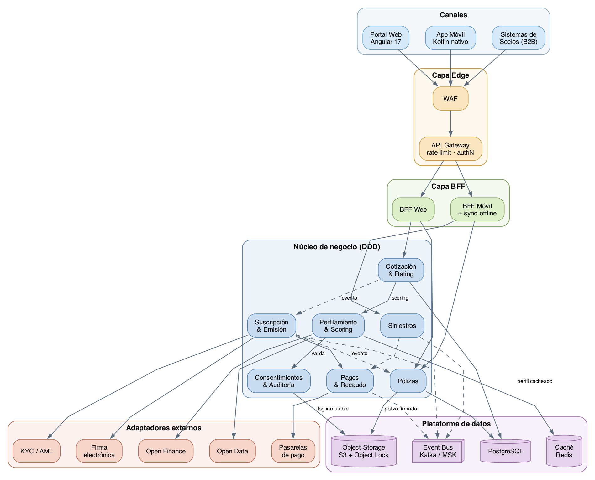
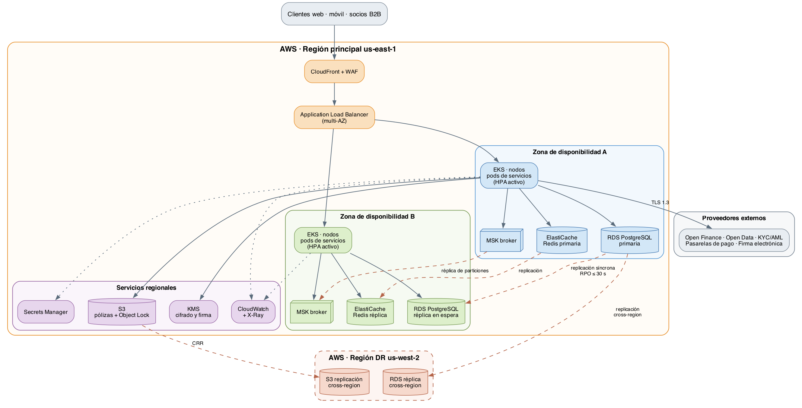
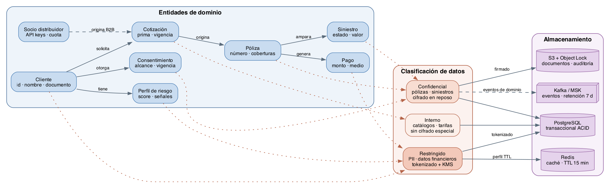

# Hoja de Trabajo — Arquitectura, Patrones y Experimentos

**Universidad de los Andes · Maestría en Ingeniería de Software · MISW4501**
**Proyecto Integrador — Grupo 2 · Solventa**
**Semana 4 · 30 de agosto de 2026**

| Integrante | Rol |
|---|---|
| Jazmin Natalia Córdoba Puerto | Gerente — Usabilidad y entrega |
| Juan Esteban Mejía Izasa | Web front, integración API, pagos |
| Miguel Alejandro Gómez Alarcón | Arquitectura, Open Finance, KYC, rendimiento, seguridad |
| Angie Natalia Arandio Niño | Dominio, web back, móvil, pruebas unitarias |

---

## Contenido de este documento

| Sección | Contenido |
|---|---|
| §1 | Contexto y atributos de calidad que dirigen el diseño |
| §2 | Modelos de arquitectura: vista funcional, de despliegue y de información |
| §3 | Diseño detallado — patrones aplicados y su razonamiento frente a cada ASR |
| §4 | Decisiones de arquitectura y alternativas descartadas |
| §5 | Propuesta de experimentos de arquitectura |
| §6 | Refinamiento de la estrategia de pruebas |
| §7 | Plan de trabajo y estado del tablero |

---

## 1. Contexto y atributos de calidad que dirigen el diseño

Solventa es una aseguradora digital nativa en la nube construida sobre Finanzas Abiertas y Datos Abiertos. Su promesa de negocio —cotizar, suscribir, emitir y pagar siniestros de forma casi instantánea, embebiendo el seguro en el punto de necesidad del cliente— impone exigencias que no se resuelven eligiendo bien un framework, sino decidiendo bien la estructura del sistema.

El diseño que se presenta en este documento no parte de una preferencia tecnológica sino de los nueve escenarios de calidad (ASR) definidos en la semana 3. Cada decisión estructural que se documenta a continuación existe porque hay al menos un ASR que la exige.

| ASR | Atributo | Medida de respuesta | Consecuencia arquitectural |
|---|---|---|---|
| ASR-1.1 | Latencia | p95 < 200 ms con 500 req/min | Caché de perfiles, cálculo asíncrono de lo no crítico |
| ASR-1.2 | Latencia bajo degradación | p95 < 200 ms desde caché, 0% de pérdida | Circuit breaker, timeout agresivo, degradación elegante |
| ASR-2.1 | Modificabilidad | Nueva pasarela en < 4 horas-hombre, 0 cambios en el núcleo | Puertos y adaptadores, inversión de dependencias |
| ASR-2.2 | Modificabilidad | Nuevo ramo en ≤ 2 semanas, 0 cambios en el motor de rating | Configuración externalizada, motor parametrizado |
| ASR-3.1 | Disponibilidad | Recuperación < 30 s, ≥ 99,9% | Fallback a fuente primaria, health checks, bulkhead |
| ASR-3.2 | Disponibilidad multi-zona | RTO ≤ 10 min, RPO ≤ 30 s | Despliegue activo-activo multi-AZ, réplica con promoción |
| ASR-3.3 | Continuidad offline | 100% de consultas sin conexión, sync ≤ 10 s | Cliente offline-first, almacenamiento local cifrado |
| ASR-4.1 | Confidencialidad | 100% TLS 1.3, 0 PII en texto plano | Tokenización de PII, cifrado en tránsito y reposo |
| ASR-4.2 | Integridad | Alerta de alteración no autorizada < 1 s | Firma digital, almacenamiento inmutable, auditoría |

**Restricciones que acotan el espacio de diseño**

- Contenedores obligatorios para todos los microservicios; nada se instala en el sistema anfitrión.
- PostgreSQL como almacenamiento transaccional primario; no se admite una base NoSQL en ese rol.
- Cumplimiento de Ley 1581 de 2012, Decreto 1297 de 2022, Circular Externa 004 de 2024 y PCI-DSS.
- Consentimiento revocable con efecto en menos de 5 minutos.
- Expansión a México, Chile y Perú dentro de 36 meses, lo que obliga a que la regionalización sea configuración y no una bifurcación del código.

---

## 2. Modelos de arquitectura

### 2.1 Vista funcional

La vista funcional muestra cómo se descompone el sistema en componentes y cómo colaboran para atender los recorridos de negocio. La estructura es de cuatro capas más una plataforma de datos transversal.

**Capa de canales.** Tres consumidores con necesidades distintas: el portal web en Angular, la aplicación móvil nativa en Kotlin y los sistemas de socios distribuidores que consumen la API B2B. Son deliberadamente delgados: no contienen reglas de negocio, porque una regla que vive en el canal debe reimplementarse en cada canal nuevo.

**Capa Edge.** Concentra lo que debe ocurrir antes de que una petición toque lógica de negocio: filtrado de tráfico malicioso en el WAF, y en el API Gateway la autenticación, la limitación de tasa por cliente y por socio, y la terminación TLS. Situar esto en el borde evita que cada servicio reimplemente controles de seguridad, que es la principal fuente de inconsistencias de seguridad en arquitecturas de microservicios.

**Capa BFF.** Un backend por canal. El BFF Web compone respuestas orientadas a pantallas amplias con muchos datos por petición; el BFF Móvil compone respuestas compactas y además gestiona el protocolo de sincronización offline. Sin esta capa, o bien el núcleo se contamina con formatos específicos de canal, o bien el móvil paga el costo de recibir cargas útiles pensadas para web.

**Núcleo de negocio.** Siete servicios delimitados por contexto de dominio: Cotización y Rating, Perfilamiento y Scoring, Suscripción y Emisión, Pólizas, Siniestros, Pagos y Recaudo, y Consentimientos y Auditoría. La frontera de cada servicio coincide con una frontera de lenguaje del negocio, no con una capa técnica. Los servicios se comunican de forma síncrona solo cuando el resultado es necesario para responder al usuario; el resto de la colaboración ocurre por eventos.

**Plataforma de datos.** PostgreSQL para lo transaccional, Redis como caché de perfiles de riesgo, Kafka como bus de eventos de dominio y almacenamiento de objetos con bloqueo de escritura para documentos y auditoría.

**Adaptadores externos.** Cada proveedor externo —Open Finance, Open Data, KYC/AML, pasarelas de pago y firma electrónica— se alcanza exclusivamente a través de un adaptador que traduce entre el modelo del proveedor y el modelo de dominio de Solventa. Ningún servicio del núcleo conoce el formato de un proveedor.

### 2.2 Vista de despliegue

La vista de despliegue muestra dónde se ejecuta cada componente y qué mecanismos de redundancia lo protegen.

**Distribución activo-activo.** Los nodos de EKS están repartidos entre dos zonas de disponibilidad y ambas reciben tráfico simultáneamente. No es una configuración activo-pasivo: si una zona cae, la capacidad de la otra ya está caliente y sirviendo peticiones, lo que hace que el tiempo de recuperación dependa del tiempo de detección del balanceador y no del tiempo de arranque de instancias. Esta es la decisión que hace alcanzable el RTO de 10 minutos del ASR-3.2.

**Datos.** RDS PostgreSQL opera en configuración multi-AZ con réplica en espera y promoción automática. La replicación síncrona hacia la zona B es lo que sostiene el RPO de 30 segundos. Redis y los brokers de Kafka también están replicados entre zonas.

**Región de recuperación.** Una réplica de lectura entre regiones hacia us-west-2 y replicación entre regiones del almacenamiento de objetos cubren el escenario de pérdida completa de la región principal. Este escenario está fuera del alcance de los experimentos del Proyecto Final 1, pero se documenta porque condiciona decisiones de diseño que sí se toman ahora, como no depender de identificadores generados localmente por instancia.

**Servicios regionales.** El servicio de gestión de llaves cifra los datos en reposo y firma las pólizas emitidas; el almacenamiento de objetos con bloqueo de escritura garantiza que un registro de auditoría no pueda alterarse ni siquiera con credenciales administrativas; la observabilidad centralizada recoge métricas y trazas distribuidas de todos los servicios.

### 2.3 Vista de información

La vista de información muestra las entidades de dominio, cómo se clasifican sus datos según sensibilidad y dónde se persiste cada clase.

**Entidades de dominio.** El cliente es la entidad raíz. De él dependen su perfil de riesgo, sus consentimientos y sus cotizaciones. Una cotización origina una póliza; una póliza ampara siniestros y genera pagos. Los socios distribuidores originan cotizaciones por el canal B2B, lo que significa que el modelo debe soportar una cotización sin cliente registrado previamente.

**Clasificación de datos.** El sistema clasifica los datos en tres niveles y el nivel determina el tratamiento, no la preferencia del desarrollador:

| Nivel | Contenido | Tratamiento |
|---|---|---|
| Restringido | Información personal identificable, datos financieros de Open Finance, datos de medios de pago | Tokenizado antes de persistirse; el dato original solo existe en el servicio de tokenización, cifrado con llave gestionada |
| Confidencial | Pólizas, siniestros, consentimientos | Cifrado en reposo; los documentos además firmados digitalmente |
| Interno | Catálogos de ramos, tarifas, parámetros de configuración | Sin cifrado especial; su exposición no genera daño |

Esta clasificación es la que hace verificable el ASR-4.1: la afirmación «cero datos personales en texto plano» solo se puede comprobar si antes se declaró qué cuenta como dato personal.

**Persistencia.** PostgreSQL guarda el estado transaccional; Redis guarda perfiles de riesgo con vencimiento de 15 minutos, lo que acota la ventana de exposición de datos derivados; el almacenamiento de objetos guarda documentos firmados y el registro de auditoría en modo de solo escritura; Kafka retiene los eventos de dominio 7 días para permitir su reproceso.

---

## 3. Diseño detallado — patrones aplicados y su razonamiento

Esta sección documenta cada patrón estructural adoptado. Para cada uno se indica el problema concreto que resuelve, el ASR que lo motiva, cómo se aplica en Solventa y qué se sacrifica al adoptarlo. Un patrón sin contrapartida declarada suele ser un patrón que no se entendió.

### 3.1 Tabla resumen

| # | Patrón | ASR que atiende | Componente donde se aplica |
|---|---|---|---|
| P1 | Caché de perfiles con lectura anticipada | ASR-1.1, ASR-1.2 | Perfilamiento y Scoring · Redis |
| P2 | Interruptor de circuito | ASR-1.2, ASR-3.1 | Adaptadores externos |
| P3 | Tiempo de espera acotado con reintento y espera creciente | ASR-1.2 | Adaptadores externos |
| P4 | Mamparo de aislamiento | ASR-3.1 | Núcleo de negocio |
| P5 | Puertos y adaptadores | ASR-2.1 | Adaptadores externos · núcleo |
| P6 | Estrategia con configuración externalizada | ASR-2.2 | Cotización y Rating |
| P7 | Backend por canal | ASR-3.3 | Capa BFF |
| P8 | Publicación y suscripción de eventos de dominio | ASR-1.2, ASR-2.1 | Event Bus |
| P9 | Tokenización de datos sensibles | ASR-4.1 | Consentimientos · Perfilamiento |
| P10 | Almacenamiento inmutable con firma digital | ASR-4.2 | Pólizas · auditoría |
| P11 | Cliente con prioridad al modo desconectado | ASR-3.3 | App móvil · BFF Móvil |
| P12 | Autoescalado con comprobaciones de salud | ASR-3.2 | EKS |

### 3.2 P1 — Caché de perfiles con lectura anticipada

**Problema.** El cálculo del perfil de riesgo requiere consultar Open Finance y Open Data. Esas consultas tardan cientos de milisegundos en el mejor caso. Si la cotización espera esa consulta de forma sincrónica, el objetivo de 200 ms del ASR-1.1 es inalcanzable por construcción: ninguna optimización interna compensa una llamada de red externa a un tercero.

**Aplicación.** El servicio de Perfilamiento consulta primero Redis. Si el perfil está presente y vigente, responde desde caché. Si no, consulta al proveedor externo, responde y almacena el resultado con vencimiento de 15 minutos. Para los clientes que llegan por un socio distribuidor con campaña programada, el perfil se precalcula en lote antes de la campaña.

**Razonamiento frente al ASR.** El ASR-1.1 exige p95 menor a 200 ms con 500 peticiones por minuto. Con una tasa de acierto de caché del 80% —conservadora para una ventana de 15 minutos en un flujo de cotización donde el usuario itera sobre planes— el percentil 95 queda determinado por el camino de caché y no por el camino externo. El ASR-1.2 va más lejos: exige que bajo degradación del proveedor el sistema siga respondiendo en 200 ms, lo que solo es posible si el perfil cacheado puede servir como respuesta válida y no solo como optimización.

**Contrapartida aceptada.** Un perfil cacheado puede estar hasta 15 minutos desactualizado. Para un scoring de seguro esto es tolerable: la situación financiera de una persona no cambia de forma material en ese intervalo. No sería tolerable para un saldo de cuenta, y por eso el caché se aplica al perfil derivado y nunca al dato financiero crudo.

### 3.3 P2 — Interruptor de circuito

**Problema.** Cuando un proveedor externo se degrada, el modo de falla más dañino no es que responda con error, sino que responda lento. Las peticiones se acumulan, los hilos del servicio se agotan esperando, y un problema de un proveedor se convierte en la caída completa de Solventa.

**Aplicación.** Cada adaptador externo está envuelto en un interruptor con tres estados. En estado cerrado las peticiones fluyen normalmente. Cuando la proporción de fallos o de respuestas por encima del umbral de tiempo supera el 50% en una ventana móvil, el interruptor abre y las peticiones siguientes fallan de inmediato sin tocar la red, activando la ruta de degradación. Tras un intervalo, el interruptor pasa a semiabierto y deja pasar un número reducido de peticiones de prueba.

**Razonamiento frente al ASR.** El ASR-1.2 describe exactamente este escenario: 5.000 peticiones concurrentes con el proveedor respondiendo por encima de 700 ms, y exige 0% de peticiones perdidas. Sin interruptor, las peticiones se pierden por agotamiento de recursos. Con interruptor, la petición no se pierde: se atiende por la ruta degradada usando el perfil cacheado. La diferencia entre cumplir y no cumplir el ASR-1.2 no está en la velocidad del sistema sino en su capacidad de dejar de esperar a tiempo.

**Contrapartida aceptada.** Durante la apertura del interruptor, clientes cuyo perfil no está en caché reciben una cotización preliminar en lugar de una definitiva. Se prefiere una respuesta aproximada e inmediata sobre una respuesta exacta que no llega.

### 3.4 P3 — Tiempo de espera acotado con reintento y espera creciente

**Problema.** Un tiempo de espera mal calibrado anula el interruptor de circuito. Si el tiempo de espera del cliente supera el del usuario, el usuario abandona antes de que el sistema decida.

**Aplicación.** Cada llamada externa tiene un tiempo de espera explícito, derivado hacia atrás desde el presupuesto de latencia total: si el objetivo extremo a extremo es 200 ms, el adaptador de Open Finance no puede tener un tiempo de espera de 3 segundos. Los reintentos se aplican solo a operaciones idempotentes, con espera creciente y un componente aleatorio para no sincronizar a todos los clientes en la misma reintentada.

**Razonamiento frente al ASR.** Es el patrón que hace operativo el presupuesto de latencia del ASR-1.1. Un presupuesto de latencia que no se traduce en tiempos de espera configurados es una intención, no un mecanismo.

**Contrapartida aceptada.** Tiempos de espera agresivos aumentan la proporción de respuestas degradadas cuando la red está lenta pero funcional. Se acepta porque el ASR prioriza responder a tiempo sobre responder con el dato más fresco.

### 3.5 P4 — Mamparo de aislamiento

**Problema.** Servicios que comparten un mismo depósito de conexiones o de hilos se hunden juntos. Si Siniestros agota el depósito de conexiones a la base de datos, Cotización deja de responder aunque no tenga ningún problema propio.

**Aplicación.** Cada servicio tiene depósitos de recursos separados por dependencia: un depósito de conexiones para PostgreSQL, otro para Redis, otro por cada adaptador externo. En Kubernetes, cada servicio tiene límites propios de CPU y memoria.

**Razonamiento frente al ASR.** El ASR-3.1 exige disponibilidad de 99,9% con recuperación en menos de 30 segundos ante la caída de Redis. Sin aislamiento, la caída de Redis propaga la saturación a las conexiones de PostgreSQL y la recuperación deja de depender solo de Redis. Con aislamiento, el fallo queda confinado y la ruta de respaldo hacia PostgreSQL tiene recursos disponibles para operar.

**Contrapartida aceptada.** Se desperdicia capacidad: recursos reservados para una dependencia inactiva no se prestan a otra. Es el costo directo de que un fallo no se propague.

### 3.6 P5 — Puertos y adaptadores

**Problema.** El ASR-2.1 exige integrar una pasarela de pagos nueva en menos de 4 horas-hombre y sin modificar ningún servicio del núcleo. Si el servicio de Pagos conoce el formato de la pasarela, cada pasarela nueva obliga a modificarlo, probarlo y desplegarlo.

**Aplicación.** El núcleo define un puerto —una interfaz expresada en el lenguaje del dominio: autorizar cobro, confirmar cobro, reversar cobro— y no conoce ninguna implementación. Cada pasarela se integra escribiendo un adaptador que implementa ese puerto y traduce entre el modelo de la pasarela y el del dominio. La selección del adaptador ocurre por configuración según el país. Integrar una pasarela nueva es escribir una clase nueva y agregar una entrada de configuración: cero archivos modificados en el núcleo.

**Razonamiento frente al ASR.** La medida de respuesta del ASR-2.1 —«cero cambios en servicios del núcleo»— es una afirmación verificable sobre el diagrama de dependencias, no sobre la buena voluntad del equipo. La inversión de dependencias es lo que la vuelve estructuralmente cierta: el núcleo no puede depender de una pasarela porque la flecha de dependencia apunta al revés.

**Contrapartida aceptada.** Hay una capa de indirección adicional y un modelo de dominio que mantener en paralelo a los modelos de los proveedores. Para un sistema con un solo proveedor sería sobrecosto injustificado; con cinco categorías de proveedores externos y expansión a cuatro países, se paga solo.

### 3.7 P6 — Estrategia con configuración externalizada

**Problema.** El ASR-2.2 exige lanzar un ramo nuevo en dos semanas sin tocar la lógica central del motor de rating. Un motor con las reglas de cada ramo escritas en código requiere modificar, probar y desplegar el motor por cada ramo.

**Aplicación.** El motor de rating no conoce ramos: conoce cómo evaluar un árbol de reglas y cómo componer factores. Las reglas de cada ramo, sus factores, coberturas y parámetros viven en configuración versionada, no en el código. Añadir el seguro de mascota es cargar una definición nueva. Lo mismo aplica a la regionalización: los parámetros de México son una configuración, no una bifurcación del código.

**Razonamiento frente al ASR.** El objetivo de negocio de expandirse a tres países en 36 meses y el ASR-2.2 apuntan a la misma propiedad estructural: la variabilidad del negocio debe estar en los datos y no en el código. Si está en el código, cada variación cuesta un ciclo de despliegue y el plazo de dos semanas se consume en el proceso, no en el trabajo.

**Contrapartida aceptada.** Una configuración mal formada puede romper el motor en ejecución, un error que un compilador habría detectado. Se mitiga validando la definición contra un esquema al cargarla y ejecutando un juego de casos de referencia antes de activarla.

### 3.8 P7 — Backend por canal

**Problema.** Web y móvil tienen necesidades opuestas. Web puede recibir cargas útiles grandes en una sola petición; móvil necesita cargas pequeñas, tolerancia a red intermitente y un protocolo de sincronización. Un backend único termina sirviendo mal a ambos.

**Aplicación.** Dos backends: el BFF Web compone vistas ricas agregando varios servicios del núcleo en una respuesta; el BFF Móvil entrega cargas mínimas, gestiona el protocolo de sincronización con el almacenamiento local del dispositivo y resuelve conflictos.

**Razonamiento frente al ASR.** El ASR-3.3 exige que el 100% de las consultas de póliza funcionen sin conexión y que la sincronización tome 10 segundos o menos. Eso requiere lógica de sincronización con estado, versiones y resolución de conflictos, que no tiene ningún sentido en el canal web. Ponerla en un backend compartido obligaría al canal web a cargar con complejidad que no usa.

**Contrapartida aceptada.** Hay lógica de composición duplicada entre los dos BFF. Se acepta porque la alternativa —un backend que sirve a ambos— acopla la evolución de los dos canales: cada cambio para móvil obliga a re-probar web.

### 3.9 P8 — Publicación y suscripción de eventos de dominio

**Problema.** La emisión de una póliza dispara efectos en varios servicios: notificar al cliente, actualizar la administración de pólizas, registrar auditoría, alimentar tableros regulatorios. Si Emisión llama sincrónicamente a los cuatro, su latencia es la suma de las cuatro y su disponibilidad el producto de las cuatro.

**Aplicación.** Emisión publica un evento de dominio y termina. Los servicios interesados se suscriben y reaccionan a su ritmo. El bus retiene los eventos 7 días, lo que permite reprocesar cuando un consumidor estuvo caído o cuando se corrige un error de procesamiento.

**Razonamiento frente al ASR.** Sostiene el ASR-1.2 al sacar del camino crítico todo lo que no es necesario para responderle al usuario, y refuerza el ASR-2.1: agregar un consumidor nuevo —por ejemplo, un tablero regulatorio para un país nuevo— no requiere tocar el productor.

**Contrapartida aceptada.** Consistencia eventual. Durante un intervalo breve la póliza existe pero el tablero aún no la refleja. Es aceptable para efectos secundarios; no lo sería para el cobro de la prima, que por eso permanece sincrónico dentro de la transacción de emisión.

### 3.10 P9 — Tokenización de datos sensibles

**Problema.** El ASR-4.1 exige cero datos personales en texto plano en tránsito, y la regulación exige poder revocar un consentimiento con efecto en menos de 5 minutos. Si el dato personal está copiado en las bases de siete servicios, revocar significa borrarlo en siete lugares y demostrarlo.

**Aplicación.** Un único servicio custodia los datos sensibles. El resto del sistema opera sobre tokens que no tienen valor si se filtran. Un servicio que necesita el dato original debe solicitarlo presentando autorización, y cada solicitud queda registrada. Revocar un consentimiento es invalidar la capacidad de destokenizar, lo que surte efecto de inmediato en todo el sistema sin tocar siete bases de datos.

**Razonamiento frente al ASR.** Convierte la afirmación del ASR-4.1 en algo demostrable: para verificar que no hay información personal en texto plano basta con inspeccionar el tráfico y los volcados de las bases y comprobar que solo aparecen tokens. Con el dato replicado, la verificación tendría que ser exhaustiva sobre todo el sistema.

**Contrapartida aceptada.** El servicio de tokenización es un punto único de falla y un salto adicional de latencia en las operaciones que requieren el dato original. Se mitiga porque el camino crítico de cotización opera sobre el perfil derivado y no necesita destokenizar.

### 3.11 P10 — Almacenamiento inmutable con firma digital

**Problema.** El ASR-4.2 exige detectar en menos de 1 segundo cualquier alteración no autorizada de una póliza emitida, incluyendo alteraciones hechas con credenciales internas comprometidas. Un control basado en permisos no sirve: se asume que el atacante ya tiene los permisos.

**Aplicación.** Al emitirse, cada póliza se firma con una llave gestionada y se almacena en un contenedor con bloqueo de escritura que impide la modificación y el borrado durante el periodo de retención, incluso para cuentas administrativas. Cada lectura verifica la firma. Cada escritura genera un registro de auditoría inmutable con el servicio, el momento y la huella antes y después.

**Razonamiento frente al ASR.** El control no depende de que el atacante carezca de permisos, sino de que la plataforma de almacenamiento no acepte la operación. Esto cambia la naturaleza de la garantía: pasa de ser una política a ser una propiedad del sistema.

**Contrapartida aceptada.** El periodo de retención inmutable implica costo de almacenamiento que no se puede liberar anticipadamente, y errores legítimos no se corrigen borrando sino emitiendo un documento compensatorio. Es exactamente el comportamiento que la regulación espera de una aseguradora.

### 3.12 P11 — Cliente con prioridad al modo desconectado

**Problema.** El ASR-3.3 exige que el 100% de las consultas de póliza estén disponibles sin conexión. Un cliente que consulta al servidor y muestra un error cuando no hay red no puede cumplirlo, por rápido que sea el servidor.

**Aplicación.** La app trata el almacenamiento local cifrado como su fuente de lectura y la red como un mecanismo de actualización en segundo plano. Las pólizas se sincronizan al iniciar sesión y se conservan con vigencia de 24 horas. Las acciones ejecutadas sin conexión se encolan y se envían en orden al recuperar conectividad.

**Razonamiento frente al ASR.** La medida «100% de consultas disponibles sin conexión» solo es alcanzable si la ausencia de red es el caso normal y no la excepción. Esta es una decisión de diseño del cliente que no se puede añadir después: reordena de dónde lee la aplicación.

**Contrapartida aceptada.** Datos potencialmente desactualizados, resolución de conflictos y datos sensibles en el dispositivo. Se mitiga con vigencia de 24 horas, aviso visible al vencerse, precedencia del servidor ante conflicto y cifrado del almacenamiento local limitado a lo mínimo necesario para mostrar la póliza.

### 3.13 P12 — Autoescalado con comprobaciones de salud

**Problema.** El ASR-3.2 exige RTO de 10 minutos ante la pérdida de una zona. Si la recuperación depende de arrancar instancias nuevas, el tiempo lo determina el arranque en frío.

**Aplicación.** Los pods se distribuyen entre zonas con reglas de antiafinidad, de modo que ninguna zona concentra todas las réplicas de un servicio. Cada pod expone comprobaciones de vitalidad y de disponibilidad, y el balanceador retira de rotación al que no responde. El autoescalador horizontal reacciona al uso de CPU con umbral del 70% y ventana de 30 segundos, con reducción lenta para evitar oscilaciones.

**Razonamiento frente al ASR.** Al mantener capacidad activa en ambas zonas, la recuperación se reduce al tiempo de detección más el de redistribución, ambos del orden de decenas de segundos. El autoescalado cubre el segundo efecto de perder una zona: la zona superviviente recibe el doble de tráfico y debe crecer.

**Contrapartida aceptada.** Se paga capacidad ociosa en operación normal, del orden del doble de la estrictamente necesaria. Es el precio explícito de un RTO de minutos.

---

## 4. Decisiones de arquitectura y alternativas descartadas

Documentar lo que se descartó y por qué es tan informativo como documentar lo elegido.

| # | Decisión adoptada | Alternativas evaluadas | Razón del descarte |
|---|---|---|---|
| D1 | Microservicios por contexto de dominio | Monolito modular | El monolito habría simplificado el desarrollo en 8 semanas, pero impide escalar de forma independiente el servicio de scoring, que es el único con exigencia de latencia de 200 ms y el único con picos de 10× |
| D2 | PostgreSQL como almacenamiento transaccional | Base documental como primaria | Restricción dura del proyecto; además la emisión requiere transacciones con garantías fuertes entre póliza, pago y consentimiento |
| D3 | Kafka como bus de eventos | Cola de mensajes tradicional | La retención y la relectura de eventos son necesarias para reprocesar y para incorporar consumidores nuevos sin coordinación con el productor |
| D4 | Dos BFF, uno por canal | BFF único compartido | La lógica de sincronización offline es específica de móvil; compartirla acopla la evolución de ambos canales |
| D5 | Tokenización centralizada | Cifrado a nivel de campo en cada servicio | El cifrado por campo replica el dato en siete bases y hace que revocar un consentimiento en menos de 5 minutos sea inverificable |
| D6 | Multi-AZ activo-activo | Activo-pasivo con recuperación | Un esquema pasivo hace que el RTO dependa del arranque en frío, lo que pone en riesgo el objetivo de 10 minutos del ASR-3.2 |
| D7 | Kotlin nativo para móvil | Framework multiplataforma | El acceso a biometría, cámara con validación de nitidez y almacenamiento seguro del dispositivo es de primera clase en nativo; el onboarding biométrico es el recorrido de mayor riesgo técnico |
| D8 | Angular para web | Alternativa basada en biblioteca | Decisión del equipo del 19 de agosto; el marco de trabajo completo aporta enrutamiento, formularios e internacionalización integrados, relevantes para los cuatro locales objetivo |

---

## 5. Propuesta de experimentos de arquitectura

### 5.1 Qué es un experimento de arquitectura y qué no lo es

Un experimento de arquitectura no es una prueba de software. Una prueba verifica que el sistema hace lo que se especificó. Un experimento **valida una hipótesis de diseño sobre la cual el equipo tiene incertidumbre**, construyendo una porción real del diseño para evaluar su viabilidad y medir si la decisión tomada permite cumplir el requisito de calidad objetivo.

De esa definición se desprenden cuatro consecuencias que gobiernan el diseño de esta sección:

1. **El experimento construye una porción del diseño, no un banco de pruebas desechable.** Los microservicios y conectores que se levantan para el experimento son los mismos que quedan en el producto. Lo que se recorta es el alcance funcional, no la fidelidad arquitectural.
2. **El experimento debe medir de forma precisa.** Una conclusión del tipo «funcionó bien» no reduce incertidumbre. Cada experimento define de antemano la métrica, el instrumento que la captura y el umbral que separa el éxito del fracaso.
3. **Si el análisis no es favorable, se cambia la decisión de diseño y se experimenta de nuevo.** Por eso cada ficha incluye explícitamente cuál es la decisión alternativa que se adoptaría ante un resultado adverso. Un experimento sin plan B no es un experimento: es una demostración.
4. **Solo se experimenta donde hay incertidumbre.** Si el punto de sensibilidad no genera incertidumbre en el equipo, experimentarlo consume esfuerzo sin producir información. La selección de qué se experimenta se justifica en §5.2.

### 5.2 Puntos de sensibilidad e identificación de la incertidumbre

Un **punto de sensibilidad** es una decisión de arquitectura de la que depende críticamente el cumplimiento de una historia de arquitectura. Antes de diseñar experimento alguno, el equipo identificó los puntos de sensibilidad de las once historias de arquitectura y evaluó, para cada uno, cuánta incertidumbre genera.

La incertidumbre se calificó con tres criterios: si el equipo ha implementado antes ese mecanismo, si el cumplimiento del umbral depende de valores que hoy no se conocen, y si un resultado adverso obligaría a rehacer estructura y no solo a ajustar parámetros.

| Historia | ASR | Punto de sensibilidad (decisión crítica) | Incertidumbre | ¿Se experimenta? |
|---|---|---|---|---|
| HU-ARQ-07 | ASR-1.1 | Que el perfil derivado se pueda cachear con una tasa de acierto suficiente y que el procesamiento restante quepa en el presupuesto de 200 ms | **Alta** | Sí — EXP-01 |
| HU-ARQ-08 | ASR-1.2 | La calibración del umbral y la ventana del interruptor de circuito, y el reparto del presupuesto de latencia entre tiempos de espera | **Alta** | Sí — EXP-02 |
| HU-ARQ-06 | ASR-3.1 | Que la ruta de respaldo hacia PostgreSQL absorba el tráfico del caché caído sin propagar la saturación a otros servicios | **Alta** | Sí — EXP-03 |
| HU-ARQ-03 | ASR-4.1 | Que la tokenización centralizada no introduzca latencia inaceptable en el camino crítico ni deje rutas por donde el dato original se filtre | **Alta** | Sí — EXP-04 |
| HU-ARQ-02 | ASR-2.1 | Que la definición del puerto de pagos sea lo bastante general para absorber una pasarela con contrato distinto sin fugas de abstracción | Media | Sí — EXP-05, prioridad menor |
| HU-ARQ-10 | ASR-3.3 | El protocolo de sincronización y la resolución de conflictos entre el almacenamiento local y el servidor | Media | Sí — EXP-06, prioridad menor |
| HU-ARQ-01 | ASR-2.2 | Que el motor de rating sea genuinamente agnóstico al ramo | Media | Se difiere al Proyecto Final 2 |
| HU-ARQ-11 | ASR-4.2 | El bloqueo de escritura del almacenamiento de objetos | **Baja** | **No.** Es una capacidad documentada y garantizada por la plataforma, no una decisión de diseño incierta. Se verifica con una prueba de configuración, no con un experimento |
| HU-ARQ-09 | ASR-3.2 | El comportamiento activo-activo multi-zona y la promoción automática de la réplica | Media | Se difiere al Proyecto Final 2 por dependencia de infraestructura con costo |

> **Sobre HU-ARQ-11.** Se decidió deliberadamente no diseñar un experimento para el bloqueo de escritura del almacenamiento de objetos. El mecanismo es una garantía de la plataforma con comportamiento especificado por el proveedor; el equipo no tiene incertidumbre sobre si funciona, sino sobre si lo configuró bien. Esa es una pregunta de verificación de configuración, y su lugar es la suite de pruebas de seguridad, no el programa de experimentación. Aplicar aquí el criterio del profesor —no experimentar lo que no genera incertidumbre— libera 8 horas que se reasignan a los experimentos de latencia, donde la incertidumbre sí es alta.

**Sprint 1 de diseño.** Los cuatro experimentos de incertidumbre alta conforman el Sprint 1 de diseño y se ejecutan en las semanas 5 y 6. Los de incertidumbre media se ejecutan si hay holgura.

### 5.3 EXP-01 — Viabilidad del presupuesto de latencia del motor de scoring

| Campo | Contenido |
|---|---|
| **Historia de arquitectura** | HU-ARQ-07 · Optimización de latencia del motor de scoring (SOL-28) |
| **Requisito de calidad objetivo** | ASR-1.1 — p95 < 200 ms con 500 req/min; p99 < 400 ms |
| **Punto de sensibilidad** | Resolver el scoring desde un perfil derivado cacheado en lugar de consultar Open Finance en el camino crítico |
| **Incertidumbre que motiva el experimento** | El equipo no sabe dos cosas: qué tasa de acierto real produce una ventana de vigencia de 15 minutos en un flujo donde el usuario itera sobre planes, y cuánto del presupuesto de 200 ms consume el procesamiento propio una vez descontada la consulta externa. Si el procesamiento propio consume 150 ms, el diseño no cierra por más que el caché acierte |
| **Propósito** | Determinar si la decisión de cachear el perfil derivado hace viable el presupuesto de latencia, y medir el reparto real de ese presupuesto entre sus componentes |

**Patrones y tácticas que se validan**

| Tipo | Elemento |
|---|---|
| Patrón | P1 — Caché de perfiles con lectura anticipada |
| Táctica (rendimiento) | Mantener múltiples copias de los datos computados |
| Táctica (rendimiento) | Reducir la demanda computacional en el camino crítico |
| Táctica (rendimiento) | Acotar el tiempo de ejecución mediante presupuesto de latencia por salto |

**Porción del diseño que se construye**

Se implementa el camino crítico completo de cotización con fidelidad arquitectural: los tres componentes reales, sus conectores reales y la persistencia real. Se recorta el alcance funcional a un solo ramo y un solo plan de cobertura.

**Microservicios involucrados**

| Microservicio | Propósito en el experimento | Comportamiento esperado | Tecnología |
|---|---|---|---|
| Cotización y Rating | Recibe la solicitud, solicita el perfil, aplica el motor de rating y compone la prima | Responder el 95% de las solicitudes en menos de 200 ms; consumir menos de 40 ms en el cálculo de rating | Python 3.11 · Flask · Gunicorn con trabajadores concurrentes |
| Perfilamiento y Scoring | Resuelve el perfil de riesgo consultando primero el caché y recurriendo al proveedor externo solo ante ausencia | Tasa de acierto de caché ≥ 80%; menos de 20 ms en el camino de acierto | Python 3.11 · Flask |
| Adaptador Open Finance | Traduce entre el modelo del proveedor y el modelo de dominio, con tiempo de espera acotado | Respetar un tiempo de espera de 150 ms; no bloquear más allá de ese límite | Python 3.11 · httpx con depósito de conexiones |

**Conectores involucrados**

| Conector | Comportamiento que se prueba | Tecnología |
|---|---|---|
| Cotización → Perfilamiento | Que el salto de red entre servicios añada menos de 5 ms al percentil 95 | HTTP/1.1 con conexión persistente y depósito de conexiones |
| Perfilamiento → Caché | Que la lectura del perfil se resuelva por debajo de 2 ms en el percentil 99 | Protocolo RESP · cliente redis-py con depósito |
| Cotización → Base de datos | Que la consulta de tarifas y parámetros del ramo no supere 10 ms | psycopg con depósito de conexiones |
| Perfilamiento → Proveedor externo | Que el tiempo de espera de 150 ms se respete y no se desborde | HTTP sobre TLS hacia un simulador con latencia controlada |

**Montaje y medición**

Entorno en contenedores con los tres servicios, PostgreSQL y Redis. Un simulador reemplaza a Open Finance con latencia fija de 300 ms. Se genera carga de 500 peticiones por minuto durante 10 minutos, con una distribución de clientes que produce la tasa de acierto objetivo. Se instrumenta cada salto por separado para poder atribuir el tiempo consumido a un componente concreto y no solo al total.

| Métrica | Instrumento | Umbral |
|---|---|---|
| Latencia extremo a extremo por percentil | JMeter | p95 < 200 ms · p99 < 400 ms |
| Tasa de acierto del caché | Contadores del servicio de perfilamiento | ≥ 80% |
| Latencia por salto | Trazas distribuidas | Ver tabla de conectores |
| Tasa de error | JMeter | 0% |

**Resultado esperado y criterio de refutación**

Se espera p95 por debajo de 200 ms con tasa de acierto igual o superior al 80% y cero errores. La hipótesis queda refutada si el p95 supera 200 ms **teniendo la tasa de acierto en el objetivo**: eso significaría que el problema no está en la estrategia de caché sino en el procesamiento propio.

**Decisión alternativa ante resultado adverso**

Si se refuta, la decisión de diseño que se revisa es el momento del cálculo: se pasa de calcular la prima de forma sincrónica a precalcular las primas de las combinaciones más frecuentes de ramo y perfil, y servir el cálculo exacto solo para las combinaciones poco frecuentes. Esto convierte el problema de latencia en un problema de espacio de almacenamiento, que es más barato de resolver.

**Esfuerzo:** 10 horas-hombre · **Prioridad:** Alta · **Sprint 1 de diseño, semana 5**

### 5.4 EXP-02 — Calibración de la degradación elegante

| Campo | Contenido |
|---|---|
| **Historia de arquitectura** | HU-ARQ-08 · Event Bus Kafka y degradación elegante (SOL-37) |
| **Requisito de calidad objetivo** | ASR-1.2 — p95 < 200 ms desde caché con el proveedor degradado; 0% de peticiones perdidas |
| **Punto de sensibilidad** | El umbral y la ventana del interruptor de circuito, y el reparto del presupuesto de latencia entre los tiempos de espera de cada salto |
| **Incertidumbre que motiva el experimento** | El interruptor de circuito es un mecanismo conocido, pero sus parámetros no se pueden derivar analíticamente. Un umbral demasiado alto deja que el sistema se sature antes de abrir; uno demasiado bajo abre ante fluctuaciones normales y degrada innecesariamente. El equipo no tiene datos previos para elegir esos valores |
| **Propósito** | Encontrar la calibración del interruptor que abre a tiempo para evitar el agotamiento de recursos sin abrir de forma espuria, y confirmar que la ruta degradada sostiene el objetivo de latencia |

**Patrones y tácticas que se validan**

| Tipo | Elemento |
|---|---|
| Patrón | P2 — Interruptor de circuito · P3 — Tiempo de espera con reintento y espera creciente |
| Táctica (disponibilidad) | Detección de fallas mediante monitoreo de la tasa de respuesta |
| Táctica (disponibilidad) | Degradación elegante ante indisponibilidad de una dependencia |
| Táctica (rendimiento) | Acotar el tiempo de espera para liberar recursos |

**Porción del diseño que se construye**

Se reutiliza el montaje del EXP-01 y se añade el interruptor de circuito envolviendo al adaptador Open Finance, con su estado expuesto como métrica. Es una extensión del mismo código de producción, no un montaje paralelo.

**Microservicios involucrados**

| Microservicio | Propósito en el experimento | Comportamiento esperado | Tecnología |
|---|---|---|---|
| Perfilamiento y Scoring | Alojar el interruptor y decidir entre ruta normal y ruta degradada | Cambiar a ruta degradada en menos de 10 s desde el inicio de la degradación | Python 3.11 · pybreaker |
| Adaptador Open Finance | Ser el recurso protegido por el interruptor | Fallar rápido cuando el interruptor está abierto, sin consumir conexiones | Python 3.11 · httpx |
| Cotización y Rating | Consumir el perfil sin conocer si vino por ruta normal o degradada | Mantener p95 < 200 ms durante toda la degradación | Python 3.11 · Flask |

**Conectores involucrados**

| Conector | Comportamiento que se prueba | Tecnología |
|---|---|---|
| Perfilamiento → Proveedor externo | Que ante latencia superior a 700 ms el interruptor abra antes de que se agote el depósito de conexiones | HTTP con interruptor y tiempo de espera de 150 ms |
| Perfilamiento → Caché | Que la ruta degradada sostenga el volumen completo de tráfico redirigido | redis-py con depósito dimensionado para el pico |
| Instrumentación del interruptor | Que las transiciones de estado se registren con marca de tiempo precisa | Métricas expuestas por el servicio |

**Montaje y medición**

Sobre el montaje del EXP-01 se inyecta latencia creciente en el simulador hasta superar los 700 ms, sosteniendo una carga de 10× la nominal. Se recorre una rejilla de configuraciones del interruptor variando umbral de fallo y tamaño de ventana, para identificar la combinación que abre a tiempo sin abrir de forma espuria.

| Métrica | Instrumento | Umbral |
|---|---|---|
| Tiempo hasta la apertura del interruptor | Métrica de estado del interruptor | < 10 s |
| Latencia durante la degradación | JMeter | p95 < 200 ms |
| Peticiones perdidas por agotamiento de recursos | JMeter · métricas del depósito | 0% |
| Aperturas espurias en operación normal | Métrica de estado del interruptor | 0 en 10 min de carga nominal |

**Resultado esperado y criterio de refutación**

Se espera identificar al menos una configuración que cumpla las cuatro métricas simultáneamente. La hipótesis queda refutada si ninguna configuración de la rejilla logra abrir a tiempo sin producir aperturas espurias: eso indicaría que el problema no es de calibración sino de dimensionamiento de los depósitos de recursos.

**Decisión alternativa ante resultado adverso**

Si se refuta, se añade el mamparo de aislamiento (P4) como mecanismo primario en lugar de complementario: se asigna al adaptador Open Finance un depósito de conexiones propio y estrecho, de modo que su saturación sea imposible de propagar aunque el interruptor no abra a tiempo.

**Esfuerzo:** 12 horas-hombre · **Prioridad:** Alta · **Sprint 1 de diseño, semana 5**

### 5.5 EXP-03 — Absorción del tráfico ante la caída del caché

| Campo | Contenido |
|---|---|
| **Historia de arquitectura** | HU-ARQ-06 · Tolerancia a fallos y failover (SOL-29) |
| **Requisito de calidad objetivo** | ASR-3.1 — recuperación < 30 s; disponibilidad ≥ 99,9%; cero transacciones activas perdidas |
| **Punto de sensibilidad** | Que la ruta de respaldo hacia PostgreSQL absorba el tráfico que atendía el caché sin propagar la saturación al resto de los servicios |
| **Incertidumbre que motiva el experimento** | Cuando Redis cae, el 100% del tráfico que resolvía por caché pasa a PostgreSQL de golpe. El equipo no sabe si el depósito de conexiones dimensionado para operación normal soporta ese salto, ni si la saturación resultante se mantiene confinada al perfilamiento o se propaga a los servicios que comparten la misma base |
| **Propósito** | Verificar que la caída del caché degrada el rendimiento sin interrumpir el servicio, y que el aislamiento por mamparo confina el efecto |

**Patrones y tácticas que se validan**

| Tipo | Elemento |
|---|---|
| Patrón | P2 — Interruptor de circuito · P4 — Mamparo de aislamiento |
| Táctica (disponibilidad) | Detección de fallas mediante comprobación de vitalidad |
| Táctica (disponibilidad) | Recuperación mediante degradación a una fuente alternativa |
| Táctica (disponibilidad) | Contención del fallo mediante limitación de recursos compartidos |

**Porción del diseño que se construye**

Se añade al montaje anterior la ruta de respaldo del perfilamiento hacia PostgreSQL y los depósitos de conexiones separados por dependencia. Se incorpora un segundo servicio —Pólizas— que comparte la base de datos, para poder observar si la saturación se propaga.

**Microservicios involucrados**

| Microservicio | Propósito en el experimento | Comportamiento esperado | Tecnología |
|---|---|---|---|
| Perfilamiento y Scoring | Detectar la ausencia del caché y conmutar a la fuente primaria | Conmutar en menos de 30 s; no perder transacciones en curso | Python 3.11 · redis-py con comprobación de salud |
| Pólizas | Servir como testigo de propagación del fallo | Mantener su latencia y su tasa de error sin alteración durante todo el incidente | Python 3.11 · Flask |
| Cotización y Rating | Sostener el flujo de usuario durante la conmutación | Degradar la latencia de forma acotada y transitoria, sin errores | Python 3.11 · Flask |

**Conectores involucrados**

| Conector | Comportamiento que se prueba | Tecnología |
|---|---|---|
| Perfilamiento → Caché | Que la pérdida de conexión se detecte rápido y no quede esperando | redis-py con tiempo de espera de conexión corto |
| Perfilamiento → Base de datos | Que el depósito absorba el tráfico redirigido sin agotarse | psycopg con depósito dedicado y dimensionado para el pico |
| Pólizas → Base de datos | Que su depósito, separado del anterior, permanezca intacto | psycopg con depósito independiente |

**Montaje y medición**

Carga sostenida nominal sobre cotización y sobre pólizas simultáneamente. Se detiene el contenedor de Redis a mitad del ensayo y se reinicia dos minutos después. Se registra el comportamiento de ambos servicios durante todo el ciclo.

| Métrica | Instrumento | Umbral |
|---|---|---|
| Tiempo de conmutación a la fuente primaria | Trazas y registros del servicio | < 30 s |
| Transacciones activas perdidas | Conciliación de peticiones enviadas contra confirmadas | 0 |
| Disponibilidad en la ventana medida | JMeter | ≥ 99,9% |
| Latencia y errores del servicio testigo | JMeter | Sin alteración significativa |

**Resultado esperado y criterio de refutación**

Se espera conmutación por debajo de 30 s, cero transacciones perdidas y un servicio testigo sin afectación. La hipótesis queda refutada si el servicio de Pólizas se degrada: eso demostraría que el aislamiento por mamparo no está operando y que el fallo se propaga por el recurso compartido.

**Decisión alternativa ante resultado adverso**

Si se refuta, se separa físicamente el acceso a datos: el perfilamiento deja de compartir instancia de base de datos con el resto y pasa a tener la suya, convirtiendo el aislamiento lógico en aislamiento de infraestructura.

**Esfuerzo:** 8 horas-hombre · **Prioridad:** Alta · **Sprint 1 de diseño, semana 6**

### 5.6 EXP-04 — Costo y hermeticidad de la tokenización de datos sensibles

| Campo | Contenido |
|---|---|
| **Historia de arquitectura** | HU-ARQ-03 · Tokenización de PII y trazabilidad (SOL-23) |
| **Requisito de calidad objetivo** | ASR-4.1 — 100% TLS 1.3; 100% de campos personales tokenizados; cero datos personales en texto plano |
| **Punto de sensibilidad** | Centralizar la custodia del dato sensible en un único servicio, en lugar de cifrar por campo en cada servicio |
| **Incertidumbre que motiva el experimento** | La decisión tiene dos riesgos que el equipo no puede resolver en el papel. El primero es de rendimiento: el servicio de tokenización es un salto adicional y un punto único, y no se sabe cuánto añade al camino crítico. El segundo es de hermeticidad: el diseño afirma que el dato original no sale del servicio custodio, pero esa afirmación solo se puede sostener inspeccionando lo que realmente circula y se persiste |
| **Propósito** | Medir el costo en latencia de la tokenización centralizada y verificar empíricamente que no existe ninguna ruta por la cual el dato original escape del servicio custodio |

**Patrones y tácticas que se validan**

| Tipo | Elemento |
|---|---|
| Patrón | P9 — Tokenización de datos sensibles |
| Táctica (seguridad) | Limitar el acceso mediante custodia centralizada |
| Táctica (seguridad) | Cifrar los datos en tránsito y en reposo |
| Táctica (seguridad) | Registrar la auditoría de cada acceso al dato original |

**Porción del diseño que se construye**

Se implementa el servicio de tokenización real y se integra en el recorrido completo de cotización, incluyendo el paso de consentimiento. Se siembran datos cebo con patrones reconocibles para poder rastrearlos por todo el sistema.

**Microservicios involucrados**

| Microservicio | Propósito en el experimento | Comportamiento esperado | Tecnología |
|---|---|---|---|
| Tokenización | Custodiar el dato original y entregar tokens sin valor fuera del sistema | Tokenizar en menos de 15 ms; registrar en auditoría cada destokenización | Python 3.11 · Flask · cifrado con llave gestionada |
| Perfilamiento y Scoring | Operar exclusivamente sobre el perfil derivado, sin necesitar el dato original | No solicitar destokenización en el camino crítico de cotización | Python 3.11 · Flask |
| Consentimientos y Auditoría | Registrar el consentimiento y permitir su revocación | Que la revocación invalide la destokenización en menos de 5 min | Python 3.11 · Flask · PostgreSQL |

**Conectores involucrados**

| Conector | Comportamiento que se prueba | Tecnología |
|---|---|---|
| Servicio a servicio | Que el 100% de las conexiones negocie TLS 1.3 y ninguna caiga a una versión anterior | TLS 1.3 entre contenedores |
| Perfilamiento → Tokenización | Que el salto añada menos de 15 ms y no esté en el camino crítico de cotización | HTTP sobre TLS con depósito de conexiones |
| Servicios → Bus de eventos | Que ningún evento publicado contenga datos personales en texto plano | Kafka con inspección de los mensajes de los temas |
| Servicios → Base de datos | Que ninguna tabla persista datos personales en texto plano | psycopg · inspección directa de los volcados |

**Montaje y medición**

Se ejecuta el recorrido completo de cotización con datos cebo. Se captura el tráfico entre servicios, se vuelcan las tablas de PostgreSQL y se consumen los mensajes de todos los temas de Kafka. Se buscan los patrones cebo en cada uno de esos artefactos.

| Métrica | Instrumento | Umbral |
|---|---|---|
| Coincidencias de datos cebo fuera del servicio custodio | Búsqueda sobre volcados, tráfico y mensajes | 0 |
| Versión de TLS negociada | Captura de tráfico · OWASP ZAP | TLS 1.3 en el 100% |
| Latencia añadida por la tokenización | Trazas distribuidas | < 15 ms |
| Entradas de auditoría por destokenización | Consulta al registro de auditoría | Una por cada acceso, sin excepción |

**Resultado esperado y criterio de refutación**

Se espera cero coincidencias fuera del servicio custodio. Una sola coincidencia en un volcado, en un mensaje del bus o en el tráfico refuta la hipótesis e identifica el punto exacto de fuga, que es precisamente el valor del experimento.

**Decisión alternativa ante resultado adverso**

Si aparece una fuga por el bus de eventos, se adopta la publicación de eventos con referencia en lugar de con contenido: el evento transporta un identificador y el consumidor recupera lo que necesite, sujeto a su propia autorización. Si la latencia añadida resulta inaceptable, se introduce un caché de tokens de corta vigencia dentro del servicio consumidor, aceptando explícitamente el aumento de superficie de exposición.

**Esfuerzo:** 12 horas-hombre · **Prioridad:** Alta · **Sprint 1 de diseño, semana 6**

### 5.7 Experimentos de incertidumbre media

Los dos experimentos siguientes se ejecutan si el Sprint 1 de diseño deja holgura. Su incertidumbre es menor porque un resultado adverso obligaría a ajustar una abstracción, no a rehacer la estructura.

| | EXP-05 | EXP-06 |
|---|---|---|
| **Historia** | HU-ARQ-02 (SOL-20) | HU-ARQ-10 (SOL-44) |
| **ASR** | ASR-2.1 | ASR-3.3 |
| **Punto de sensibilidad** | Generalidad de la definición del puerto de pagos | Protocolo de sincronización y resolución de conflictos |
| **Propósito** | Medir empíricamente el costo de integrar una pasarela con contrato distinto, en vez de afirmarlo | Verificar que la billetera funciona sin red y que la sincronización cumple el objetivo de tiempo |
| **Patrón / táctica** | P5 · Inversión de dependencias, encapsular la variabilidad | P7, P11 · Mantener copia local, sincronización diferida |
| **Microservicios** | Pagos y Recaudo · adaptador de pasarela nuevo | BFF Móvil · Pólizas |
| **Conectores** | Puerto de dominio hacia el adaptador; adaptador hacia el simulador de pasarela | Protocolo de sincronización entre app y BFF; almacenamiento local cifrado |
| **Resultado esperado** | < 4 horas-hombre · cero archivos del núcleo modificados | 100% de consultas sin red · sincronización ≤ 10 s |
| **Refutación** | Cualquier archivo del núcleo modificado indica fuga de abstracción en el puerto | Cualquier consulta que requiera red; sincronización por encima de 10 s |
| **Decisión alternativa** | Redefinir el puerto en términos de intención de negocio y no de operaciones de pasarela | Sincronización incremental por diferencias en lugar de por instantánea completa |
| **Tecnología** | Registro de cambios por archivo · simulador de pasarela · cronometraje | Emulador Android · Espresso · control de conectividad · inspección del almacenamiento local |
| **Esfuerzo** | 6 horas-hombre | 10 horas-hombre |

### 5.8 Ficha consolidada de tecnología

Esta es la tecnología completa requerida para ejecutar el Sprint 1 de diseño. La columna de familiaridad importa: donde el equipo no domina la herramienta, el esfuerzo estimado incluye el tiempo de aprendizaje.

| Categoría | Tecnología | Uso en los experimentos | Familiaridad del equipo |
|---|---|---|---|
| Lenguaje y marco | Python 3.11 · Flask | Implementación de los cuatro microservicios | Alta |
| Servidor de aplicación | Gunicorn con trabajadores concurrentes | Servir los microservicios bajo carga | Media |
| Base de datos | PostgreSQL 15 | Persistencia transaccional; fuente de respaldo en EXP-03 | Alta |
| Caché | Redis 7 | Perfiles de riesgo; objeto de la falla inducida en EXP-03 | Media |
| Bus de eventos | Kafka 3.x en modo sin coordinador externo | Inspección de mensajes en EXP-04 | Baja — se reserva tiempo de aprendizaje |
| Cliente de base de datos | psycopg con depósito de conexiones | Conectores hacia PostgreSQL; aislamiento por mamparo | Alta |
| Cliente de caché | redis-py con depósito | Conector hacia Redis | Media |
| Cliente HTTP | httpx con depósito y tiempo de espera | Adaptadores hacia proveedores externos | Alta |
| Interruptor de circuito | pybreaker | Mecanismo bajo prueba en EXP-02 | Baja — se reserva tiempo de aprendizaje |
| Orquestación local | Docker · Docker Compose | Entorno completo de los experimentos | Alta |
| Generación de carga | Apache JMeter | Carga y medición de percentiles en EXP-01, 02 y 03 | Media |
| Simulación de dependencias | Simulador HTTP con latencia controlada | Open Finance degradado en EXP-01 y 02 | Media |
| Trazas distribuidas | Instrumentación de trazas por salto | Atribución de latencia por componente | Baja — se reserva tiempo de aprendizaje |
| Seguridad | OWASP ZAP | Verificación de TLS en EXP-04 | Media |
| Inspección de datos | Consultas de verificación · consumidor de inspección de temas | Búsqueda de datos cebo en EXP-04 | Alta |
| Cifrado y llaves | Servicio de gestión de llaves | Cifrado del dato custodiado en EXP-04 | Baja — se reserva tiempo de aprendizaje |

### 5.9 Distribución de actividades por integrante

Las 42 horas del Sprint 1 de diseño se reparten de forma equitativa entre los cuatro integrantes, asignando a cada uno las actividades más cercanas a su rol pero sin dejar a nadie fuera de la construcción.

| Integrante | Actividades asignadas | Experimentos | Horas |
|---|---|---|---|
| **Miguel Gómez** | Construir el servicio de Perfilamiento con su caché; instrumentar las trazas por salto; calibrar el interruptor de circuito recorriendo la rejilla de configuraciones; ejecutar la verificación de TLS y la búsqueda de datos cebo | EXP-01 · EXP-02 · EXP-04 | 11 h |
| **Angie Arandio** | Construir el servicio de Cotización y el motor de rating; construir la ruta de respaldo hacia PostgreSQL y los depósitos separados por dependencia; ejecutar la falla inducida del caché y conciliar transacciones | EXP-01 · EXP-03 | 11 h |
| **Juan Mejía** | Construir el adaptador Open Finance y el simulador con latencia controlada; construir el servicio de Tokenización e integrarlo al recorrido; configurar los conectores con sus depósitos y tiempos de espera | EXP-01 · EXP-02 · EXP-04 | 10 h |
| **Jazmin Córdoba** | Preparar el entorno en contenedores; construir los planes de carga en JMeter; ejecutar las corridas y consolidar las mediciones; redactar el informe de resultados y la decisión que se toma con cada uno | EXP-01 · EXP-02 · EXP-03 | 10 h |
| | | **Total** | **42 h** |

> El reparto asigna a cada integrante al menos dos experimentos y combina construcción con medición, de modo que nadie quede solo construyendo ni solo midiendo. La redacción del informe se asigna explícitamente porque un experimento cuyo resultado no se documenta no reduce la incertidumbre del equipo, solo la de quien lo ejecutó.

### 5.10 Resumen de esfuerzo del programa

| Experimento | Historia | ASR | Incertidumbre | Esfuerzo | Cuándo |
|---|---|---|---|---|---|
| EXP-01 Presupuesto de latencia | HU-ARQ-07 | ASR-1.1 | Alta | 10 h | Semana 5 |
| EXP-02 Degradación elegante | HU-ARQ-08 | ASR-1.2 | Alta | 12 h | Semana 5 |
| EXP-03 Caída del caché | HU-ARQ-06 | ASR-3.1 | Alta | 8 h | Semana 6 |
| EXP-04 Tokenización | HU-ARQ-03 | ASR-4.1 | Alta | 12 h | Semana 6 |
| **Sprint 1 de diseño** | | | | **42 h** | **Semanas 5–6** |
| EXP-05 Pasarela nueva | HU-ARQ-02 | ASR-2.1 | Media | 6 h | Semana 7 si hay holgura |
| EXP-06 Continuidad offline | HU-ARQ-10 | ASR-3.3 | Media | 10 h | Semana 7 si hay holgura |
| **Total del programa** | | | | **58 h** | |

Las 42 horas del Sprint 1 equivalen a 21 puntos de historia con la convención del equipo de 1 punto igual a 2 horas, y están contenidas dentro de los 42 puntos asignados a las historias de arquitectura en el alcance del Proyecto Final 1: construir el mecanismo y ejecutar el experimento que lo valida son parte de la misma historia.

Se descartaron tres experimentos que sí aparecían en versiones anteriores de esta propuesta: el de integridad de pólizas, porque su punto de sensibilidad no genera incertidumbre; y los de ramo nuevo y pérdida de zona, porque su incertidumbre es media y su ejecución depende de infraestructura con costo, por lo que se difieren al Proyecto Final 2.

---

## 6. Refinamiento de la estrategia de pruebas

La estrategia de pruebas versión 2.0, entregada en la semana 3, se refina en tres puntos como consecuencia del diseño detallado de este documento.

### 6.1 Cambios respecto a la versión 2.0

| # | Cambio | Motivo |
|---|---|---|
| 1 | Se incorpora el nivel de **prueba de arquitectura** como categoría propia, distinta de la prueba de integración | Un experimento de arquitectura valida una propiedad de calidad, no una funcionalidad; mezclarlo con las pruebas de integración oculta que su criterio de éxito es una medida y no una aserción de igualdad |
| 2 | Se alinean los objetivos de cobertura con el backlog descompuesto de 62 historias | La versión 2.0 se escribió contra un backlog de 20 historias; los umbrales por componente se redistribuyen según el nuevo reparto |
| 3 | Se elimina toda referencia residual al stack anterior en los documentos fuente | Los entregables ya se migraron a Angular y Kotlin nativo, pero los archivos fuente en el repositorio conservan referencias al stack descartado, lo que arrastra el error a cada versión nueva |

### 6.2 Niveles de prueba consolidados

| Nivel | Qué verifica | Herramientas | Criterio |
|---|---|---|---|
| Unitaria | Lógica de una unidad aislada | pytest (backend) · Jasmine y Karma (web) · JUnit 5 y MockK (móvil) | 80% de líneas en backend · 70% en clientes |
| Módulo | Un servicio completo con sus dependencias simuladas | pytest con dobles de prueba | Todos los criterios de aceptación de las historias del servicio |
| Integración | Colaboración real entre servicios | pytest con contenedores de prueba · Postman | Recorridos de cotización, emisión y siniestro completos |
| Extremo a extremo | Recorrido de usuario en el cliente real | Playwright (web) · Espresso (móvil) | Los dos recorridos críticos del alcance del Proyecto Final 1 |
| **Arquitectura** | Que una decisión de diseño produce la propiedad de calidad atribuida | JMeter · OWASP ZAP · inyección de fallas | La medida de respuesta del ASR correspondiente |
| Rendimiento | Comportamiento bajo carga | JMeter | Objetivos de percentil de los ASR de latencia |
| Seguridad | Ausencia de vulnerabilidades conocidas y de fuga de datos | OWASP ZAP · inspección de volcados | 0 hallazgos críticos · 0 datos personales en texto plano |
| Internacionalización | Comportamiento por locale | Pruebas parametrizadas por locale | 4 locales: CO, MX, CL, PE |

### 6.3 Relación entre experimentos y pruebas

Los experimentos de la sección §5 no reemplazan a las pruebas: las anteceden. Un experimento responde «¿esta decisión de diseño produce la propiedad que necesito?». Una prueba responde «¿esta propiedad sigue presente después del último cambio?». Por eso cada experimento que resulte satisfactorio deja como residuo una prueba automatizada que lo vuelve a ejecutar de forma continua: el EXP-01 se convierte en una prueba de rendimiento periódica, y el EXP-04 en una verificación de seguridad dentro del proceso de integración.

---

## 7. Plan de trabajo y tablero

### 7.1 Estado del proyecto

| Semana | Foco | Estado |
|---|---|---|
| 1 (3–9 ago) | Acta de constitución y backlog inicial | Completada |
| 2 (10–16 ago) | Visión de arquitectura, EDT y estrategia de pruebas | Completada |
| 3 (17–23 ago) | Escenarios de calidad, historias de usuario y frameworks | Completada · corregida en esta entrega |
| 4 (24–30 ago) | Modelos de arquitectura, patrones y diseño de experimentos | Esta entrega |
| 5 (31 ago–6 sep) | Ejecución de EXP-01 y EXP-02 · construcción del núcleo de cotización | Planificada |
| 6 (7–13 sep) | Ejecución de EXP-03 y EXP-04 · cliente web | Planificada |
| 7 (14–20 sep) | Cliente móvil · experimentos de holgura | Planificada |
| 8 (21–27 sep) | Integración, cierre y presentación final | Planificada |

### 7.2 Compromiso por sprint

Con una velocidad efectiva de 19 puntos de historia por semana y 76 puntos disponibles para las semanas 5 a 8, el compromiso es el siguiente:

| Semana | Historias comprometidas | SP |
|---|---|---|
| 5 | HU-ARQ-05, HU-ARQ-07, FE-10.2, FE-01.1 | 18 |
| 6 | HU-ARQ-06, FE-01.2, FE-01.3 | 18 |
| 7 | HU-ARQ-03, HU-ARQ-08, FE-01.4 | 19 |
| 8 | FE-02.1, FE-02.4, FE-02.5, FE-05.1, FE-05.2, FE-06.1, FE-06.2 | 21 |
| **Total** | **17 historias** | **76** |

El detalle completo del backlog de 62 historias, el cálculo de la capacidad del equipo y el criterio de corte de alcance están en el documento de historias de usuario versión 2.0 que acompaña esta entrega.

### 7.3 Correcciones aplicadas a la entrega de la semana 3

| Observación recibida | Corrección | Dónde verificarla |
|---|---|---|
| Se esperaba la lista completa de historias, no solo 20 | Backlog descompuesto a 62 historias; promedio de 7,6 a 3,7 SP por historia | Documento de historias de usuario v2.0, §4 |
| No se encontró evidencia del cálculo de capacidad | Cálculo paso a paso incorporado dentro del entregable | Documento de historias de usuario v2.0, §2 |
| Backlog de 152 SP con solo 20 historias | Re-estimación de abajo hacia arriba a 229 SP y corte explícito de alcance | Documento de historias de usuario v2.0, §3 y §5 |

### 7.4 Tablero

El tablero del proyecto en Jira refleja el backlog descompuesto, con épicas, estimación en puntos de historia, prioridad y la asociación de cada historia de arquitectura con su ASR.

**Tablero Jira:** https://proyectointegradorgrupo2.atlassian.net/jira/software/projects/SOL/boards
**Backlog:** https://proyectointegradorgrupo2.atlassian.net/jira/software/projects/SOL/backlog
**Repositorio:** https://github.com/Migue765/proyecto-final-uniandes
